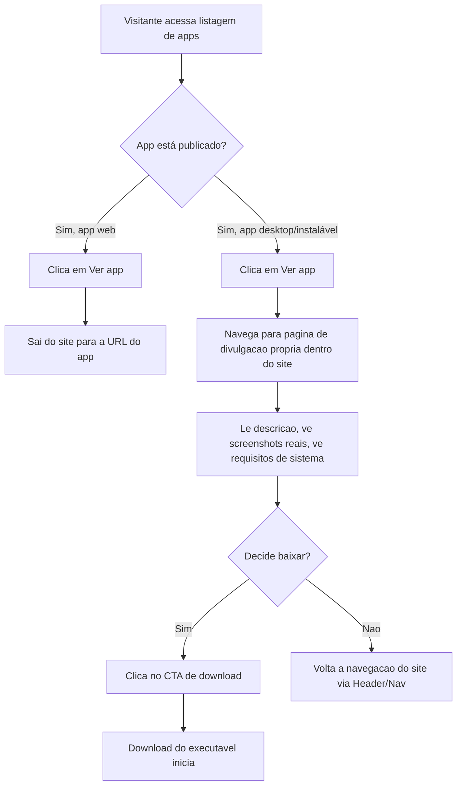
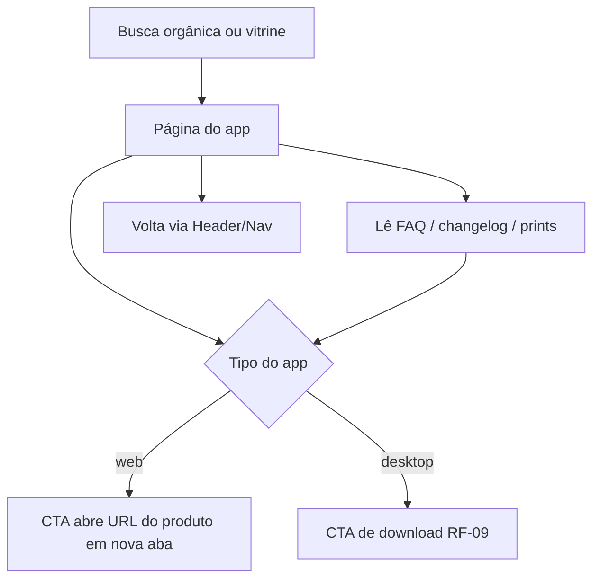

# PRD-TECNICO.md — Site institucional LJSSoftware

**Status:** Rascunho refinado (Loop A, Rodada 2), com **Adendo (Rodada 3 —
reabertura pontual)** cobrindo o novo RF-09 (página de divulgação de app
desktop). Rodadas 1-2 permanecem válidas e não foram reescritas; ver Seção 9
para o adendo completo.
**Base:** `PRD.md` (atualizado 2026-09-17, Rodada 3/Adendo, Seção 8)
**Data:** 2026-09-07 (Rodada 1) — atualizado 2026-09-07 (Rodada 2) —
atualizado 2026-09-17 (Adendo Rodada 3)
**Autor:** Gestor (chapéu Business Analyst)

---

## 1. Requisitos Funcionais

### RF-01 — Página inicial (Home) [deriva de RA-01]
**Descrição:** O site deve exibir uma página inicial que apresenta a marca
LJSSoftware ao visitante.
**Critério de aceite (EARS):**
- O sistema DEVE exibir, ao carregar a URL raiz do domínio, o nome da marca
  (LJSSoftware) e uma frase de apresentação curta (tagline).
- O sistema DEVE exibir na home um ponto de acesso visível (link/botão) para
  a seção de listagem de apps (RF-02).

### RF-02 — Listagem/vitrine de apps [deriva de RA-02] — Resolvido (Rodada 2)
**Descrição:** O site deve listar os aplicativos em desenvolvimento pela
LJSSoftware. Confirmado pelo stakeholder: nenhum app está publicado no
lançamento — todos devem ser exibidos com status "em breve".
**Critério de aceite (EARS):**
- O sistema DEVE exibir, para cada app cadastrado, ao menos: nome e descrição
  curta.
- QUANDO um app não tiver destino de publicação disponível (situação de
  todos os apps na fase 1), o sistema DEVE exibir um indicador visual de
  status "Em breve" no lugar de um link clicável, sem apresentar link
  quebrado ou vazio.
- QUANDO um app futuramente for publicado (fora do escopo da fase 1, mas a
  estrutura deve suportar), o sistema DEVE permitir substituir o indicador
  "Em breve" por um link de saída funcional para aquele app específico, sem
  exigir redesenho da seção.
- A quantidade e os nomes dos apps a listar na fase 1 serão fornecidos pelo
  stakeholder como conteúdo (não são parte do critério de aceite estrutural
  deste requisito, que é sobre o comportamento do componente de listagem).

### RF-03 — Seção "Sobre" [deriva de RA-03]
**Descrição:** Seção com apresentação breve do stakeholder/marca.
**Critério de aceite (EARS):**
- O sistema DEVE exibir uma seção "Sobre" acessível a partir da home, com um
  texto descrevendo a proposta da LJSSoftware.

### RF-04 — Canal de contato [deriva de RA-04] — Resolvido (Rodada 2)
**Descrição:** Forma de o visitante entrar em contato com o stakeholder.
Confirmado pelo stakeholder: link simples de e-mail e/ou LinkedIn — sem
formulário, sem backend de envio.
**Critério de aceite (EARS):**
- O sistema DEVE exibir, em local visível do site (ex.: home e/ou rodapé),
  um link de e-mail (`mailto:`) e/ou um link para o perfil de LinkedIn do
  stakeholder.
- QUANDO o visitante clicar no link de e-mail, o sistema DEVE abrir o
  cliente de e-mail padrão do dispositivo com o destinatário já preenchido.
- QUANDO o visitante clicar no link de LinkedIn, o sistema DEVE abrir o
  perfil em nova aba.
- O sistema NÃO DEVE apresentar formulário de contato nem qualquer campo que
  exija processamento de envio no servidor (fora de escopo, confirmado).

### RF-05 — Publicação com HTTPS no domínio próprio [deriva de RA-05]
**Descrição:** O site deve estar acessível publicamente em
`ljssoftware.com.br` com conexão segura.
**Critério de aceite (EARS):**
- O sistema DEVE responder em `https://ljssoftware.com.br` com certificado
  TLS válido.
- QUANDO o visitante acessar via `http://`, o sistema DEVE redirecionar
  automaticamente para `https://`.

### RF-06 — Responsividade [deriva de RA-06]
**Descrição:** O layout deve se adaptar a diferentes tamanhos de tela.
**Critério de aceite (EARS):**
- O sistema DEVE exibir corretamente todo o conteúdo da home, da listagem de
  apps, da seção "Sobre" e do canal de contato em telas com largura a partir
  de 360px (mobile) até resoluções desktop comuns, sem sobreposição de
  elementos ou necessidade de rolagem horizontal.

### RF-07 — SEO básico [deriva de RA-07]
**Descrição:** Metadados mínimos para descoberta orgânica.
**Critério de aceite (EARS):**
- O sistema DEVE incluir, em toda página pública, uma tag `<title>` e uma
  meta description específicas para o conteúdo da página.
- O sistema DEVE servir um favicon reconhecível da marca.

### RF-08 — Identidade visual básica [deriva de RA-08] — Resolvido (Rodada 2)
**Descrição:** Não existe identidade visual prévia da LJSSoftware. Confirmado
pelo stakeholder: precisa ser criada como parte do escopo, podendo ser tão
simples quanto um wordmark tipográfico (nome estilizado em texto) e uma
paleta de cores — sem exigência de logotipo ilustrativo elaborado.
**Critério de aceite (EARS):**
- O sistema DEVE apresentar, de forma consistente em todas as páginas, um
  wordmark (nome "LJSSoftware" estilizado tipograficamente) e uma paleta de
  cores fixa (mínimo: 1 cor primária, 1 cor de destaque/CTA, cores neutras de
  texto/fundo).
- O favicon (RF-07) DEVE ser derivado do mesmo wordmark/paleta, garantindo
  consistência visual da marca.
- Este requisito NÃO exige a criação de um logotipo ilustrativo/símbolo
  gráfico — um wordmark tipográfico simples satisfaz o critério de aceite.

---

## 2. Requisitos Não-Funcionais

| # | Requisito | Critério de aceite (EARS) |
|---|---|---|
| RNF-01 | Desempenho de carregamento | O sistema DEVE carregar a home com tempo de exibição do conteúdo principal (LCP) abaixo de 2.5s em conexão 4G simulada. |
| RNF-02 | Disponibilidade | O sistema DEVE estar acessível publicamente com disponibilidade compatível com hospedagem padrão de mercado para site estático/institucional (meta de referência: 99.5% mensal, ajustável conforme provedor escolhido no SDD.md). |
| RNF-03 | Idioma do conteúdo | **Resolvido (Rodada 2).** O sistema DEVE apresentar todo o conteúdo textual em português (pt-BR). O sistema NÃO DEVE incluir seletor de idioma nem versão em inglês na fase 1 (confirmado como fora de escopo). |
| RNF-04 | Acessibilidade básica | O sistema DEVE fornecer texto alternativo (`alt`) para toda imagem informativa e manter contraste de texto mínimo adequado para leitura (WCAG AA como referência). |
| RNF-05 | Manutenibilidade de conteúdo | **Resolvido (Rodada 2).** Stakeholder confirmou atualização de conteúdo rara. O sistema DEVE ser implementável como site estático (conteúdo versionado em arquivo/código-fonte), SEM exigir painel administrativo ou CMS dinâmico — confirmado como fora de escopo. Atualizações de conteúdo (ex.: novo app publicado) serão feitas via nova build/deploy, não via interface administrativa. |
| RNF-06 | Custo de operação | O sistema DEVE ser hospedado em solução de custo mínimo ou gratuito (ex.: hospedagem estática), sem exigir custo recorrente relevante além do domínio já pago pelo stakeholder — confirmado como restrição de orçamento. |

---

## 3. Regras de Negócio

| # | Regra | Racional |
|---|---|---|
| RN-01 | Um app sem link de destino disponível deve ser exibido com status "Em breve", nunca como link quebrado ou ausente. | Evita experiência de erro (404/link morto) e mantém transparência sobre o estágio do produto. |
| RN-02 | Todo link de saída para um app deve abrir identificando claramente que o visitante está saindo do site da LJSSoftware para o destino do app (ex.: indicação visual ou abertura em nova aba). | Evita confusão do usuário sobre em qual site está navegando; boa prática de UX para links de saída. |

> Nota: regras de negócio adicionais (ex.: critérios para remover um app da
> vitrine, ordenação da listagem) não puderam ser levantadas por falta de
> informação sobre o portfólio real de apps — a revisitar quando a Pergunta
> em Aberto 1 do `PRD.md` for respondida.

---

## 4. Fluxos de Usuário/Processo

### Fluxo principal: Visitante descobre um app através do site

```mermaid
flowchart TD
    A[Visitante acessa ljssoftware.com.br] --> B[Home carrega]
    B --> C{Visitante quer ver os apps?}
    C -- Sim --> D[Acessa listagem de apps]
    D --> E{App está publicado?}
    E -- Sim --> F[Clica no link de saída do app]
    F --> G[Sai do site LJSSoftware para o destino do app]
    E -- Não --> H[Vê indicador "Em breve"]
    C -- Não, quer saber sobre a marca --> I[Acessa seção Sobre]
    C -- Não, quer contato --> J[Acessa canal de contato]
    J --> K[Clica em link de e-mail ou LinkedIn]
    K --> L[Sai do site para o cliente de e-mail ou perfil de LinkedIn]
```

**Caminhos alternativos:**
- Visitante chega direto em uma página interna via link compartilhado (ex.:
  link direto para a seção de apps) — o sistema deve permitir navegação de
  volta à home a partir de qualquer seção.
- Visitante acessa via `http://` — redirecionado para `https://` (RF-05)
  antes de qualquer outro fluxo.

---

## 5. Dependências e Integrações

| # | Dependência/Integração | Tipo | Observação |
|---|---|---|---|
| DI-01 | Domínio `ljssoftware.com.br` | Já existente | Confirmado pelo stakeholder; requer configuração de DNS apontando para a hospedagem escolhida (decisão do Coordenador no SDD.md). |
| DI-02 | Certificado TLS/HTTPS | A provisionar | Tipicamente automático em provedores modernos (ex.: Let's Encrypt via plataforma de hospedagem) — decisão de plataforma no SDD.md. |
| DI-03 | Destinos de link de cada app (loja de apps, site próprio do app, repositório) | **Resolvido — não aplicável na fase 1.** | Confirmado que nenhum app está publicado; RF-02 usa status "em breve" para todos, sem link de destino real. Esta dependência só passa a existir em fase futura, quando o primeiro app for publicado. |
| DI-04 | Ferramenta de analytics | A definir no SDD.md | Ajustado ao objetivo de sucesso redefinido (Seção 3 do `PRD.md`): deve medir cliques no canal de contato (RF-04) como sinal de interesse na fase 1, não cliques de saída para apps (que ficam para fase futura). Ferramenta específica é decisão técnica do Coordenador, respeitando LGPD se houver coleta de dados de visitantes. |
| DI-05 | Canal de contato (e-mail/LinkedIn) | **Resolvido.** | Confirmado como link direto (`mailto:` e/ou URL de LinkedIn) — não há integração de envio de e-mail nem backend a provisionar, pois não há formulário (confirmado fora de escopo). |
| DI-06 | Identidade visual (wordmark + paleta) | **Resolvido — entra em escopo.** | Confirmado pelo stakeholder que não existe identidade visual prévia e que ela deve ser criada como parte do escopo (RF-08/RA-08). Passa a ser um artefato de entrada que o Executor precisa produzir (ou receber definido pelo Coordenador/stakeholder) antes/durante a implementação visual — não é mais uma dependência externa pendente, e sim um item do próprio escopo de execução. |

---

## 6. Premissas e Riscos Resolvidos

| # (origem PRD.md) | Premissa/Risco | Situação |
|---|---|---|
| PR-01 | Existe ao menos 1 app publicado para divulgar no lançamento | **Refutada com evidência direta do stakeholder (Rodada 2):** nenhum app está publicado — todos em desenvolvimento. RF-02/DI-03 ajustados para refletir isso (status "em breve" para todos, sem link de destino real na fase 1). |
| PR-02 | Idioma principal é pt-BR | **Confirmada com evidência direta do stakeholder (Rodada 2):** só português, sem versão em inglês na fase 1. RNF-03 fechado. |
| PR-03 | Não há necessidade de captura de leads na fase 1 | **Confirmada com evidência direta do stakeholder (Rodada 2):** contato via link simples (e-mail/LinkedIn), sem formulário. RF-04/DI-05 fechados. |
| PR-04 | Solução técnica pode ser site estático simples | **Premissa de produto confirmada** pelo stakeholder (atualização de conteúdo rara, Rodada 2) — RNF-05 fechado nesse nível. A decisão final de arquitetura (qual stack/hospedagem estática) permanece com o Coordenador no SDD.md, mas não há mais ambiguidade de requisito de produto impedindo essa decisão. |
| PR-05 | Risco de expectativa de orçamento/prazo desalinhada | **Mitigado com evidência direta do stakeholder (Rodada 2):** preferência explícita por solução gratuita/baixo custo (RNF-06) e sem prazo fixo de lançamento — reduz o risco de expectativa desalinhada para o Coordenador planejar o TASK.md. |
| PR-06 (nova, origem PRD.md Rodada 2) | Identidade visual básica pode ser produzida sem contratação externa de designer | **Registrada, não resolvida nesta rodada** — depende de avaliação de capacidade do Coordenador/Executor na fase de execução; não é uma resolução de requisito de produto, e sim uma validação de viabilidade técnica/prática a ser feita adiante. |

> Todas as premissas herdadas da Rodada 1 foram validadas ou refutadas com
> evidência citada (resposta direta do stakeholder, registrada no `PRD.md`
> Seção 6/7), conforme exigido antes de aprovar este documento.

---

## 7. Interpretações Registradas

| # | Ambiguidade | Interpretação adotada | Porquê |
|---|---|---|---|
| INT-01 (atualizado Rodada 2) | RA-04 ("canal de contato") não especificava, na Rodada 1, se seria simples (link) ou complexo (formulário com envio) | Resolvida pela resposta direta do stakeholder: link simples (e-mail/LinkedIn), sem formulário. RF-04 especificado com esse formato definitivo — não é mais interpretação do BA, e sim decisão de produto já confirmada. | Registrado aqui apenas para rastreabilidade histórica da ambiguidade original; a decisão em si veio do stakeholder (chapéu PM/BA não decidiu por conta própria algo que era escopo de produto). |
| INT-02 | RA-01 não define se "apresentação da marca" inclui texto longo institucional ou apenas tagline curta | Adotada a interpretação mínima (tagline curta) como piso de aceite em RF-01, permitindo que texto mais elaborado seja adicionado sem violar o critério de aceite | Interpretação de detalhe de conteúdo dentro do requisito já aceito (RA-01), não altera o que é o produto — compatível com o papel do chapéu BA de resolver ambiguidade de interpretação, não de escopo. |
| INT-03 (nova, Rodada 2) | RA-08 ("identidade visual básica") não especifica se exige logotipo ilustrativo/símbolo gráfico | Adotada a interpretação mínima: wordmark tipográfico (nome estilizado em texto) + paleta de cores satisfaz o critério de aceite de RF-08; logotipo ilustrativo não é exigido | Interpretação de nível de detalhe dentro do requisito já aceito pelo stakeholder ("mesmo que básica/minimalista... talvez um logotipo simples em texto/wordmark" — palavras do próprio stakeholder), não altera o que foi pedido, apenas fixa o piso mínimo de aceite para o Executor. |

---

---

## 9. Adendo (Rodada 3 — reabertura pontual, 2026-09-17)

**Base:** `PRD.md` Seção 8 (adendo), `CTO-REVIEW.md` "Gate 1 — Reabertura
pontual" (Aprovado, 2026-09-17).

### 9.1 RF-09 — Página de divulgação de app desktop [deriva de RA-09] — nova

**Descrição:** Para apps do portfólio distribuídos como executável desktop
(sem URL de produto própria), o link "Ver app" do card na vitrine deve
apontar para uma página de divulgação própria dentro do site, em vez de
apontar direto para o download do executável. Primeiro caso concreto:
**Evolução Segura**, página `evolucao-segura.html`.

**Critério de aceite (EARS):**
- O sistema DEVE disponibilizar, para cada app desktop/instalável do
  portfólio cujo badge "Em breve" seja substituído por link real, uma página
  própria dentro do site (URL `/[nome-do-app]`, arquivo `[nome-do-app].html`) antes de o link ser
  publicado — nunca deve existir um link "Ver app" para um app desktop
  apontando direto para o arquivo executável a partir do card da vitrine.
- A página de divulgação DEVE conter, no mínimo: (a) descrição do app
  (proposta de valor, o que o app resolve); (b) ao menos 1 screenshot real
  do produto, capturado do repositório
  (`https://github.com/leandrosegheto17/EvolucaoSegura`) e/ou da execução
  local do instalado (`evolucao-segura.exe`) — não mockup/arte genérica; (c)
  um CTA de download do executável, visivelmente identificado como tal
  (ex.: indicando tamanho/formato do arquivo, quando essa informação
  estiver disponível); (d) requisitos de sistema do app (ex.: SO suportado),
  SE essa informação estiver disponível na fonte (repositório/produto) — se
  não estiver disponível, a seção pode ser omitida, não é bloqueante.
- QUANDO o visitante clicar no link "Ver app" do card de um app
  desktop/instalável na vitrine (`apps.html`) ou na prévia da Home
  (`index.html`), o sistema DEVE navegar para a página de divulgação
  própria daquele app dentro do mesmo domínio (não abrir download nem
  navegar para destino externo diretamente).
- QUANDO o visitante clicar no CTA de download **dentro** da página de
  divulgação, o sistema DEVE iniciar o download do executável (destino
  técnico do arquivo — ex.: GitHub Releases — é decisão do Coordenador no
  SDD.md, fora do escopo deste requisito de produto).
- A página de divulgação DEVE seguir o mesmo Header/Nav e Footer/Contato
  byte-idênticos das demais páginas do site (G-02 do `GUARDRAILS.md`
  permanece aplicável), e a mesma identidade visual (RF-08) — não é uma
  landing page isolada fora do design system.

### 9.2 Ajuste a RF-02 — critério de roteamento do link "Ver app"

RF-02 (Seção 1) é complementado com a seguinte regra, sem alterar seu
critério de aceite original:

- QUANDO um app tiver destino de publicação disponível e for um **app web**
  (URL de produto própria), o sistema DEVE substituir o indicador "Em breve"
  por um link de saída externo direto ao produto (comportamento já
  implementado para Destino Ideal e Radar Esportivo — sem mudança).
- QUANDO um app tiver destino de publicação disponível e for um **app
  desktop/instalável** (distribuído como executável, sem URL de produto
  própria), o sistema DEVE substituir o indicador "Em breve" por um link
  interno para a página de divulgação própria daquele app (RF-09), nunca por
  um link direto de download a partir do card.

### 9.3 Regra de negócio (adendo à Seção 3)

| # | Regra | Racional |
|---|---|---|
| RN-03 | O card de um app na vitrine/prévia nunca aponta diretamente para um arquivo de download (executável) — apps desktop/instalável sempre passam por uma página de divulgação própria antes do CTA de download | Preserva contexto e confiança antes de iniciar o download de um binário; mantém consistência de UX com os apps web, que também levam a uma página de produto (a do próprio app), não a um arquivo direto |

### 9.4 Fluxo de usuário (adendo à Seção 4)



### 9.5 Dependências e integrações (adendo à Seção 5)

| # | Dependência/Integração | Tipo | Observação |
|---|---|---|---|
| DI-07 | Screenshots reais do produto Evolução Segura | A capturar (Executor) | Fontes: repositório GitHub `https://github.com/leandrosegheto17/EvolucaoSegura` e/ou execução local do instalado (`C:\Users\leand\AppData\Local\EvolucaoSegura\evolucao-segura.exe`). Tarefa de execução, a detalhar no `TASK.md` — não decisão deste documento. |
| DI-08 | Hospedagem/distribuição do binário `evolucao-segura.exe` para download | A definir no SDD.md | Decisão técnica do Coordenador (ex.: GitHub Releases do próprio repositório vs. asset versionado no site) — deve respeitar G-01 (zero build/framework) e G-10 (sem serviço pago) do `GUARDRAILS.md`. |
| DI-09 | Nova página `evolucao-segura.html` | Novo artefato de execução | Deve seguir o mesmo design system/`UX-SPEC.md` das páginas já publicadas (8 com `minha-jornada.html`) (G-02, G-12 do `GUARDRAILS.md` aplicáveis) — decisão de layout cabe ao Coordenador/Executor, não a este documento. |

### 9.6 Premissas e riscos resolvidos (adendo à Seção 6)

| # (origem PRD.md) | Premissa/Risco | Situação |
|---|---|---|
| PR-07 | Screenshots reais e suficientes podem ser obtidos do GitHub e/ou execução local, sem arte criada do zero | **Registrada, não resolvida nesta rodada** — depende de o Executor efetivamente inspecionar as duas fontes e confirmar quantidade/qualidade suficiente de imagens; se insuficiente, escalar ao Gestor (chapéu PM/marketing) antes de publicar a página com conteúdo abaixo do mínimo do RF-09. |
| PR-08 | Distribuição do executável sem custo recorrente, compatível com G-10 | **Plausível, não resolvida nesta rodada** — GitHub Releases do próprio repositório público é a opção mais óbvia (gratuita), mas a decisão final e a verificação de compatibilidade com G-10 cabem ao Coordenador no SDD.md. |
| PR-09 | O critério de roteamento (Seção 9.2) cobre todos os apps restantes do portfólio | **Assumida como válida nesta rodada** — não há indício hoje de um terceiro tipo de distribuição (ex.: app mobile só em loja) entre os apps restantes (Meu Objetivo, Gestão da Pelada; Minha Jornada já publicado com página interna, Lote 13); a reavaliar quando cada um for publicado, conforme já registrado no `PRD.md`. |

### 9.7 Interpretações registradas (adendo à Seção 7)

| # | Ambiguidade | Interpretação adotada | Porquê |
|---|---|---|---|
| INT-04 (nova, Rodada 3) | O pedido do stakeholder não especifica se "requisitos do sistema" (SO suportado, espaço em disco) é obrigatório na página de divulgação | Adotada a interpretação condicional: exibir SE a informação estiver disponível na fonte (repositório/produto); não bloqueia a publicação da página se a informação não existir | Interpretação de detalhe de conteúdo dentro do requisito já aceito (RF-09), evita bloquear a entrega por uma informação que pode simplesmente não existir documentada no repositório atual |
| INT-05 (nova, Rodada 3) | Não foi especificado se o critério de roteamento (RF-02/RF-09) deve ser aplicado retroativamente aos 3 apps ainda "Em breve" | Adotada a interpretação de que o critério é uma regra permanente de produto (Seção 9.2), mas sua aplicação a cada app específico só ocorre quando esse app for de fato publicado — não há ação retroativa sobre os cards já existentes | Evita decisão prematura sobre apps cujo tipo de distribuição (web vs. desktop) ainda não foi confirmado pelo stakeholder para os 3 restantes |

---

## Checklist de pronto (chapéu BA) — Adendo Rodada 3

- [x] Todo requisito funcional novo tem critério de aceite testável (RF-09
      completo, RF-02 complementado sem quebrar seu critério original)
- [x] Toda regra de negócio nova tem racional declarado (RN-03)
- [x] O fluxo de usuário do adendo tem pontos de decisão e caminhos
      alternativos mapeados (Seção 9.4)
- [x] Toda dependência/integração nova está nomeada (DI-07 a DI-09)
- [x] Toda premissa/risco herdado do PM (Seção 8.5 do `PRD.md`) está
      registrada nesta seção (PR-07 a PR-09) — nenhuma marcada como
      "resolvida" sem evidência, pois dependem de tarefas de execução ainda
      não realizadas
- [x] Toda ambiguidade resolvida está registrada na Seção 9.7 (INT-04,
      INT-05)

**Conclusão do adendo:** este documento está pronto para handoff de contexto
ao Coordenador (reabertura do `SDD.md`/`TASK.md`) e, na sequência, ao
Executor. Pontos que permanecem como decisão técnica (não de produto) para o
Coordenador resolver: hospedagem/distribuição do binário (DI-08), layout da
nova página (DI-09), e para o Executor: captura efetiva dos screenshots
reais (DI-07/PR-07).

---

## Checklist de pronto (chapéu BA) — Rodada 2

- [x] Todo requisito funcional tem critério de aceite testável — RF-01 a
      RF-08 completos, incluindo RF-02 e RF-04, antes pendentes, agora
      resolvidos com o formato definitivo confirmado pelo stakeholder.
- [x] Toda regra de negócio tem racional declarado (RN-01, RN-02)
- [x] O fluxo de usuário principal tem pontos de decisão e caminhos
      alternativos mapeados (Seção 4), incluindo o fluxo de contato completo
      (antes pendente)
- [x] Toda dependência/integração conhecida está nomeada e resolvida (Seção
      5) — DI-03 marcada como não aplicável na fase 1 (não há apps
      publicados), DI-05 e DI-06 resolvidas
- [x] Toda premissa/risco herdado do PM foi validada ou refutada com
      evidência citada — PR-01 a PR-05 resolvidas com resposta direta do
      stakeholder (Seção 6); PR-06 (nova) registrada como pendente de
      avaliação de viabilidade na execução, não bloqueia este documento
- [x] Toda ambiguidade resolvida está registrada na Seção 7 (INT-01
      atualizada, INT-02 mantida, INT-03 nova)

**Conclusão:** este documento está pronto para handoff de contexto ao
Coordenador (SDD.md) e ao Executor/Validador. Pontos que permanecem como
decisão técnica (não de produto) para o Coordenador resolver no SDD.md:
escolha de stack/hospedagem estática (RNF-05/RNF-06), ferramenta de
analytics (DI-04) e avaliação de viabilidade de produção interna da
identidade visual (PR-06).

---

## 10. Adendo (Rodada 4 — Página de detalhe padronizada por app, RASCUNHO, 2026-09-18)

**Base:** `PRD.md` Seção 9; `CTO-REVIEW.md` Gate 1 (Aprovado com ressalvas,
2026-09-18). Requisitos condicionados à resposta do usuário na Pergunta 1
(RF-10.3/RF-10.4).

### 10.1 RF-10 — Template de página de app [deriva de RA-10]

**Descrição:** esqueleto HTML reutilizável, derivado de
`evolucao-segura.html`, aplicado a cada app publicado.

**Critérios de aceite (EARS):**
- RF-10.1: O sistema DEVE fornecer o template como arquivo HTML estático
  documentado (`public/`, ou modelo em documento do repositório), copiado
  manualmente por app, sem build, framework ou geração automática (G-01).
- RF-10.2: A página de cada app DEVE conter, nesta ordem: (a) hero com nome,
  proposta de valor em uma frase e CTA principal; (b) proposta de valor
  detalhada; (c) prints/demo; (d) FAQ; (e) changelog; (f) CTA final.
  QUANDO um app não tiver conteúdo real para (c), (d) ou (e), a seção DEVE ser
  omitida do DOM, nunca exibida vazia ou com texto de preenchimento.
- RF-10.3: QUANDO o app for web publicado, o CTA principal DEVE abrir a URL
  do produto em nova aba com `rel="noopener noreferrer"` e indicação visual
  de saída (RN-02). QUANDO for desktop, o CTA DEVE seguir RF-09.
- RF-10.4: O link "Ver app" do card em `apps.html` e `index.html` DEVE
  apontar para a página interna do app, e nenhum card DEVE apontar para
  arquivo de download (G-15). [Aprovado pelo usuário em 2026-09-18 para apps web; aplicável a Destino Ideal, Radar Esportivo e Minha Jornada (Lote 13, L-14 resolvida em 2026-09-18).]
- RF-10.5: A seção de changelog DEVE listar entradas em ordem decrescente
  de data, cada uma com data (AAAA-MM-DD), versão (se houver) e descrição
  curta em pt-BR.
- RF-10.6: A seção de FAQ DEVE ter no mínimo 3 perguntas/respostas em
  pt-BR e usar elemento nativo (`<details>`/`<summary>` ou padrão já
  existente no Lote 8/9), sem JS novo obrigatório.
- RF-10.7: Cada página DEVE ter `<title>`, meta description, `<link
  rel="canonical">` e Open Graph, todos únicos por app (estende RF-07), e
  DEVE constar no `sitemap.xml` se existir.
- RF-10.8: O sistema DEVE aplicar Header/Nav e Footer byte-idênticos às
  demais páginas (G-02), com `aria-current="page"` no item-mãe "Apps".
- RF-10.9: Todo print DEVE usar dado 100% fictício (G-17), estar em WebP
  com fallback (G-07) e ter `alt` descritivo (RNF-04).
- RF-10.10: O CTA principal de cada página DEVE ser mensurável no
  Cloudflare Web Analytics (G-03), sem novo script de terceiro.
- RF-10.11: Páginas de apps ainda "Em breve" NÃO DEVEM ser criadas nesta
  rodada; o card "Em breve" mantém badge sem link (RN-01).

### 10.2 RNF adicionais

| # | Requisito | Critério (EARS) |
|---|---|---|
| RNF-07 | Desempenho | Cada página de app DEVE ter LCP < 2.5s em 4G simulado (RNF-01), com imagens fora da dobra em `loading="lazy"`. |
| RNF-08 | Acessibilidade | Cada página DEVE atender WCAG AA (G-05), um único `<h1>`, hierarquia de headings sem salto, e os 4 estados aplicáveis/justificados (G-06). |
| RNF-09 | Segurança | Nenhuma página DEVE carregar script/iframe de terceiro fora da CSP vigente (G-09); demo em vídeo somente arquivo próprio. |
| RNF-10 | Custo | A entrega NÃO DEVE introduzir serviço pago (G-10). |
| RNF-11 | Manutenção | Adicionar um novo app DEVE exigir apenas: copiar o template, preencher conteúdo, atualizar o card e o sitemap, com checklist documentado no template. |

### 10.3 Regra de negócio

| # | Regra | Racional |
|---|---|---|
| RN-04 | Só existe página de app (indexável) quando há produto publicado e conteúdo real mínimo (proposta de valor + ao menos 1 print). | Evita conteúdo fino/promessa vazia, que prejudica SEO e confiança. |
| RN-05 | **Aprovada pelo usuário (2026-09-18).** RN-03/G-15 são mantidas (nunca link direto para binário) e a regra "app web = link direto" da Seção 8.2 é substituída por "todo app publicado = página interna com botão 'Abrir app' externo", via nova entrada no Log de Alterações do `GUARDRAILS.md` (**aplicada** em 2026-09-18). | Mudança de critério registrada, sem edição silenciosa. |

### 10.4 Fluxo (adendo)



### 10.5 Dependências

| # | Dependência | Observação |
|---|---|---|
| DI-10 | Conteúdo real por app (descrição, prints, FAQ, changelog) | Fornecido pelo usuário via PDF do manual de cada app (prints e textos extraídos dele, como no Minha Jornada); bloqueia cada página. Prints sujeitos a G-17. |
| DI-11 | Componentes CSS do Lote 8 | Reuso; qualquer componente novo (ex.: changelog) exige G-12 (UX-SPEC 3.2). |
| DI-12 | `sitemap.xml`/`robots` | Verificar existência (Coordenador). |
| DI-13 | Decisão do usuário (Pergunta 1) | **Resolvida (2026-09-18): aprovada.** |

### 10.6 Interpretações

| # | Ambiguidade | Interpretação | Porquê |
|---|---|---|---|
| INT-06 | "Prints/demo" pode significar demo interativa | Confirmado pelo usuário: GIF é suficiente (imagem/GIF/vídeo estático próprio) | Interativa exigiria backend/terceiro (G-16, G-09) |
| INT-07 | "Cada app do portfólio" inclui apps "Em breve" | Adotado: só apps publicados (RN-04) | Evita páginas vazias; INT-05 já previa aplicação por publicação |

### 10.7 Checklist (BA)
- [x] Todo RF novo com critério EARS testável
- [x] Regras de negócio com racional (RN-04, RN-05)
- [x] Fluxo com decisão e caminhos alternativos
- [x] Dependências nomeadas (DI-10 a DI-13)
- [x] Premissas PR-10 a PR-13 validadas (2026-09-18, decisões do usuário; PR-11 e PR-12 como riscos aceitos)
- [x] Ambiguidades registradas (INT-06, INT-07)
