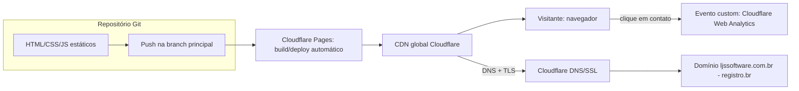

# SDD.md — Site institucional LJSSoftware

**Status:** Pronto para revisão do usuário (Loop B do `/definir_organizar`) —
**sincronização factual pontual** nesta data (Seção 3 e índice de ADRs) para
refletir `ADR-005` (identidade visual final, supersede `ADR-004`), decorrente
de reabertura do `UX-SPEC.md`; nenhuma nova decisão arquitetural foi tomada
aqui, só a atualização dos nomes de fonte/identidade já decididos alhures
**Base:** `PRD.md` + `PRD-TECNICO.md` (Rodada 2, aprovados)
**Data:** 2026-09-07
**Autor:** Coordenador (chapéu Software Architect)

---

## 1. Visão Geral

O site institucional LJSSoftware é uma solução **100% estática**, sem
backend, sem banco de dados e sem CMS/painel administrativo, publicada em
`ljssoftware.com.br`. O objetivo é apresentar a marca, um portfólio de apps
em desenvolvimento (todos com status "Em breve" na fase 1) e um canal de
contato direto (e-mail/LinkedIn).

Princípios que guiam toda decisão abaixo:
- **Custo mínimo/gratuito** (RNF-06) — nenhuma peça da arquitetura tem custo
  recorrente além do domínio, já pago.
- **Baixa manutenção ao longo do tempo** (RNF-05) — atualização de conteúdo
  é rara; a arquitetura prioriza zero dependências que possam apodrecer
  (versão de framework desatualizada, vulnerabilidade de pacote) em vez de
  otimizar para velocidade de desenvolvimento inicial.
- **Sem dado sensível** — não há autenticação, não há formulário com envio
  ao servidor, não há armazenamento de dado pessoal do visitante além de
  analytics agregado/anonimizado (ADR-003). Isso reduz proporcionalmente a
  superfície de segurança a tratar (Seção 7).

Este SDD.md é o primeiro dos três artefatos produzidos nesta chamada; o
`UX-SPEC.md` (chapéu UX/UI) é desenhado dentro dos limites técnicos aqui
definidos, e o `TASK.md` (chapéu Tech Lead) decompõe ambos em tarefas.

## 2. Componentes e Fluxo de Dados

Não há camada de backend/API nem banco de dados. O "fluxo de dados" do
sistema é, na prática, o fluxo de build/deploy e o fluxo de navegação do
visitante:



Componentes de página (todos estáticos, sem estado de servidor):

| Componente | Página(s) onde aparece | Responsabilidade |
|---|---|---|
| Header/Nav | `index.html`, `apps.html`, `sobre.html` | Wordmark + navegação entre páginas; colapsa em menu mobile |
| Hero | `index.html` | Apresentação da marca + tagline + CTA para vitrine (RF-01) |
| Vitrine de apps (grid de cards) | `apps.html` | Lista de apps com nome, descrição curta, badge "Em breve" (RF-02) |
| Seção Sobre | `sobre.html` | Texto institucional (RF-03) |
| Rodapé/Contato | Todas as páginas | Link `mailto:` e/ou LinkedIn (RF-04), replicado de forma idêntica |
| Página 404 | `404.html` | Fallback para rota inexistente, com link de volta à home |

Não existe estado compartilhado entre páginas em tempo de execução (sem
JS de roteamento/estado global) — cada HTML é autocontido, o único JS
vanilla necessário é o toggle do menu mobile e, opcionalmente, o disparo do
evento custom de analytics no clique do link de contato.

## 3. Stack Tecnológica

| Camada | Escolha | Justificativa (resumo — detalhe no ADR) |
|---|---|---|
| Estrutura do site | HTML5 + CSS3 + JS vanilla, multi-página, sem framework/gerador, sem build step | ADR-001 — zero dependência de build/runtime, menor risco de dependência desatualizada em projeto de atualização rara |
| Hospedagem | Cloudflare Pages (plano gratuito) | ADR-002 — custo zero, TLS automático, CDN global, deploy via Git |
| DNS/TLS | Cloudflare DNS (NS do domínio migrado do registro.br) | ADR-002 — TLS gerenciado automaticamente, satisfaz RF-05 |
| Analytics | Cloudflare Web Analytics + evento custom de clique em contato | ADR-003 — gratuito, sem cookie, atende à métrica de sucesso do `PRD.md` sem exigir banner de consentimento |
| Identidade visual | Direção "Geométrico/Glass" com ícone de marca real + paleta navy/glass/teal, produzida internamente a partir de arte-fonte fornecida pelo usuário | ADR-005 (supersede ADR-004) — resolve PR-06, sem custo de designer externo; decisão final tomada diretamente pelo usuário após comparação de 5 conceitos visuais |
| Fontes | Google Fonts (Unbounded para títulos/headings, Outfit para corpo), auto-hospedadas nos arquivos estáticos do site | Evita requisição externa a CDN de terceiro (performance/RNF-01 e privacidade), sem custo de licença — nomes de fontes atualizados pelo ADR-005 (política de self-hosting mantida) |
| Controle de versão/deploy | Git (repositório conectado ao Cloudflare Pages) | Cobre RNF-05 (atualização via nova build/deploy) |

## 4. Decisões Arquiteturais (Índice de ADRs)

| ADR | Título | Status |
|---|---|---|
| [ADR-001](adr/001-arquitetura-estatica-multipagina-sem-framework.md) | Arquitetura estática multi-página, sem framework/gerador de site | Aceito |
| [ADR-002](adr/002-hospedagem-cloudflare-pages.md) | Hospedagem em Cloudflare Pages com DNS gerenciado no Cloudflare | Aceito |
| [ADR-003](adr/003-analytics-cloudflare-web-analytics.md) | Analytics via Cloudflare Web Analytics | Aceito |
| [ADR-004](adr/004-identidade-visual-produzida-internamente.md) | Identidade visual básica produzida internamente (wordmark tipográfico) | Superseded by ADR-005 |
| [ADR-005](adr/005-identidade-visual-geometrico-glass-com-icone.md) | Identidade visual final: direção "Geométrico/Glass" com ícone de marca | Aceito |

## 5. Modelo de Dados de Alto Nível

Não há banco de dados. O "modelo de dados" aqui é o **modelo de conteúdo**
que estrutura o que é hardcoded em cada página HTML — documentado para que
futuras edições de conteúdo (ex.: adicionar um app) sigam um formato
consistente:

```
App (representado como <article class="app-card"> em apps.html)
├── nome: string (obrigatório)
├── descricao_curta: string (obrigatório)
├── status: enum ["em-breve", "publicado"]  (fase 1: sempre "em-breve")
└── link_destino: string | null
    (null na fase 1 para todos; quando "publicado", preenchido e o
     badge "Em breve" é substituído pelo link real — RF-02 exige que essa
     troca não exija redesenho da seção, só edição do atributo/bloco)

PaginaEstatica (cada .html)
├── title: string (único por página — RF-07)
├── meta_description: string (única por página — RF-07)
├── favicon: referência ao asset derivado do wordmark (RF-08)
└── conteudo: markup HTML fixo da página
```

Esse "modelo" não é persistido em banco — vive como convenção de marcação
HTML, documentada aqui e detalhada em diretrizes de implementação no
`TASK.md` (Seção 1), para que qualquer edição futura (mesmo manual) preserve
a estrutura esperada por RF-02/RF-07/RF-08.

## 6. Riscos Técnicos

| # | Risco | Severidade | Mitigação / dívida aceita |
|---|---|---|---|
| RT-01 | Concentração de dependência num único provedor (Cloudflare: DNS + hosting + analytics) | Média | Exportar e guardar a zona DNS antes da migração de NS; arquivos estáticos ficam no Git, portátil para outro provedor (GitHub Pages/Netlify) se necessário — sem lock-in de código |
| RT-02 | Duplicação manual de header/nav/rodapé entre 3-4 páginas HTML (ADR-001) pode divergir com o tempo | Baixa | Diretriz de implementação no `TASK.md` exigindo blocos idênticos entre páginas; revisitar migração para SSG leve se o número de páginas crescer (gatilho registrado no ADR-001) |
| RT-03 | Migração de nameservers no registro.br é uma ação manual do stakeholder, fora do controle do Executor | Baixa/Média (risco de atraso, não técnico) | Sinalizado como pré-requisito explícito de deploy no `TASK.md`/`DEPLOY.md`; não bloqueia o desenvolvimento do site em si, só a publicação final |
| RT-04 | Ausência de build pipeline significa que otimização de imagem (compressão, WebP) é manual | Baixa | Diretriz de implementação: todo asset de imagem deve ser exportado já otimizado (WebP com fallback) antes de ser versionado — checklist no `TASK.md` |
| RT-05 | Identidade visual produzida internamente (ADR-004) pode não atingir o nível de polimento de um designer profissional | Baixa (aceita conscientemente) | Escopo já delimitado pelo PRD-TECNICO.md (INT-03): wordmark tipográfico simples é o piso de aceite, não exige mais que isso |
| RT-06 | Cloudflare Web Analytics tem funcionalidade mais limitada que ferramentas dedicadas de produto | Baixa | Suficiente para a métrica declarada no `PRD.md` (contagem de cliques em contato); revisitar em fase 2 se necessário |

## 7. Requisitos de Segurança

Proporcional ao porte do projeto (site institucional estático, sem dado
sensível, sem autenticação, sem formulário com backend). Insumo para o
Validador (chapéu DevSecOps) aprofundar depois via SAST/DAST/hardening.

- **Transporte:** TLS obrigatório em toda rota; HTTP redireciona para HTTPS
  automaticamente ("Always Use HTTPS" na Cloudflare) — cobre RF-05.
- **Headers de segurança básicos** (via arquivo `_headers` do Cloudflare
  Pages, aplicado a todas as rotas):
  - `Content-Security-Policy`: restritiva, permitindo apenas os domínios de
    fonte/analytics usados (self + Cloudflare Web Analytics beacon).
  - `X-Content-Type-Options: nosniff`
  - `X-Frame-Options: DENY` (o site não deve ser embutido em iframe de
    terceiros)
  - `Referrer-Policy: strict-origin-when-cross-origin`
  - `Permissions-Policy` restringindo APIs de navegador não usadas (câmera,
    microfone, geolocalização, etc.)
- **Autenticação/Autorização:** não aplicável — não há login, conta de
  usuário ou área restrita (fora de escopo confirmado no `PRD.md`).
- **Criptografia:** não há dado sensível armazenado; TLS em trânsito cobre a
  única superfície de dado (navegação do visitante). Não há dado em repouso
  além do próprio código-fonte estático versionado no Git.
- **Isolamento:** não aplicável na forma tradicional (sem multi-tenant, sem
  processo de servidor próprio) — a superfície de ataque se resume a
  hospedagem estática + DNS, ambos geridos pelo provedor (Cloudflare).
- **Privacidade/LGPD:** nenhuma coleta de dado pessoal identificável; o
  analytics (ADR-003) é agregado/anonimizado e sem cookies — não exige
  banner de consentimento sob a leitura atual da LGPD para esse tipo de
  coleta. Recomenda-se, ainda assim, uma nota curta de privacidade no
  rodapé do site como boa prática (não é requisito bloqueante do PRD;
  sinalizado aqui como sugestão para o Executor avaliar com baixo custo de
  implementação).
- **Dependências:** por não haver `package.json`/build toolchain (ADR-001),
  não há superfície de dependência de terceiros a monitorar por
  vulnerabilidade (fora das fontes Google Fonts auto-hospedadas, que são
  arquivos estáticos, não pacotes executáveis).

---

## Checklist de Pronto — SDD.md

- [x] Toda decisão arquitetural relevante tem ADR correspondente em `.md/adr/`
      (ADR-001 a ADR-004)
- [x] Toda escolha de stack tem justificativa e trade-off/alternativa
      considerados (Seção 3 + ADRs)
- [x] Todo risco técnico/gargalo tem severidade; toda dívida técnica aceita
      tem o motivo registrado (Seção 6: RT-01 a RT-06)
- [x] Requisitos de segurança cobrem autenticação, autorização, criptografia
      e isolamento (quando aplicável), sem item genérico sem detalhe
      concreto — Seção 7 trata cada item explicitamente, incluindo os "não
      aplicável" com justificativa
- [x] Nenhuma das 7 seções está vazia ou com placeholder
