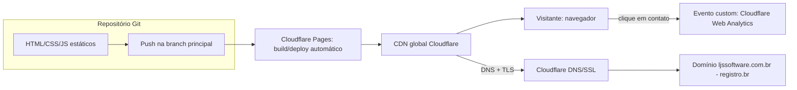

# SDD.md — Site institucional LJSSoftware

**Status:** Aprovado e implementado (Lotes 1-7). **Reaberto pontualmente
(Rodada 3, 2026-09-17)** para a demanda "página de divulgação de app desktop
(Evolução Segura)" — adiciona a decisão de hospedagem do instalador (`ADR-006`)
e registra os riscos/lacunas associados (RT-07, RT-08). Não altera nenhuma
decisão anterior (ADR-001 a ADR-005 permanecem válidas e inalteradas).
**Reaberto pontualmente novamente (Rodada 4, 2026-09-18)** para a demanda
"Página de detalhe padronizada por app" (RA-10, `PRD-TECNICO.md` Seção 10):
template de página de app, roteamento interno dos cards de todo app publicado
e avaliação de RT-02/ADR-001 (Seções 2, 4, 5 e 6 abaixo). Nenhuma decisão
anterior alterada; nenhum ADR novo (ver nota na Seção 4).
**Base:** `PRD.md` + `PRD-TECNICO.md` (Rodada 2, aprovados) — adendo Rodada 3
(`PRD.md` Seção 8, `PRD-TECNICO.md` Seção 9)
**Data original:** 2026-09-07 · **Data desta revisão:** 2026-09-17
**Autor:** Coordenador (chapéu Software Architect)

---

## 1. Visão Geral

O site institucional LJSSoftware é uma solução **100% estática**, sem
backend, sem banco de dados e sem CMS/painel administrativo, publicada em
`ljssoftware.com.br`. O objetivo é apresentar a marca, um portfólio de apps
em desenvolvimento (todos com status "Em breve" na fase 1) e um canal de
contato direto (e-mail/LinkedIn).

Princípios que guiam toda decisão abaixo:
- **Custo mínimo/gratuito** (RNF-06) — nenhuma peça da arquitetura tem custo
  recorrente além do domínio, já pago.
- **Baixa manutenção ao longo do tempo** (RNF-05) — atualização de conteúdo
  é rara; a arquitetura prioriza zero dependências que possam apodrecer
  (versão de framework desatualizada, vulnerabilidade de pacote) em vez de
  otimizar para velocidade de desenvolvimento inicial.
- **Sem dado sensível** — não há autenticação, não há formulário com envio
  ao servidor, não há armazenamento de dado pessoal do visitante além de
  analytics agregado/anonimizado (ADR-003). Isso reduz proporcionalmente a
  superfície de segurança a tratar (Seção 7).

Este SDD.md é o primeiro dos três artefatos produzidos nesta chamada; o
`UX-SPEC.md` (chapéu UX/UI) é desenhado dentro dos limites técnicos aqui
definidos, e o `TASK.md` (chapéu Tech Lead) decompõe ambos em tarefas.

## 2. Componentes e Fluxo de Dados

Não há camada de backend/API nem banco de dados. O "fluxo de dados" do
sistema é, na prática, o fluxo de build/deploy e o fluxo de navegação do
visitante:



Componentes de página (todos estáticos, sem estado de servidor):

| Componente | Página(s) onde aparece | Responsabilidade |
|---|---|---|
| Header/Nav | `index.html`, `apps.html`, `sobre.html`, `evolucao-segura.html` | Wordmark + navegação entre páginas; colapsa em menu mobile |
| Hero | `index.html`, `evolucao-segura.html` (variante `.hero--product`) | Apresentação da marca + tagline + CTA para vitrine (RF-01); na página de produto, apresentação do app + CTA de download (RF-09) |
| Vitrine de apps (grid de cards) | `apps.html` | Lista de apps com nome, descrição curta, badge "Em breve" ou link "Ver app" — direto (app web) ou para página própria (app desktop, RF-09/RN-03) |
| Seção Sobre | `sobre.html` | Texto institucional (RF-03) |
| Página de divulgação de app desktop | `evolucao-segura.html` (padrão reutilizável para futuros apps desktop) | Descrição, screenshots reais, requisitos de sistema e CTA de download do executável (RF-09) — nunca é o card da vitrine que aponta direto para o binário (RN-03) |
| Página de detalhe de app (template) **[Rodada 4]** | `evolucao-segura.html` (referência), `destino-ideal.html`, `radar-esportivo.html` (RF-10) | Generaliza a linha acima: todo app **publicado** (web ou desktop) tem página interna própria, copiada manualmente de um template mantido em `dev/templates/app-page.template.html` (fora de `public/`, nunca publicado nem indexável). Seções na ordem: hero+CTA, proposta de valor, prints/demo, FAQ, changelog, CTA final; prints/FAQ/changelog omitidos do DOM quando sem conteúdo real (RF-10.2). CTA principal: app web = "Abrir app" externo (nova aba, `rel="noopener noreferrer"`, indicação de saída); app desktop = CTA de download conforme RF-09/L-11. Apps "Em breve" não têm página (RN-04) |
| Rodapé/Contato | Todas as páginas | Link `mailto:` e/ou LinkedIn (RF-04), replicado de forma idêntica |
| Página 404 | `404.html` | Fallback para rota inexistente, com link de volta à home |

Não existe estado compartilhado entre páginas em tempo de execução (sem
JS de roteamento/estado global) — cada HTML é autocontido, o único JS
vanilla necessário é o toggle do menu mobile e, opcionalmente, o disparo do
evento custom de analytics no clique do link de contato.

## 3. Stack Tecnológica

| Camada | Escolha | Justificativa (resumo — detalhe no ADR) |
|---|---|---|
| Estrutura do site | HTML5 + CSS3 + JS vanilla, multi-página, sem framework/gerador, sem build step | ADR-001 — zero dependência de build/runtime, menor risco de dependência desatualizada em projeto de atualização rara |
| Hospedagem | Cloudflare Pages (plano gratuito) | ADR-002 — custo zero, TLS automático, CDN global, deploy via Git |
| DNS/TLS | Cloudflare DNS (NS do domínio migrado do registro.br) | ADR-002 — TLS gerenciado automaticamente, satisfaz RF-05 |
| Analytics | Cloudflare Web Analytics + evento custom de clique em contato | ADR-003 — gratuito, sem cookie, atende à métrica de sucesso do `PRD.md` sem exigir banner de consentimento |
| Identidade visual | Direção "Geométrico/Glass" com ícone de marca real + paleta navy/glass/teal, produzida internamente a partir de arte-fonte fornecida pelo usuário | ADR-005 (supersede ADR-004) — resolve PR-06, sem custo de designer externo; decisão final tomada diretamente pelo usuário após comparação de 5 conceitos visuais |
| Fontes | Google Fonts (Unbounded para títulos/headings, Outfit para corpo), auto-hospedadas nos arquivos estáticos do site | Evita requisição externa a CDN de terceiro (performance/RNF-01 e privacidade), sem custo de licença — nomes de fontes atualizados pelo ADR-005 (política de self-hosting mantida) |
| Controle de versão/deploy | Git (repositório conectado ao Cloudflare Pages) | Cobre RNF-05 (atualização via nova build/deploy) |
| Distribuição do instalador (`evolucao-segura.exe`) | GitHub Releases do repositório `EvolucaoSegura` | ADR-006 (novo) — custo zero, sem novo serviço na arquitetura (G-10), versionamento de binário atrelado ao versionamento do produto; pré-requisito: repositório/Release tornado público pelo stakeholder (RT-08) |
| Ativação/licenciamento (chave → contra-chave) do app Evolução Segura | **Fora de escopo desta reabertura — não decidido** | RF-09 cobre só a página de divulgação, não a validação server-side descrita no fluxo de licenciamento do produto; decisão de arquitetura (ex.: Cloudflare Pages Functions serverless vs. processo manual) fica pendente para quando essa funcionalidade for de fato priorizada — ver Riscos Técnicos (RT-07) e `TASK.md` Seção 6 (Lacuna L-08) |

## 4. Decisões Arquiteturais (Índice de ADRs)

| ADR | Título | Status |
|---|---|---|
| [ADR-001](adr/001-arquitetura-estatica-multipagina-sem-framework.md) | Arquitetura estática multi-página, sem framework/gerador de site | Aceito |
| [ADR-002](adr/002-hospedagem-cloudflare-pages.md) | Hospedagem em Cloudflare Pages com DNS gerenciado no Cloudflare | Aceito |
| [ADR-003](adr/003-analytics-cloudflare-web-analytics.md) | Analytics via Cloudflare Web Analytics | Aceito |
| [ADR-004](adr/004-identidade-visual-produzida-internamente.md) | Identidade visual básica produzida internamente (wordmark tipográfico) | Superseded by ADR-005 |
| [ADR-005](adr/005-identidade-visual-geometrico-glass-com-icone.md) | Identidade visual final: direção "Geométrico/Glass" com ícone de marca | Aceito |
| [ADR-006](adr/006-hospedagem-instalador-github-releases.md) | Hospedagem/distribuição do instalador via GitHub Releases | Aceito |

**Nota Rodada 4 — nenhum ADR novo.** A demanda RA-10 não introduz decisão
estrutural nova: mantém HTML/CSS/JS puro, sem build (ADR-001/G-01), sem novo
serviço (ADR-002/003, G-10), sem novo script/iframe de terceiro (G-09) e
mantém a regra RN-03/G-15 (nunca link direto para binário). O que muda é
apenas o critério de roteamento do card para apps web (link externo direto ->
página interna com "Abrir app"), decisão de produto já aprovada pelo
usuário (`PRD-TECNICO.md` RN-05), a ser refletida em G-15 por revisão
formal do `GUARDRAILS.md` (proposta pendente do Gestor, não aplicada aqui).
O "gatilho de revisão futura" do ADR-001 (página própria por app publicado)
foi **avaliado** e está registrado em RT-02: decisão de manter o padrão manual
mantida, sem superseder o ADR-001 (ADR é imutável, G-13).

## 5. Modelo de Dados de Alto Nível

Não há banco de dados. O "modelo de dados" aqui é o **modelo de conteúdo**
que estrutura o que é hardcoded em cada página HTML — documentado para que
futuras edições de conteúdo (ex.: adicionar um app) sigam um formato
consistente:

```
App (representado como <article class="app-card"> em apps.html)
├── nome: string (obrigatório)
├── descricao_curta: string (obrigatório)
├── status: enum ["em-breve", "publicado"]
├── tipo: enum ["web", "desktop"]  (novo, Rodada 3 — RF-09/RN-03; decide o
│   destino do link "Ver app" quando status = "publicado")
├── link_destino: string | null
│   (null enquanto status = "em-breve"; quando "publicado":
       - [Rodada 4, RN-05] QUALQUER tipo -> URL interna da página de
         detalhe do app (`[slug].html`), nunca URL de arquivo/binário
         direto (RN-03) e, a partir da Rodada 4, também não mais a URL
         externa direta do app web: essa URL passa a viver só como
         `cta_url_externa` dentro da própria página do app.
       - Histórico (Rodada 2/3, superado para apps web pela Rodada 4):
         tipo = "web" -> URL externa direta; tipo = "desktop" -> página
         interna. Apps "em-breve" seguem sem página (RN-04).)
├── slug: string | null  (novo, Rodada 4 — nome do arquivo `[slug].html`;
│   null enquanto "em-breve")
└── cta_url_externa: string | null  (novo, Rodada 4 — só para tipo "web":
    URL do produto aberta em nova aba pelo botão "Abrir app" da página;
    null para "desktop", cujo CTA segue RF-09/L-11)

PaginaApp (novo, Rodada 4 — um .html por app publicado)
├── secoes obrigatórias: hero (nome + proposta em 1 frase + CTA), proposta
│   de valor, CTA final
├── secoes omitíveis (removidas do DOM sem conteúdo real, RF-10.2): prints/
│   demo (RN-04 exige >= 1 print para a página existir), FAQ (>= 3 perguntas
│   quando presente), changelog (entradas AAAA-MM-DD decrescentes)
└── head: title, meta description, canonical, Open Graph — únicos (RF-10.7);
    presente em sitemap.xml

PaginaEstatica (cada .html)
├── title: string (único por página — RF-07)
├── meta_description: string (única por página — RF-07)
├── favicon: referência ao asset derivado do wordmark (RF-08)
└── conteudo: markup HTML fixo da página
```

Esse "modelo" não é persistido em banco — vive como convenção de marcação
HTML, documentada aqui e detalhada em diretrizes de implementação no
`TASK.md` (Seção 1), para que qualquer edição futura (mesmo manual) preserve
a estrutura esperada por RF-02/RF-07/RF-08.

## 6. Riscos Técnicos

| # | Risco | Severidade | Mitigação / dívida aceita |
|---|---|---|---|
| RT-01 | Concentração de dependência num único provedor (Cloudflare: DNS + hosting + analytics) | Média | Exportar e guardar a zona DNS antes da migração de NS; arquivos estáticos ficam no Git, portátil para outro provedor (GitHub Pages/Netlify) se necessário — sem lock-in de código |
| RT-02 | Duplicação manual de header/nav/rodapé entre 3-4 páginas HTML (ADR-001) pode divergir com o tempo. **[ATUALIZADO, Rodada 4]** O gatilho do ADR-001 ("página própria por app publicado") foi atingido: o site vai de 5 para 7 páginas HTML (+`destino-ideal.html`, +`radar-esportivo.html`), cada nova app publicada soma +1 | Baixa -> **Média-baixa** | **Avaliação:** manter o padrão manual (sem SSG, G-01/ADR-001 intactos) — 7 páginas ainda é gerenciável, o usuário já aprovou o padrão manual (PR-11) e SSG reintroduziria build/dependência contra RNF-05. Mitigação nova, sem build: script Node sem dependências em `dev/html/` (nunca publicado, mesmo padrão dos checks já existentes) que compara byte a byte Header/Footer de todas as páginas de `public/` (única variação: `aria-current`) e valida title/description/canonical únicos, h1 único e presença no `sitemap.xml` — rodado ao final de cada tarefa/lote que toque HTML. **Novo gatilho de reavaliação (nova decisão a registrar em ADR superseding ou complementar, se ocorrer):** ao chegar a 10 páginas HTML ou se o script apontar divergência recorrente (>= 2 lotes seguidos) — sinalizar ao Gestor |
| RT-09 | **[Novo, Rodada 4]** Conteúdo real das páginas (textos e prints) depende de PDF do manual de cada app fornecido pelo usuário (DI-10); prints podem conter dado real de terceiros (G-17) e demo é limitada a GIF/vídeo próprio estático (INT-06, G-09/G-16) | Média (atraso de conteúdo; risco de privacidade se G-17 falhar) | Tarefas de extração de prints separadas das de montagem da página; checagem de dado fictício por print; página só é publicada com conteúdo real mínimo (RN-04); LCP/`loading="lazy"` e WebP+fallback (G-07, RNF-07) exigidos por critério de aceite |
| RT-03 | Migração de nameservers no registro.br é uma ação manual do stakeholder, fora do controle do Executor | Baixa/Média (risco de atraso, não técnico) | Sinalizado como pré-requisito explícito de deploy no `TASK.md`/`DEPLOY.md`; não bloqueia o desenvolvimento do site em si, só a publicação final |
| RT-04 | Ausência de build pipeline significa que otimização de imagem (compressão, WebP) é manual | Baixa | Diretriz de implementação: todo asset de imagem deve ser exportado já otimizado (WebP com fallback) antes de ser versionado — checklist no `TASK.md` |
| RT-05 | Identidade visual produzida internamente (ADR-004) pode não atingir o nível de polimento de um designer profissional | Baixa (aceita conscientemente) | Escopo já delimitado pelo PRD-TECNICO.md (INT-03): wordmark tipográfico simples é o piso de aceite, não exige mais que isso |
| RT-06 | Cloudflare Web Analytics tem funcionalidade mais limitada que ferramentas dedicadas de produto | Baixa | Suficiente para a métrica declarada no `PRD.md` (contagem de cliques em contato); revisitar em fase 2 se necessário |
| RT-07 | **[Novo, Rodada 3]** O fluxo de licenciamento do Evolução Segura (chave de instalação → validação no site → contra-chave) exige processamento server-side que o site estático atual não tem (ADR-001/G-01/G-04) | Média (não bloqueia esta reabertura, mas é uma lacuna real de produto se o app depender de licenciar via site) | Explicitamente fora do escopo de RF-09 (só a página de divulgação); decisão de arquitetura (Cloudflare Pages Functions serverless dentro do free tier vs. processo manual por e-mail vs. outra solução) fica pendente para quando essa funcionalidade for priorizada — exigirá novo ADR nesse momento, sinalizado ao Gestor antes de implementar por poder alterar a garantia de "zero backend" (G-01/G-04) |
| RT-08 | **[Novo, Rodada 3]** O repositório `https://github.com/leandrosegheto17/EvolucaoSegura` retornou `404` a uma requisição não autenticada nesta reabertura — indício de que está privado, divergindo da premissa "repositório público" do `PRD.md` Seção 8.3 | Média (bloqueia só a publicação do link real, não o desenvolvimento) | Registrado como pré-requisito de publicação em `ADR-006`: repositório (ou a Release específica com o instalador) precisa ser tornado público pelo stakeholder antes de `TASK.md` T10.2 substituir o badge "Em breve" por link real — mesmo padrão de dependência manual externa já usado para RT-03 |

## 7. Requisitos de Segurança

Proporcional ao porte do projeto (site institucional estático, sem dado
sensível, sem autenticação, sem formulário com backend). Insumo para o
Validador (chapéu DevSecOps) aprofundar depois via SAST/DAST/hardening.

- **Transporte:** TLS obrigatório em toda rota; HTTP redireciona para HTTPS
  automaticamente ("Always Use HTTPS" na Cloudflare) — cobre RF-05.
- **Headers de segurança básicos** (via arquivo `_headers` do Cloudflare
  Pages, aplicado a todas as rotas):
  - `Content-Security-Policy`: restritiva, permitindo apenas os domínios de
    fonte/analytics usados (self + Cloudflare Web Analytics beacon).
  - `X-Content-Type-Options: nosniff`
  - `X-Frame-Options: DENY` (o site não deve ser embutido em iframe de
    terceiros)
  - `Referrer-Policy: strict-origin-when-cross-origin`
  - `Permissions-Policy` restringindo APIs de navegador não usadas (câmera,
    microfone, geolocalização, etc.)
- **Autenticação/Autorização:** não aplicável — não há login, conta de
  usuário ou área restrita (fora de escopo confirmado no `PRD.md`).
- **Criptografia:** não há dado sensível armazenado; TLS em trânsito cobre a
  única superfície de dado (navegação do visitante). Não há dado em repouso
  além do próprio código-fonte estático versionado no Git.
- **Isolamento:** não aplicável na forma tradicional (sem multi-tenant, sem
  processo de servidor próprio) — a superfície de ataque se resume a
  hospedagem estática + DNS, ambos geridos pelo provedor (Cloudflare).
- **Privacidade/LGPD:** nenhuma coleta de dado pessoal identificável; o
  analytics (ADR-003) é agregado/anonimizado e sem cookies — não exige
  banner de consentimento sob a leitura atual da LGPD para esse tipo de
  coleta. Recomenda-se, ainda assim, uma nota curta de privacidade no
  rodapé do site como boa prática (não é requisito bloqueante do PRD;
  sinalizado aqui como sugestão para o Executor avaliar com baixo custo de
  implementação).
- **Dependências:** por não haver `package.json`/build toolchain (ADR-001),
  não há superfície de dependência de terceiros a monitorar por
  vulnerabilidade (fora das fontes Google Fonts auto-hospedadas, que são
  arquivos estáticos, não pacotes executáveis).

---

## Checklist de Pronto — SDD.md

- [x] Toda decisão arquitetural relevante tem ADR correspondente em `.md/adr/`
      (ADR-001 a ADR-006)
- [x] Toda escolha de stack tem justificativa e trade-off/alternativa
      considerados (Seção 3 + ADRs)
- [x] Todo risco técnico/gargalo tem severidade; toda dívida técnica aceita
      tem o motivo registrado (Seção 6: RT-01 a RT-08)
- [x] Requisitos de segurança cobrem autenticação, autorização, criptografia
      e isolamento (quando aplicável), sem item genérico sem detalhe
      concreto — Seção 7 trata cada item explicitamente, incluindo os "não
      aplicável" com justificativa
- [x] Nenhuma das 7 seções está vazia ou com placeholder
