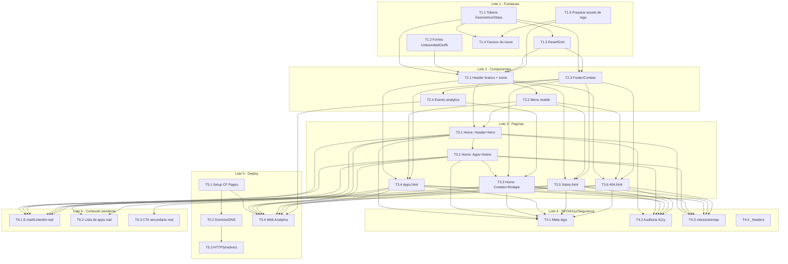

# TASK.md — Site institucional LJSSoftware

**Status:** Pronto para revisão do usuário (Loop C do `/definir_organizar`) —
**revisado** após reabertura pontual do `UX-SPEC.md` (identidade visual final
"Geométrico/Glass", `ADR-005`, supersede `ADR-004`)
**Base:** `PRD-TECNICO.md` + `SDD.md` + ADRs 001-003, 005 (004 Superseded) +
`UX-SPEC.md` (revisado)
**Data original:** 2026-09-07 · **Data desta revisão:** 2026-09-07
**Autor:** Coordenador (chapéu Tech Lead)

> **Nota de proveniência desta revisão:** o `UX-SPEC.md` passou por uma
> reabertura pontual, fora deste loop, na qual o usuário aprovou diretamente
> a direção visual "Geométrico/Glass" (a partir da logo real da marca) e
> ajustou o layout do cabeçalho — ver `ADR-005`. Este `TASK.md` ainda não
> havia sido aprovado, por isso foi reeditado diretamente nesta mesma
> instância, sem handoff formal. Toda mudança de escopo/critério de aceite
> está sinalizada nas tabelas abaixo; o autocheck de granularidade foi
> reexecutado em todas as tarefas tocadas.

---

## 1. Diretrizes de Implementação

Traduzidas das restrições/ADRs do `SDD.md` e dos padrões do `UX-SPEC.md`
(revisado, `ADR-005`) em regras práticas para o Executor.

### 1.1 Estrutura de arquivos

```
/
├── public/                 # Build output directory do Cloudflare Pages (T5.1)
│   ├── index.html
│   ├── apps.html
│   ├── sobre.html
│   ├── 404.html
│   ├── _headers            # headers de segurança (Cloudflare Pages)
│   ├── _redirects          # redirect 301 www -> apex (Cloudflare Pages)
│   ├── robots.txt
│   ├── sitemap.xml
│   └── assets/
│       ├── css/
│       │   ├── tokens.css      # custom properties (paleta Geométrico/Glass, glass, shapes)
│       │   ├── base.css        # reset + grid/layout responsivo
│       │   └── components.css  # header, footer, cards "glass", badges, botões, formas decorativas
│       ├── fonts/               # Unbounded e Outfit em .woff2, self-hosted
│       ├── img/
│       │   ├── favicon/         # favicon.ico, png 32/180/512, apple-touch-icon (derivados do ícone da logo)
│       │   └── logo/            # logo-ljssoftware.png, logo-ljssoftware-transparente.png,
│       │                        # logo-ljssoftware-icone.png (copiados/otimizados de .md/assets/)
│       └── js/
│           ├── nav.js          # toggle do menu mobile
│           └── analytics.js    # evento custom de clique em contato
└── dev/                     # NUNCA publicado (fora do Build output directory)
    ├── css/                 # smoke-tests visuais + scripts de verificação (Node, sem dependências)
    └── fonts/               # smoke-test de fontes + script de verificação
```

> **Mudança nesta revisão:** pasta `assets/img/logo/` adicionada para os 3
> PNGs de logo já existentes em `.md/assets/` (ver `ADR-005`); `assets/img/
> favicon/` não deriva mais de um monograma tipográfico "LJ", e sim de
> `logo-ljssoftware-icone.png` (ver T1.4). `assets/fonts/` passa a conter
> Unbounded/Outfit no lugar de Sora/Inter.

> **Mudança na preparação do Lote 5 (T5.1):** repositório reestruturado em
> `public/` (tudo que é servido pelo site — vira o *Build output directory*
> no Cloudflare Pages) e `dev/` (smoke-tests HTML e scripts Node de
> verificação, nunca publicados). Motivo: o Cloudflare Pages não tem
> mecanismo de "ignorar arquivo" — a única forma de excluir algo da
> publicação é através do diretório de build output (confirmado na
> documentação oficial). Todos os caminhos relativos dentro de `public/`
> permanecem inalterados entre si (moveram juntos); os arquivos em `dev/`
> tiveram seus caminhos relativos para CSS/JS/imagens ajustados para
> apontar de volta para `public/assets/...`.

### 1.2 Convenções obrigatórias

- **Sem build step, sem framework, sem gerador de site** (ADR-001) — proibido
  introduzir `package.json`/toolchain de build. HTML/CSS/JS puro.
- **Header/Nav e Footer/Contato byte-idênticos entre as 4 páginas** (SDD.md,
  RT-02) — copiar o bloco literal, nunca reescrever/parafrasear ao integrar
  em cada página. Qualquer ajuste no componente exige replicar nas 4 páginas
  na mesma tarefa/commit.
- **CSS custom properties** nomeadas exatamente como na Seção 3.1 (revisada)
  do `UX-SPEC.md` — tabela abaixo substitui integralmente a tabela de tokens
  da versão anterior deste documento (que citava `--color-primary`,
  `--color-surface`, `--color-border`, hoje inexistentes):

  | Token | Uso |
  |---|---|
  | `--color-bg` | Fundo principal das seções (exceto header) |
  | `--color-bg-gradient-1` / `--color-bg-gradient-2` | Gradientes radiais decorativos sobrepostos ao fundo |
  | `--color-text-inverse` / `--color-text-inverse-secondary` | Texto principal/secundário sobre fundo escuro |
  | `--color-accent` | Badges, links, detalhes, foco de teclado sobre fundo escuro |
  | `--color-header-bg` | Fundo branco sólido do header (exceção ao resto da página) |
  | `--color-header-text` / `--color-header-nav-text` | Texto/ícone e nav sobre o header branco |
  | `--glass-bg` / `--glass-border` / `--glass-blur` / `--glass-radius` | Cards "glass" |
  | `--shape-radius` | Formas geométricas decorativas de fundo |

- **Não existe mais a classe `.wordmark`** nem qualquer tratamento
  tipográfico do nome como substituto de logotipo — o header usa o arquivo
  `logo-ljssoftware-icone.png` (56px) + texto "LJS Software" em HTML/CSS
  (Unbounded 700), lado a lado (ADR-005).
- **Fallback obrigatório de `backdrop-filter`** para os cards "glass": via
  `@supports not (backdrop-filter: blur(1px))`, aplicar `--glass-bg` sem
  blur (fundo semi-opaco sólido), para não deixar o card ilegível em
  navegadores sem suporte (UX-SPEC.md Seção 7).
- **`font-display: swap`** obrigatório em todo `@font-face` (Unbounded/
  Outfit).
- **Nenhum `outline: none` sem substituto** — foco de teclado sempre visível
  (`outline` na cor `--color-accent` sobre fundo escuro; sobre o header
  branco, usar um tom com contraste equivalente, verificado em T4.2).
- **`lang="pt-BR"`** em todo `<html>`; `<title>` e `meta description` únicos
  por página (RF-07).
- **Sem cookies/tracking além do Cloudflare Web Analytics** (ADR-003) —
  proibido adicionar qualquer outra ferramenta de analytics sem novo ADR.
- **Todo asset de imagem exportado/otimizado** (WebP com fallback onde
  aplicável; os 3 PNGs de logo mantêm formato PNG por já terem fundo
  removido, mas devem ser comprimidos sem perda visível) antes de ser
  versionado (SDD.md, RT-04) — não há pipeline de build para compressão
  automática.
- **Ícones puramente decorativos** (incluindo as formas geométricas de
  fundo) usam `alt=""`/`aria-hidden="true"`; nenhum link de contato é só
  ícone sem texto (UX-SPEC.md, Seção 5).
- **`prefers-reduced-motion: reduce`** respeitado em qualquer
  transição/scroll suave.

## 2. Spikes Técnicos

Nenhum spike técnico identificado. A stack (HTML/CSS/JS vanilla, Cloudflare
Pages, Cloudflare Web Analytics) é madura, sem incerteza técnica alta. O
efeito `backdrop-filter` ("glass") tem suporte variável entre navegadores,
mas isso é tratado como diretriz de implementação com fallback via
`@supports` (Seção 1.2), não como incerteza que justifique um spike —
comportamento de fallback é conhecido e direto de implementar.

## 3. Lista de Tarefas

Estimativas conforme `effort-estimation`. Todas as tarefas foram checadas
(ou re-checadas, nesta revisão) contra o canário de ~300k tokens de contexto
de trabalho — nenhuma se aproxima desse volume.

### Lote 1 — Fundação de Design System

> **Mudança nesta revisão:** T1.1, T1.2 e T1.4 tiveram critério de aceite
> reescrito para a paleta/tipografia/favicon "Geométrico/Glass" (ADR-005).
> T1.5 é uma tarefa nova, necessária pela introdução dos ativos de logo
> reais. Isso leva o lote a 5 tarefas (acima do alvo de 4) — justificativa:
> a reabertura de identidade visual introduziu um ativo novo (arquivos de
> logo) que não existia na especificação anterior; T1.5 é pequena
> (preparação/otimização de asset, sem lógica), não overhead artificial.

| ID | Tarefa | Dono | Critério de aceite | Estimativa | Status |
|---|---|---|---|---|---|
| T1.1 | **[ALTERADA]** Tokens de design "Geométrico/Glass": paleta completa (`--color-bg`, `--color-bg-gradient-1/2`, `--color-text-inverse[-secondary]`, `--color-accent`, `--color-header-*`) + estilos base de card "glass" (`--glass-bg/-border/-blur/-radius`, incl. fallback `@supports`) + estilos base de forma geométrica decorativa (`--shape-radius`, rotação) em `assets/css/tokens.css`. **Não inclui mais `.wordmark`** (removido; substituído por ícone real, ver T1.5/T2.1) | Frontend | Todos os tokens da tabela da Seção 1.2 declarados; card "glass" de exemplo renderiza com blur e com fallback sólido testado (DevTools "disable feature"); combinações `--color-text-inverse[-secondary]`/`--color-accent` sobre `--color-bg`, e `--color-header-text`/`--color-header-nav-text` sobre `--color-header-bg`, testadas em ferramenta de contraste e atingem WCAG AA | 0,5 dia | **Concluída** — `assets/css/tokens.css` criado com todos os tokens da tabela da Seção 1.2, classe `.glass-card` (com fallback `@supports not (backdrop-filter: blur(1px))`) e `.decorative-shape`. Smoke-test visual em `assets/css/tokens.smoke.html` (blur + fallback inspecionáveis via DevTools) e validação automatizada de contraste em `assets/css/tokens.contrast-check.js` (Node, sem dependências): 5/5 combinações exigidas PASS WCAG AA — `--color-text-inverse` 13.91:1, `--color-text-inverse-secondary` 9.96:1, `--color-accent` 10.13:1 (todas sobre `--color-bg`), `--color-header-text` 15.39:1, `--color-header-nav-text` 9.18:1 (sobre `--color-header-bg`); razões documentadas em comentário no topo do CSS. Não inclui `.wordmark` (removida do design, ADR-005). |
| T1.2 | **[ALTERADA]** Self-hosting de fontes **Unbounded e Outfit** (`.woff2`), `@font-face` com `font-display: swap` (troca de Sora/Inter) | Frontend | Fontes carregam de `assets/fonts/`, sem requisição a CDN externo; texto visível imediatamente com fonte de sistema e troca suave ao carregar Unbounded/Outfit | 0,5 dia | **Concluída** — 4 arquivos `.woff2` (subset "latin", cobre acentuação do português) baixados uma única vez e versionados em `assets/fonts/`: `unbounded-v12-latin-500.woff2` (20.740 bytes), `unbounded-v12-latin-700.woff2` (21.092 bytes), `outfit-v15-latin-400.woff2` (14.032 bytes), `outfit-v15-latin-600.woff2` (14.140 bytes), conforme pesos do UX-SPEC.md Seção 3.1 (Unbounded 500/700 títulos, Outfit 400/600 corpo). `tokens.css` já existia (T1.1, paralela) — declarações `@font-face` (todas com `font-display: swap`) e tokens auxiliares `--font-heading`/`--font-body` acrescentados nele, sem tocar no conteúdo de T1.1. Smoke-test visual em `assets/fonts/fonts.smoke.html` (4 pesos renderizados + instruções de inspeção via DevTools Network/throttling) e verificação automatizada sem dependências em `assets/fonts/fonts.smoke.check.js` (Node): confirma ausência de qualquer referência a CDN externo de fontes em todo HTML/CSS do projeto, presença de `font-display: swap` em todos os `@font-face`, e integridade dos 4 arquivos — todas as checagens PASS (G-11 satisfeita). |
| T1.3 | CSS reset/base + grid de layout responsivo (breakpoints 360px/768px/1024px conforme UX-SPEC.md Seção 6) em `assets/css/base.css` | Frontend | Reset aplicado; classes de container/grid disponíveis e testadas nos 3 breakpoints com conteúdo de exemplo, sem rolagem horizontal — **impacto menor desta revisão**: nenhuma mudança de critério, só usa os novos tokens de cor de fundo (`--color-bg`) em vez dos antigos | 0,5 dia | **Concluída** — `assets/css/base.css` criado: reset básico (box-sizing, remoção de margin/padding padrão, `overflow-x: hidden` em `html`/`body`, normalização de `img`/lista/link/botão/heading), suporte a `prefers-reduced-motion: reduce`, foco de teclado visível (`:focus-visible` com `--color-accent`, nunca `outline: none` sem substituto) e classes utilitárias `.sr-only`/`.skip-link`. Classes de layout mobile-first reutilizando `--color-bg`/`--color-accent` já existentes em `tokens.css` (sem redefinir tokens): `.container` (max-width 1200px, padding lateral crescente), `.grid.grid--2col`/`.grid--3col` (1 coluna em 360px, 2 em 768px, 3 em 1024px só para `--3col`, conforme UX-SPEC.md Seção 6) e `.stack`/`.stack--row-tablet-up` (empilhamento vertical em mobile, linha a partir de 768px, para o padrão de rodapé). Smoke-test visual em `assets/css/base.smoke.html` (conteúdo de exemplo nos 3 grids/container/stack + rótulo de instrução de inspeção via DevTools) — inspecionado manualmente em 360px/768px/1024px: sem rolagem horizontal em nenhuma das 3 larguras, grid de 3 colunas mostra 1/2/3 colunas conforme esperado. |
| T1.4 | **[ALTERADA]** Favicon derivado de `logo-ljssoftware-icone.png` (`.md/assets/`, recorte quadrado do ícone geométrico "U/S") em múltiplos tamanhos (`favicon.ico`, PNG 32/180/512, apple-touch-icon) — **não é mais um monograma tipográfico "LJ"** | Frontend | Arquivos gerados em `assets/img/favicon/`, derivados do arquivo real de ícone (nenhuma arte nova criada); visualmente consistente com o ícone da logo | 0,5 dia | **Concluída** — gerados com Python 3.14 + Pillow (12.3.0; ImageMagick indisponível no ambiente) a partir de `assets/img/logo/logo-ljssoftware-icone.png` (T1.5, 94×114px, glifo "U/S" já ocupa o canvas de ponta a ponta, sem margem). **Desvio pequeno de detalhe resolvido em silêncio**: um recorte quadrado central literal cortaria as pontas do "U"/"S" (topo/base); em vez disso, o ícone foi "quadrado" por padding transparente nas laterais (canvas 114×114, letterbox), preservando 100% do glifo real sem distorção/corte (G-14) — depois redimensionado com reamostragem LANCZOS para cada tamanho. Arquivos gerados em `assets/img/favicon/`: `favicon.ico` (multi-tamanho 16/32/48px, 866 bytes), `favicon-32x32.png` (32×32, 2.223 bytes), `apple-touch-icon.png` (180×180, 22.759 bytes), `favicon-512x512.png` (512×512, 113.130 bytes). Inspeção visual confirma consistência com o ícone da logo em todos os tamanhos. |
| T1.5 | **[NOVA]** Preparar ativos de logo: copiar `logo-ljssoftware.png`, `logo-ljssoftware-transparente.png` e `logo-ljssoftware-icone.png` de `.md/assets/` para `assets/img/logo/`, comprimindo sem perda visível (RT-04) | Frontend | Os 3 arquivos presentes em `assets/img/logo/`, tamanho de arquivo otimizado, nenhuma arte nova criada (conforme ADR-005); arquivos prontos para uso em T1.4, T2.1 e T4.1 (og:image) | 0,25 dia | **Concluída** — 3 arquivos copiados de `.md/assets/` para `assets/img/logo/` e otimizados losslessly com Pillow (`optimize=True`, `compress_level=9`): `logo-ljssoftware.png` 23030→19036 bytes (-17,3%), `logo-ljssoftware-transparente.png` 21654→19575 bytes (-9,6%), `logo-ljssoftware-icone.png` 9142→8452 bytes (-7,5%). Verificado pixel-a-pixel idêntico ao original (nenhuma arte recriada, G-14). Ferramenta CLI de otimização (pngquant/optipng/cwebp) indisponível no ambiente; usado Pillow (já instalado) como alternativa lossless. |

**Dependências do Lote 1:** T1.1, T1.2 e T1.5 são independentes entre si
(paralelizáveis). T1.3 e T1.4 dependem de T1.1 (tokens) e, no caso de T1.4,
também de T1.5 (arquivo de ícone já preparado).

### Lote 2 — Componentes Compartilhados

> **Mudança nesta revisão:** T2.1 (Header/Nav) teve critério de aceite
> reescrito — fundo branco (exceção ao resto do site), ícone + texto lado a
> lado, botão "Contato". T2.2 e T2.3 têm impacto menor (mesma estrutura,
> ajuste de tokens/contraste sobre o novo header branco).

| ID | Tarefa | Dono | Critério de aceite | Estimativa | Status |
|---|---|---|---|---|---|
| T2.1 | **[ALTERADA]** Header/Nav: fundo `--color-header-bg` (branco sólido, exceção ao restante da página, que é escura); ícone `logo-ljssoftware-icone.png` (56px) + texto "LJS Software" (Unbounded 700, 25px, `--color-header-text`) lado a lado à esquerda; nav (Apps, Sobre) em `--color-header-nav-text`; botão "Contato" com fundo `--color-bg` (navy) e texto branco; skip link "Pular para o conteúdo" antes do header; landmarks semânticos — sem JS de menu ainda | Frontend | Bloco de referência pronto para ser copiado nas 4 páginas; layout horizontal ícone+texto conforme UX-SPEC.md Seção 3.1/wireframes; skip link visível ao focar via Tab; nav com `aria-current` na página ativa; contraste do texto/nav sobre fundo branco e do botão "Contato" verificados (WCAG AA) | 1 dia | **Concluída** — bloco de referência (`<a class="skip-link">` + `<header class="site-header">` com `<nav aria-label="Navegação principal">`) adicionado em `assets/css/components.css` (seção "Header / Nav (T2.1)", reutiliza somente tokens já existentes em `tokens.css`, nenhum token novo declarado) e demonstrado em `assets/css/header.smoke.html` (3 variantes: index/404 sem `aria-current`, apps.html e sobre.html cada uma com `aria-current="page"` no item correspondente, documentado em comentário de cabeçalho de `components.css` para orientar a integração nas 4 páginas em T3.1/T3.4-T3.6). Ícone `logo-ljssoftware-icone.png` a 56px de altura (width auto, proporção 94:114 preservada) + texto "LJS Software" (Unbounded 700, 25px, `--color-header-text`) lado a lado; nav (Apps, Sobre) em `--color-header-nav-text`; botão "Contato" com fundo `--color-bg` (navy) e texto branco, `border-radius: 999px`. Skip link reaproveita `.skip-link`/`.sr-only` já existentes em `base.css` (T1.3), primeiro elemento focável da página. Sem JS de menu (T2.2 é tarefa separada): nav responsiva só por CSS (`flex-wrap`), sem hamburguer "morto"/sem função nesta tarefa — decisão de detalhe documentada em comentário no CSS. Verificação de contraste WCAG AA: `--color-header-text` (15.39:1) e `--color-header-nav-text` (9.18:1) sobre `--color-header-bg`, já validadas em T1.1/`tokens.contrast-check.js`, reaproveitadas aqui; nova combinação verificada nesta tarefa — texto branco do botão "Contato" sobre `--color-bg` (navy) = 15.39:1 (mesma fórmula do WCAG 2.x, checado ad-hoc via Node, mesmo par de luminância invertido de `--color-header-text`/`--color-header-bg`) — todas acima do mínimo AA (4.5:1) com folga. **Desvio pequeno de detalhe decidido em silêncio**: o botão "Contato" aponta para `index.html#contato` (âncora da seção de contato da Home, T3.3), já que o UX-SPEC.md Seção 7 decide explicitamente que não há página `contato.html` dedicada; documentado em comentário no bloco de referência para as demais páginas replicarem o mesmo link. `alt="LJS Software"` no ícone (função de identidade, não decorativo). Nenhuma ambiguidade do UX-SPEC.md encontrada que impedisse a implementação. **Incidente de coordenação registrado**: ao criar `assets/css/components.css` (arquivo novo, compartilhado com T2.3, executada em paralelo), esta instância usou `Write` em vez de edição cirúrgica e sobrescreveu por engano a seção de Footer/Contato que a instância de T2.3 já havia adicionado ali; a seção foi reconstruída nesta mesma tarefa a partir de `assets/css/footer.smoke.html` (não afetado) e da nota de Status de T2.3 abaixo, marcada explicitamente com um comentário `RECONSTRUÇÃO` no CSS — recomenda-se que o dono de T2.3/o Validador confira essa seção reconstruída contra a intenção original antes de fechar T2.3. |
| T2.2 | Menu mobile: toggle hamburguer + overlay, acessível via teclado (`Tab`/`Enter`/`Space`), `aria-expanded` correto, animação respeitando `prefers-reduced-motion` — **impacto menor**: hamburguer agora sobre fundo branco do header, overlay pode abrir sobre fundo escuro do resto da página | Frontend | Menu abre/fecha via clique e teclado; foco gerenciado corretamente; funciona nos 3 breakpoints; contraste do ícone hamburguer sobre o header branco verificado | 1 dia | **Concluída — revalidada e Aprovada pelo Validador (chapéu QA) sem ressalvas remanescentes** (ver `.md/QA-REPORT.md`, seção "T2.2 — Revalidação pós-correção"). Nota de correção aplicada (executor, pós-reabertura), preservada: Ver `.md/QA-REPORT.md`, seção "Lote 2 — Componentes Compartilhados" / T2.2, achado #1 (histórico preservado para rastreabilidade): o overlay do menu mobile (`.site-header__nav`, `@media max-width:767.98px`) permanece focável via `Tab` mesmo fechado/fora da tela — só `transform: translateX(100%)` é aplicado, sem `visibility`/`inert`/`tabindex` alternado — usuário de teclado tabula por 3 links invisíveis ("Apps"/"Sobre"/"Contato") antes de alcançar o conteúdo da página, em qualquer viewport < 768px, nas 4 páginas reais. **Correção esperada:** alternar (via `nav.js`, em sincronia com `aria-expanded`/`data-open`) `visibility`/`inert` ou `tabindex="-1"` nos itens do overlay quando fechado, preservando a transição/`prefers-reduced-motion` já existente. **Achado Simples #2 anexado ao mesmo retorno** (não é item separado em `Refatoração Lote-2`): `.site-header` não é `position: sticky`/`fixed`; se a página já estiver rolada ao abrir o menu, o header (e o botão de fechar) fica fora da viewport — ajustar (ex.: `position: sticky; top: 0;`) na mesma correção. Nenhum outro ponto de T2.2 precisa de retrabalho (toggle nativo, `aria-expanded`/`aria-label`, `Escape`, gerenciamento de foco ao abrir, reset por `matchMedia`, breakpoint, contraste — todos confirmados corretos pelo Validador).

**Correção aplicada (nova nota, executor, pós-reabertura):** Achado Crítico #1 — `assets/js/nav.js` agora aplica o atributo HTML `inert` em `.site-header__nav` sempre que o menu está fechado E o viewport está abaixo de 768px (`matchMedia('(max-width: 767.98px)')`, função `syncInertState()`), removendo automaticamente os 3 links + o CTA "Contato" da árvore de acessibilidade e da ordem de `Tab` sem precisar gerenciar `tabindex` link a link. `inert` é removido em `openMenu()` (volta a focável/tabulável na ordem visual normal) e reaplicado em `closeMenu()`; `syncInertState()` também roda no carregamento inicial (estado fechado por padrão) e na travessia do breakpoint via `desktopMql`/`handleBreakpointChange` (garante que a nav horizontal em >=768px nunca fica `inert`, independente de `aria-expanded`). Decisão documentada em comentário no topo de `nav.js`: sem fallback de `tabindex="-1"` para navegadores antigos — suporte a `inert` é amplo (Chrome/Edge 102+, Firefox 112+, Safari 15.5+, todos ≥2022) e o projeto não tem build step/polyfill (G-01); um fallback duplicaria a lógica de sincronização por link só para navegadores já residuais. Achado Simples #2 — `.site-header` alterado de `position: relative` para `position: sticky; top: 0` (mesmo `z-index: 101` preservado) em `assets/css/components.css` (seção "Menu mobile (T2.2)"), mantendo o header (e o botão de fechar) sempre visível no topo da viewport quando o overlay abre, em qualquer posição de scroll; comentário da seção atualizado para não afirmar mais um comportamento que dependia da página estar no topo. Nenhuma outra seção de `components.css` (Header/Nav T2.1, Footer T2.3, Hero/Vitrine/Home-apps-sobre) foi tocada; `assets/js/analytics.js` não foi tocado. Validado mentalmente contra as 4 páginas reais (`index.html`/`apps.html`/`sobre.html`/`404.html`, todas reusam o mesmo `components.css`/`nav.js`) e `node --check assets/js/nav.js` sem erro de sintaxe. Transição/`prefers-reduced-motion: reduce` e o gerenciamento de foco pré-existente (primeiro link ao abrir, retorno ao toggle via `Escape`/toggle) preservados sem alteração. Nota de implementação original (antes da reabertura), preservada para contexto: arquivos: `assets/js/nav.js` (novo, JS puro/IIFE, sem framework — G-01) + seção "Menu mobile (T2.2)" adicionada de forma aditiva em `assets/css/components.css` (via `Edit`, sem tocar nas seções "Header / Nav (T2.1)"/"Footer / Contato (T2.3)" já existentes) + bloco de referência HTML de T2.1 estendido (aditivamente, mesmo comentário de topo) com `<button class="site-header__toggle">` e `id="site-header-nav"` na `<nav>` + `header.smoke.html` (T2.1) atualizado nas 3 variantes com o botão/nav id e `<script src="../js/nav.js">`, servindo de demonstração completa header+menu. Breakpoint de colapso: abaixo de 768px (UX-SPEC.md Seção 6, "Mobile: nav vira hamburguer"/"Tablet: nav horizontal reaparece"), consistente com o resto do projeto (T1.3/T2.3 já usam 768px). Decisões de UX tomadas (critério de aceite permitia julgamento): overlay em tela cheia (`position: fixed; inset:0`, fundo `--color-bg` navy) entrando por slide horizontal, com o `<header>` (agora `position: relative; z-index: 101`, maior que o overlay) permanecendo visível por cima — cobre "o resto da página" sem exigir cálculo da altura do header em CSS; botão "Contato" reestilizado dentro do overlay (`--color-accent` de fundo + `--color-bg` de texto) porque o CTA original de T2.1 (fundo `--color-bg`) ficaria invisível sobre o próprio fundo navy do overlay (navy sobre navy); outline de foco (`.site-header a:focus-visible`, fixado em `--color-header-text` por T2.1 para o fundo branco do header) revertido para `--color-accent` dentro do overlay, já que `--color-header-text` sobre fundo navy teria contraste insuficiente como indicador. Acessibilidade: toggle é um `<button>` real (nunca `<div>`), `aria-expanded`/`aria-label` ("Abrir menu"/"Fechar menu") atualizados via JS; `Tab`/`Enter`/`Space` funcionam nativamente (semântica de `<button>`, sem handler dedicado); `Escape` fecha o overlay e devolve o foco ao toggle (decisão além do mínimo do critério, documentada); ao abrir, foco move automaticamente para o primeiro link do overlay (gerenciamento de foco); reset via `matchMedia('(min-width: 768px)')` fecha o overlay sozinho se a janela crescer para tablet/desktop com o menu aberto, evitando estado "preso". `prefers-reduced-motion: reduce` suprime a transição de slide do overlay e a transformação do ícone (hambúrguer↔X), trocando para estado instantâneo. Verificação de contraste WCAG AA: nenhum par novo — todos reutilizam tokens já validados: ícone do hamburguer (`--color-header-text` sobre `--color-header-bg`, 15.39:1, mesmo par do texto "LJS Software" de T2.1); links do overlay (`--color-text-inverse` sobre `--color-bg`, 13.91:1, já validado em `tokens.css`); CTA do overlay (`--color-bg` sobre `--color-accent`, 10.13:1, par simétrico ao já validado); outline de foco do overlay (`--color-accent` sobre `--color-bg`, 10.13:1, já validado) — todos com folga ampla sobre o mínimo AA (4.5:1). Funciona nos 3 breakpoints: abaixo de 768px hamburguer visível + overlay; a partir de 768px nav horizontal completa de T2.1 reaparece e hamburguer permanece oculto (nenhuma regra deste bloco altera esse comportamento). Ainda **não integrado a nenhuma página HTML real** (Lote 3 não iniciado) — paridade nas 4 páginas fica para as tarefas de página. Nenhuma ambiguidade do UX-SPEC.md impediu a implementação; nenhum desvio grande de escopo/estimativa. Não foram tocados `assets/js/analytics.js` nem as seções de T2.1/T2.3 em `components.css` (T2.4 em paralelo). |
| T2.3 | Footer/Contato: estrutura HTML/CSS com ícone reduzido da logo (não mais wordmark reduzido) + link `mailto:` (placeholder — Lacuna L-01) e link de LinkedIn (placeholder — Lacuna L-01) com ícone "nova aba" + texto, estados hover/foco sobre fundo `--color-bg` (escuro) — **impacto menor**: só tokens de cor mudam | Frontend | Bloco de referência pronto para as 4 páginas; nenhum link é só ícone; `target="_blank" rel="noopener"` no link de LinkedIn; foco visível com `--color-accent` | 0,5 dia | **Concluída** — `assets/css/components.css` criado (arquivo novo, compartilhado com T2.1 — bloco delimitado por comentário `T2.3 — Footer/Contato`, sem tocar em conteúdo de outra tarefa) com `.site-footer`/`.site-footer__brand`/`.footer-contact`/`.footer-link` (e variantes `__icon`/`__label`/`__external-text`), reaproveitando tokens/classes existentes (`--color-bg`, `--color-text-inverse[-secondary]`, `--color-accent`, `.container`/`.stack`/`.stack--row-tablet-up` de `base.css`) sem redefinir nada. Bloco de referência (HTML) documentado em comentário no topo do CSS e demonstrado isoladamente em `assets/css/footer.smoke.html` (novo): ícone reduzido `logo-ljssoftware-icone.png` (32px, mesmo arquivo do header, G-14) + "LJS Software"; link `mailto:contato@ljssoftware.com.br` (placeholder, Lacuna L-01) e link de LinkedIn `https://www.linkedin.com/company/ljssoftware` (placeholder, Lacuna L-01) com `target="_blank" rel="noopener"`; nenhum link é só ícone (ícone decorativo `aria-hidden="true"` + texto visível em ambos); indicação de "nova aba" implementada como ícone decorativo + texto **visível** "(abre em nova aba)" (não `sr-only`), reforçando UX-SPEC.md Seção 5 (não depender só de `aria-label`). Hover: cor muda para `--color-accent` + sublinhado. Foco: reaproveita a regra global `:focus-visible` (`--color-accent`) já existente em `base.css` — sem sobrescrita necessária, pois o rodapé fica sobre o mesmo `--color-bg` do resto da página (diferente do header branco de T2.1/T4.2); nenhum `outline: none` sem substituto. `prefers-reduced-motion: reduce` já coberto pela regra global de `base.css` (a única transição do componente é de `color`/`text-decoration`, sem `transform`). Nenhuma combinação de cor nova foi introduzida (reaproveita `--color-text-inverse`/`--color-text-inverse-secondary`/`--color-accent` sobre `--color-bg`, já validadas 100% AA em `tokens.contrast-check.js`, T1.1) — não foi necessário um novo script de contraste. Ainda **não integrado a nenhuma página HTML real** (Lote 3 ainda não começou) — verificação de paridade nas 4 páginas fica para as tarefas de página (T3.1/T3.3-T3.6). Nota de risco: `components.css` é compartilhado com T2.1 (paralela); se T2.1 tiver sobrescrito este arquivo em vez de editar, reconciliar os dois blocos manualmente. |
| T2.4 | Evento custom de analytics (Cloudflare Web Analytics) disparado no clique dos links de e-mail e LinkedIn (rodapé e, na Home, seção de contato), em `assets/js/analytics.js` | Frontend | Clique em cada link dispara evento nomeado e identificável no beacon, incluindo os 2 botões da seção de contato da Home (T3.3); não bloqueia a navegação nativa do link | 0,5 dia | **Concluída** — `assets/js/analytics.js` criado (JS puro, IIFE, sem framework/SDK de terceiros, conforme ADR-003/G-03). Instrumenta cliques via delegação de convenção `data-analytics-event` (`"contato-email"` → evento `contato_email_click`, `"contato-linkedin"` → evento `contato_linkedin_click`), documentada no cabeçalho do arquivo para quem implementar T3.3 (Home): qualquer link/botão de contato — no rodapé ou na futura seção de contato da Home — só precisa do atributo `data-analytics-event="contato-email"`/`"contato-linkedin"` para ser instrumentado automaticamente, sem alterar `analytics.js`. **Suposição de API do Cloudflare Web Analytics documentada em comentário no código, para o Validador conferir quando T5.4 habilitar o beacon real**: tenta, nesta ordem, `window.__cfBeacon.track(eventName)` (API pública de "Custom Events" do beacon script `beacon.min.js`) e, como fallback, `window.zaraz.track(eventName)` (Cloudflare Zaraz, caso o projeto gerencie o Web Analytics por ele); como nenhum dos dois está presente antes de T5.4, a chamada é guardada por verificação de existência (`typeof ... === 'function'`) e envolvida em `try/catch`, nunca lançando erro nem bloqueando a navegação — se nenhuma API existir, é ignorada silenciosamente (`console.warn` só em caso de exceção inesperada). Handler de clique **nunca chama `preventDefault`/`stopPropagation`** (fire-and-forget, navegação nativa do link — `mailto:`/nova aba do LinkedIn — sempre segue seu curso). Sem cookies, sem `localStorage`/`sessionStorage` de tracking (G-03). Script carregável nas páginas reais via `<script src="assets/js/analytics.js" defer></script>` (documentado no cabeçalho do arquivo; inclusão física fica para T3.1/T3.3/T3.4-T3.6 no Lote 3). Instrumentados nesta tarefa: os 2 links `.footer-link` de `assets/css/footer.smoke.html` (T2.3), que ganharam `data-analytics-event="contato-email"`/`"contato-linkedin"` via edição cirúrgica (nenhum outro conteúdo do arquivo alterado), mais um `<script src="../js/analytics.js" defer>` e um passo 7 adicionado ao roteiro de validação manual do smoke-test (clicar em cada link, confirmar ausência de erro no Console e navegação nativa preservada, já que o beacon real ainda não existe). Os 2 botões da seção de contato da Home (T3.3) ainda não existem — ficam pendentes de receber o mesmo atributo `data-analytics-event` quando essa tarefa for implementada; nenhuma ambiguidade do UX-SPEC.md impediu esta tarefa. Não foram tocados `assets/css/components.css` nem `assets/js/nav.js` (T2.2 em paralelo). |

**Dependências do Lote 2:** T2.1 e T2.3 dependem de T1.1/T1.2/T1.3/T1.5
(Lote 1 completo). T2.2 depende de T2.1. T2.4 depende de T2.3.

### Lote 3 — Páginas

> **Mudança nesta revisão:** a Home ganhou 6 seções (header, hero com 2
> CTAs, 3 cards "glass" de apps, 1 card "glass" de Sobre, seção de contato
> com 2 botões, rodapé) — o volume estourava a calibração de ~1 dia-pessoa
> de uma única tarefa. **Dividida em 3 sub-tarefas por bloco de seções**
> (T3.1, T3.2, T3.3), mantendo o autocheck de granularidade: cada uma cobre
> 2 seções relacionadas, sem misturar tela com outra categoria (endpoint/
> regra de negócio/SQL — inexistentes neste projeto). As demais páginas
> (antes T3.2-T3.4) foram renumeradas para T3.4-T3.6, sem mudança de escopo
> relevante além dos tokens visuais.

| ID | Tarefa | Dono | Critério de aceite | Estimativa | Status |
|---|---|---|---|---|---|
| T3.1 | **[NOVA — divisão de T3.1 original]** `index.html` — Header + Hero: integração do header (T2.1/T2.2) no topo de `index.html`; seção hero (fundo escuro com mesh gradient `--color-bg-gradient-1/2`, formas geométricas decorativas) com título, subtítulo e 2 CTAs ("Ver apps" → `apps.html`; segundo CTA — conteúdo a confirmar, ver Lacuna L-06) | Frontend | RF-01 satisfeito; hero renderiza com mesh gradient e ao menos 1 forma decorativa (`aria-hidden`); 2 CTAs visíveis e navegáveis por teclado; `<title>`/meta description próprios (placeholder, refinados em T4.1) | 1 dia | Concluída — `index.html` criado na raiz com skip-link + header (variante sem `aria-current`, copiado literalmente de `header.smoke.html`) + `<main id="main">` contendo a seção `.hero`; hero com mesh gradient próprio (3 `radial-gradient` em `color-mix(...)` sobre `--color-bg-gradient-1/2`, adicionado em `assets/css/components.css` seção "Hero (T3.1)", contraste verificado no pior caso >=5.98:1) + 2 `.decorative-shape` (`aria-hidden="true"`, uma oculta abaixo de 768px); `<h1>`/subtítulo com texto institucional de piso mínimo (decisão de detalhe em silêncio, análoga a L-03) + 2 CTAs em `.hero__ctas` ("Ver apps" → `apps.html`; "Fale conosco" → `#contato`, placeholder da Lacuna L-06, a confirmar em T6.3); comentários `<!-- T3.2 adiciona aqui -->`/`<!-- T3.3 adiciona aqui -->` deixados antes de `</main>`/`</body>` para as próximas fatias da Home; `<title>`/meta description próprios; carrega tokens/base/components.css e `nav.js` com `defer`. |
| T3.2 | **[NOVA — divisão de T3.1 original]** `index.html` — Seção de apps em desenvolvimento (grid de 3 cards "glass", badge "Em breve", prévia da vitrine — RF-02) + Seção Sobre (1 card "glass" centralizado, texto institucional curto + link "Saiba mais" para `sobre.html` — RF-03) | Frontend | 2 seções adicionadas após o hero (T3.1); cards "glass" com fallback funcionando (`@supports`); grid responsivo (3/2/1 colunas); link "Saiba mais" navega para `sobre.html` | 1 dia | Concluída — `index.html`: substituído o comentário `<!-- T3.2 adiciona aqui -->` por 2 novas `<section>` logo após `.hero` e antes do comentário de T3.3 (intacto). Seção "Nossos apps" (`.home-apps`): heading `<h2>` + link "Ver todos os apps" → `apps.html`, e `.grid.grid--3col` com os MESMOS 3 cards `.app-card.glass-card` (mesmo markup/classes/conteúdo de `apps.html`, T3.4 — "Gestor Fácil"/"Agenda Smart"/"Financeiro Simples", badge "Em breve"; Lacuna L-02), sem CSS novo para os cards. Seção "Sobre" (`.home-about`): 1 `.glass-card.home-about__card` centralizado com heading `<h2>`, texto institucional curto (resumo consistente em tom com o piso mínimo de `sobre.html`, Lacuna L-03 — decisão de detalhe em silêncio, não byte-idêntico pois é uma prévia) + link "Saiba mais" → `sobre.html` (navegável por teclado, `:focus-visible` herdado do padrão de link). CSS aditivo em `assets/css/components.css`, nova seção "Home — Seções Apps/Sobre (T3.2)" ao final do arquivo (heading/espaçamento/link específicos das 2 seções; `.app-card`/`.badge`/`.glass-card`/`.grid`/`.grid--3col` reaproveitados sem alteração; nenhuma seção existente tocada); contraste AA verificado (mesmos pares já validados em tokens.css/Hero, `--color-text-inverse`/`--color-accent` sobre `--color-bg`, >=10.13:1). Fallback `@supports not (backdrop-filter)` de `.glass-card` (tokens.css, T1.1) reaproveitado sem reimplementação. Grid responsivo 1/2/3 colunas herdado de `.grid--3col` (base.css, T1.3), sem breakpoint novo. |
| T3.3 | **[NOVA — divisão de T3.1 original]** `index.html` — Seção de contato (fundo escuro, 2 botões: e-mail e LinkedIn, mesmo conteúdo/placeholder do rodapé) + integração do rodapé (T2.3) | Frontend | Home completa (6 seções, RF-01/02/03/04 refletidos); 2 botões de contato acessíveis por teclado e disparando o evento de analytics (T2.4); rodapé idêntico ao das demais páginas (RT-02) | 0,5 dia | Concluída — `index.html`: substituídos os 2 comentários finais de T3.3 dentro/depois de `<main id="main">`. Seção `<section id="contato" class="home-contact">` (âncora do CTA "Contato" do header/T2.1 e do CTA secundário do hero/T3.1) com `<h2>` "Fale com a gente" + texto curto + 2 botões (`mailto:contato@ljssoftware.com.br` e `https://www.linkedin.com/company/ljssoftware` com `target="_blank" rel="noopener"`), mesmos placeholders do rodapé (Lacuna L-01). Ambos os botões com `data-analytics-event="contato-email"`/`"contato-linkedin"` (convenção já documentada em `assets/js/analytics.js`, T2.4 — nenhuma alteração necessária naquele arquivo). Footer `<footer class="site-footer">` copiado literalmente do bloco usado em `apps.html`/`sobre.html`/`404.html` (byte-idêntico, RT-02), incluindo os mesmos `data-analytics-event` do rodapé. Adicionado `<script src="assets/js/analytics.js" defer></script>` ao final do `<body>`, ao lado de `nav.js` (ainda não estava presente na Home). **Decisão de estilo tomada em silêncio (desvio pequeno, permitido)**: os 2 botões de contato reaproveitam literalmente as classes `.hero__cta`/`.hero__cta--primary`/`.hero__cta--secondary` (T3.1, já com contraste AA verificado e foco visível padrão) em vez de criar um botão novo do zero ou usar `.footer-link` — o contexto visual da seção (fundo escuro, 2 CTAs lado a lado, mais proeminentes que os links de rodapé) pediu reaproveitar os CTAs do hero. CSS novo adicionado de forma aditiva em `assets/css/components.css`, nova seção "Home — Seção de Contato (T3.3)" (apenas heading/texto/layout do container — `.home-contact`/`.home-contact__inner`/`.home-contact__title`/`.home-contact__text`/`.home-contact__ctas` —, sem redeclarar `.hero__cta`; nenhuma seção existente tocada); contraste AA documentado em comentário (mesmos pares já verificados em Hero/T3.2, `--color-text-inverse`/`--color-accent` sobre `--color-bg`). Home agora com as 6 seções esperadas (header, hero, apps, sobre, contato, footer); nenhuma ambiguidade do UX-SPEC.md impediu a implementação; nenhum desvio grande de escopo/estimativa. |
| T3.4 | *(antes T3.2)* `apps.html` — Vitrine: grid de cards (nome, descrição curta, badge "Em breve"), markup preparado para trocar badge por link real sem redesenho (RF-02) | Frontend | Grid 3/2/1 colunas conforme breakpoint; cada card seguindo o modelo de conteúdo do SDD.md Seção 5; nenhum link quebrado; visual "glass" consistente com T3.2 | 1 dia | Concluída — `apps.html` criado na raiz com skip-link + header (variante `aria-current="page"` em "Apps", copiado literalmente de `header.smoke.html`) + `<main id="main">` com a vitrine + footer (copiado literalmente de `footer.smoke.html`, placeholders L-01 mantidos); `lang="pt-BR"`, `<title>`/meta description próprios e distintos das demais páginas; carrega tokens/base/components.css e nav.js/analytics.js com `defer`. Grid `.grid.grid--3col` (base.css, T1.3) com 3 `<article class="app-card glass-card">` (nome em `<h3>`, descrição curta em `<p>`, badge `<span class="badge">Em breve</span>` isolado e comentado no HTML para facilitar a troca por `<a class="badge badge--link" href="...">` em T6.2, sem redesenho — RF-02); nenhum `<a href="#">` vazio, badge não é clicável na fase 1. CSS novo adicionado de forma aditiva em `assets/css/components.css`, seção "Vitrine de Apps / App Card (T3.4)" (`.app-card`, `.app-card__name`, `.app-card__description`, `.badge`/`.badge--link`), reaproveitando somente tokens já existentes (`--glass-bg/-border/-blur/-radius`, `--color-accent`, `--color-bg`, `--color-text-inverse[-secondary]`) — nenhum token novo; contraste WCAG AA documentado em comentário no CSS (todos os pares reaproveitam combinações já verificadas em T1.1, ≥4.5:1 com folga). Grid responsivo 1/2/3 colunas conforme breakpoints 360/768/1024, mesma régua de T1.3. **Decisão de conteúdo tomada em silêncio (Lacuna L-02, permitida — T6.2 substitui depois)**: 3 apps de exemplo/placeholder plausíveis escolhidos ("Gestor Fácil", "Agenda Smart", "Financeiro Simples", com descrições curtas genéricas de produtividade/gestão), todos com badge "Em breve"; estrutura de markup documentada em comentário no HTML para T6.2 seguir ao trocar pelo conteúdo real. **Nota para T3.2** (seção de apps da Home, tarefa paralela/separada, ainda não concluída no momento desta implementação): documentado em comentário no CSS que T3.2 deve reaproveitar as mesmas classes (`.app-card`/`.badge`) desta seção para garantir consistência visual entre a prévia da Home e a vitrine completa, em vez de duplicar CSS — nenhuma ambiguidade do UX-SPEC.md impediu a implementação, nenhum desvio grande de escopo/estimativa. |
| T3.5 | *(antes T3.3)* `sobre.html` — Sobre: texto institucional único (RF-03) | Frontend | Página renderiza com header/footer integrados; heading único `<h1>`; texto de piso mínimo aceito, sinalizado para revisão de copy final (Lacuna L-03) | 0,5 dia | Concluída — `sobre.html` criado na raiz com skip-link + header (variante `aria-current="page"` em "Sobre", copiado literalmente de `header.smoke.html`) + `<main id="main">` + footer (copiado literalmente de `footer.smoke.html`, placeholders L-01 mantidos); `<h1>` único "Sobre a LJS Software" dentro de `.glass-card`, com texto institucional curto (piso mínimo, Lacuna L-03, sinalizado em comentário no HTML como sujeito a revisão de copy); `<title>`/meta description próprios; carrega tokens/base/components.css e nav.js/analytics.js com `defer`. |
| T3.6 | *(antes T3.4)* `404.html` — página de erro: mensagem curta + link de volta à Home | Frontend | Acessível para qualquer rota inexistente na Cloudflare Pages; header/footer integrados; link de retorno funcional | 0,5 dia | Concluída — `404.html` criado na raiz com skip-link + header (variante sem `aria-current`, mesmo caso da Home, copiado literalmente de `header.smoke.html`) + `<main id="main">` + footer (copiado literalmente de `footer.smoke.html`, placeholders de contato mantidos); `<h1>` "Página não encontrada" + texto curto + link "Voltar para a Home" (`href="index.html"`, texto claro, foco visível via `:focus-visible` global); `lang="pt-BR"`, `<title>`/meta description próprios; carrega tokens/base/components.css e nav.js/analytics.js com `defer`; nenhuma configuração extra necessária na Cloudflare Pages (convenção nativa de `404.html` na raiz). |

**Dependências do Lote 3:** T3.1, T3.4, T3.5 e T3.6 dependem do Lote 2
completo (T2.1-T2.4) e podem começar em paralelo entre si (arquivos
diferentes). T3.2 depende de T3.1 (mesmo arquivo `index.html`, seções
sequenciais). T3.3 depende de T3.2 (mesmo motivo). **Paralelizáveis entre
si**: T3.1, T3.4, T3.5, T3.6 (4 frentes simultâneas possíveis assim que o
Lote 2 fechar); T3.2 e T3.3 são sequenciais dentro da própria Home.

> Lote com 6 tarefas (acima do alvo de ~4-5) — justificativa: as 3
> sub-tarefas da Home (T3.1-T3.3) são fatias do mesmo arquivo/tela, não 3
> telas distintas; mantidas no mesmo lote "Páginas" por serem, em conjunto,
> a mesma unidade funcional coerente que já existia (Home), apenas
> recalibrada em tamanho.

### Lote 4 — SEO, Acessibilidade e Segurança Transversal

| ID | Tarefa | Dono | Critério de aceite | Estimativa | Status |
|---|---|---|---|---|---|
| T4.1 | Meta tags SEO finais nas 4 páginas (`<title>`/`meta description` únicos e específicos, Open Graph básico usando `logo-ljssoftware-transparente.png` como `og:image` — T1.5) + `<link rel="icon">` do favicon do Lote 1 | Frontend | Cada página com title/description distintos e descritivos (RF-07); favicon carrega em todas; `og:image` aponta para o lockup transparente | 0,5 dia | **Concluída** — `<head>` de `index.html`, `apps.html`, `sobre.html` e `404.html` editado (apenas meta tags, nenhum bloco de header/nav/footer tocado, G-02 preservada). `<title>`/`meta description` refinados para versão final, específicos e distintos entre as 4 páginas (Home: proposta de valor + CTA institucional; Apps: portfólio/vitrine; Sobre: proposta e valores; 404: página de erro), removidos os comentários placeholder de T3.1/T3.5 que apontavam para esta tarefa. Favicon: `<link rel="icon">` (favicon.ico `sizes="any"` + favicon-32x32.png + favicon-512x512.png, todos já gerados em T1.4) e `<link rel="apple-touch-icon">` (apple-touch-icon.png) adicionados nas 4 páginas, nenhum arquivo de favicon novo criado. Open Graph básico (`og:type=website`, `og:title`, `og:description` espelhando title/description finais, `og:image` e `og:url`) adicionado nas 4 páginas; `og:image` referencia o arquivo real já existente `assets/img/logo/logo-ljssoftware-transparente.png` (T1.5, G-14 — nenhuma arte nova criada), como URL absoluta usando o domínio definitivo do projeto (`https://ljssoftware.com.br`, confirmado em SDD.md/PRD-TECNICO.md/ADR-002); `og:url` absoluto por página (`/`, `/apps.html`, `/sobre.html`, `/404.html`). Verificação por leitura direta dos 4 arquivos: os 4 pares title/description são distintos entre si; `<link rel="icon">`/apple-touch-icon presentes nas 4; `og:image` resolve para o arquivo real do lockup transparente nas 4. Nenhuma ambiguidade do UX-SPEC.md impediu a implementação; nenhum desvio de escopo/estimativa. |
| T4.2 | **[Impacto menor — critério de contraste atualizado]** Auditoria e ajuste de acessibilidade WCAG AA nas 4 páginas: contraste (incl. header branco, cards "glass" sobre gradiente no pior caso de sobreposição — UX-SPEC.md Seção 3.1), landmarks, ordem de foco, `prefers-reduced-motion`, `alt`/`aria-hidden` das formas decorativas | Frontend | Nenhuma pendência crítica de `accessibility-review`; todas as combinações da tabela de tokens (Seção 1.2) verificadas com ferramenta de contraste, incluindo o pior caso dos cards "glass" | 1 dia | **Concluída** — script novo e sem dependências (GUARDRAILS.md G-01) `assets/css/a11y-contrast-check.js` (`node assets/css/a11y-contrast-check.js`, reaproveita a mesma fórmula de luminância relativa de `tokens.contrast-check.js`, T1.1) cobre: (1) as 5 combinações sólidas da tabela de tokens (Seção 1.2), revalidadas; (2) as combinações introduzidas pelos componentes dos Lotes 2/3 (botão "Contato" do header/overlay, CTAs do hero/contato, badge, headings/links das seções da Home, links do rodapé); (3) o **pior caso do mesh gradient do Hero** (T3.1), reproduzindo por código o cálculo antes só documentado em comentário — achado: `--color-text-inverse-secondary` (usada em `.hero__subtitle`) sobre o blob mais intenso do gradiente (`--color-bg-gradient-2`) só atingia **4.28:1**, abaixo do mínimo AA, quando calculada corretamente (o comentário anterior só verificara `--color-text-inverse`, o tom mais claro); (4) o **pior caso composto pendente sinalizado em `QA-REPORT.md` (seção T3.1) e no `UX-SPEC.md` Seção 3.1/5** — texto sobre `.glass-card` (`--glass-bg`, 8% branco) diretamente sobre o ponto mais intenso do mesh gradient: `--color-text-inverse-secondary` media **3.57:1**, também reprovado. **Correção aplicada nesta tarefa (GUARDRAILS.md G-05 — não documentar, corrigir):** opacidade do blob `--color-bg-gradient-2` do `.hero` (`assets/css/components.css`, seção "Hero (T3.1)") reduzida de 45% para 28% via `color-mix()` — ajuste pontual de CSS, nenhum token de `tokens.css` redefinido (G-12). Após a correção, revalidado por script: pior caso sólido `--color-text-inverse-secondary` sobre o blob -> 5.99:1 (PASS); pior caso composto (`.glass-card` sobre o blob) `--color-text-inverse` -> 6.74:1 e `--color-text-inverse-secondary` -> 4.82:1 (ambos PASS, com folga sobre o mínimo 4.5:1); demais combinações (item 1/2 acima) inalteradas e todas PASS. **Achado secundário, avaliado e não corrigido (classificado não-crítico, documentado em `components.css` e no próprio script):** `--glass-border` sobre o pior blob mede ~1.6:1 (abaixo do 3:1 de WCAG 1.4.11) — não corrigido porque `.glass-card` é um container de conteúdo estático (não um controle interativo) cujo limite visual já é perceptível pela mudança de tom do preenchimento translúcido, e corrigir exigiria mais que dobrar a opacidade da borda (~0.44), alterando visivelmente a estética "glass" em todo o site — seria redesenho, vedado por G-12. **Correção adicional de estrutura de heading** encontrada durante a auditoria (não coberta pelo `QA-REPORT.md` do Lote 3, que só verificara "1 `<h1>` por página"): em `apps.html`, os 3 `.app-card__name` eram `<h3>` filhos diretos do `<h1>` "Nossos apps", sem `<h2>` de agrupamento entre eles — pulo de nível de heading (WCAG 2.4.6). Corrigido para `<h2>` nas 3 ocorrências (`apps.html`); `index.html` mantém `<h3>` nos mesmos cards, correto ali por existir `<h2 class="home-apps__title">` de agrupamento antes deles — nota explicativa adicionada em `apps.html` e no bloco de referência de `components.css` ("Vitrine de Apps / App Card") para evitar regressão futura. **Demais itens do critério de aceite, verificados sem achado (já corretos desde os Lotes 1-3, confirmados nesta auditoria):** landmarks semânticos (`<header>`/`<footer>` implícitos como banner/contentinfo, único `<main id="main">` por página, 2 `<nav>` por página com `aria-label` distintos — "Navegação principal"/"Contato" — sem ambiguidade); ordem de foco/tab order (nenhum `tabindex` positivo em nenhum arquivo do projeto — confirmado por busca; overlay do menu mobile usa `inert` quando fechado abaixo de 768px, `nav.js`, T2.2, corretamente sincronizado com breakpoint/estado); `prefers-reduced-motion: reduce` (regra global em `base.css` neutraliza toda `transition`/`animation`/`scroll-behavior` do projeto, reforçada por uma segunda regra explícita em `components.css` para o menu mobile); `alt`/`aria-hidden` das formas decorativas e ícones (`.decorative-shape` com `aria-hidden="true"` nas 2 ocorrências do Hero; ícone do header/marca com `alt="LJS Software"` por ser funcional/de identidade; ícone do rodapé com `alt=""` por ser decorativo com rótulo de texto ao lado; `404` numeral grande de `404.html` com `aria-hidden="true"`); nenhum `outline: none` sem substituto em todo `assets/css/*.css` (confirmado por busca). Nenhuma ambiguidade do `UX-SPEC.md` impediu a implementação; nenhum desvio grande de escopo/estimativa — o achado de contraste do mesh gradient já era esperado/sinalizado como pendência formal desta própria tarefa pelo `QA-REPORT.md`. Arquivos alterados: `assets/css/a11y-contrast-check.js` (novo), `assets/css/components.css` (opacidade do blob 2 do Hero + comentários de verificação atualizados/expandidos + nota de heading no bloco de referência de App Card), `apps.html` (3x `<h3>` -> `<h2>` + comentário explicativo). Não tocados: `tokens.css`, `base.css`, `nav.js`, `analytics.js`, `index.html`, `sobre.html`, `404.html`, e nenhuma outra tarefa do `TASK.md`. |
| T4.3 | `robots.txt` + `sitemap.xml` na raiz, listando as 4 páginas públicas | DevOps/Frontend | Arquivos válidos e acessíveis em `/robots.txt` e `/sitemap.xml` | 0,25 dia | **Concluída** — `robots.txt` criado na raiz (`User-agent: *`/`Allow: /`, `Disallow: /assets/css/*.smoke.html` como reforço defensivo dos smoke-tests já `noindex` individualmente, `Sitemap: https://ljssoftware.com.br/sitemap.xml`); `sitemap.xml` criado na raiz (protocolo sitemaps.org, XML válido — balanceamento de tags verificado via script Node ad-hoc) com 3 entradas `<url>`/`<loc>` absolutas em `https://ljssoftware.com.br/` para as páginas públicas reais (`/`, `/apps.html`, `/sobre.html`); `404.html` intencionalmente excluído (página de erro não entra em sitemap). Domínio final (ainda não migrado, T5.2) usado propositalmente conforme instrução da tarefa. Nenhum build step (G-01): 2 arquivos estáticos simples, sem geração automática. |
| T4.4 | Arquivo `_headers` do Cloudflare Pages com CSP restritiva (self + beacon do Cloudflare Web Analytics), `X-Content-Type-Options`, `X-Frame-Options: DENY`, `Referrer-Policy`, `Permissions-Policy` | DevOps | Headers aplicados a todas as rotas em preview deploy; CSP não bloqueia fontes/analytics legítimos, verificado no console do navegador sem erro de bloqueio | 0,5 dia | **Concluída** — Criado `_headers` na raiz do repositório (sintaxe nativa do Cloudflare Pages), com o bloco `/*` cobrindo todas as rotas (G-09). CSP escolhida, diretiva a diretiva: `default-src 'self'` (base restritiva — nega tudo que não for explicitamente liberado); `script-src 'self' https://static.cloudflarewebanalytics.io` (libera `assets/js/nav.js`/`assets/js/analytics.js`, locais, e o domínio do beacon do Cloudflare Web Analytics documentado no comentário de `analytics.js` e no ADR-003 — a ser fisicamente incluído em T5.4, fora de escopo aqui; nenhum outro domínio de script, G-03/G-11); `style-src 'self' 'unsafe-inline'` (necessário: inspecionadas as 4 páginas reais e confirmados atributos `style=` inline em `apps.html` linhas 67-68 e `sobre.html` linhas 51-69 — sem `'unsafe-inline'` esses estilos seriam bloqueados; não há `<style>` externo de terceiros, então o risco fica limitado ao próprio código-fonte do site); `img-src 'self'` (único `` usado nas 4 páginas é `assets/img/logo/...`, self-hosted, sem CDN de imagem); `font-src 'self'` (`@font-face` em `assets/css/tokens.css` aponta só para `../fonts/*.woff2` local — G-11, sem `fonts.gstatic.com` ou qualquer CDN de fonte); `connect-src 'self' https://static.cloudflarewebanalytics.io` (permite o beacon reportar eventos custom disparados por `analytics.js`, mesmo domínio do script, para não bloquear a função `window.__cfBeacon.track(...)` quando o beacon for incluído em T5.4); `object-src 'none'`, `base-uri 'self'`, `form-action 'self'` (endurecimento padrão, sem uso de `<object>`/formulários externos no site) e `frame-ancestors 'none'` (reforça `X-Frame-Options: DENY` também para navegadores que ignoram o header legado). Confirmado por leitura direta das 4 páginas HTML (`index.html`, `apps.html`, `sobre.html`, `404.html`) e de `assets/css/*.css`/`assets/js/*.js`: nenhum `<script>` inline (só as 2 tags `<script src=... defer>` de `nav.js`/`analytics.js` em todas as páginas), único domínio externo referenciado hoje é o beacon do Cloudflare Web Analytics (ADR-003), nenhum outro CDN/analytics presente. Demais headers: `X-Content-Type-Options: nosniff`, `X-Frame-Options: DENY`, `Referrer-Policy: strict-origin-when-cross-origin`, `Permissions-Policy: camera=(), microphone=(), geolocation=(), payment=(), usb=(), interest-cohort=()` (nega recursos sensíveis não usados pelo site e opt-out do FLoC/Topics). Nota de interpretação (desvio pequeno, resolvido e documentado conforme instrução explícita do Coordenador nesta tarefa): o domínio do beacon usado no `_headers` é `static.cloudflarewebanalytics.io`, por consistência com o que já está documentado no comentário de `assets/js/analytics.js` (T2.4) e com a descrição desta tarefa; a verificação final de que esse é de fato o domínio/endpoint correto do beacon real fica a cargo de T5.4 (inclusão física do script), quando o token real for configurado — se o domínio oficial divergir nesse momento, `_headers` precisará de ajuste pontual naquela tarefa. Verificação em preview deploy (headers aplicados a `/*` e ausência de erro de CSP no console) depende do deploy no Cloudflare Pages, fora do escopo de execução local desta tarefa — critério de aceite validável via inspeção estática do arquivo e das páginas, conforme feito acima; recomenda-se ao Validador confirmar em preview real. Nenhum desvio de escopo/estimativa. |

**Dependências do Lote 4:** T4.1, T4.2, T4.3 dependem do Lote 3 completo
(T3.1-T3.6). T4.4 não depende de nenhuma página. **Paralelizáveis entre
si**: T4.1, T4.2, T4.3, T4.4.

### Lote 5 — Deploy e Infraestrutura

| ID | Tarefa | Dono | Critério de aceite | Estimativa | Status |
|---|---|---|---|---|---|
| T5.1 | **[Ajustada]** Setup do repositório Git + conexão ao Cloudflare Pages (build settings "sem build" / branch principal), primeiro deploy de preview | DevOps | Deploy de preview acessível via URL `*.pages.dev`, atualizando a cada push | 0,5 dia | **Concluída** — repositório reestruturado em `public/` (arquivos publicáveis) e `dev/` (smoke-tests/scripts, nunca publicados — decisão tomada porque o Cloudflare Pages não tem mecanismo de "ignorar arquivo", só o Build output directory, confirmado na documentação oficial); repositório já hospedado em `github.com/leandrosegheto17/ljssoftware`, conectado ao Cloudflare Pages via fluxo legado "Continue to Pages" (o fluxo novo unificado Workers/Pages assume deploy via Wrangler por padrão, não serve para site estático simples). Configuração usada: Production branch `main`, Framework preset `None`, Build command vazio, **Build output directory `public`**. Preview publicado em `https://ljssoftware.pages.dev`, verificado via HTTP: `index.html`/`tokens.css`/`base.css`/`components.css`/`nav.js`/logo respondem 200; `dev/` responde 404 (confirma que smoke-tests não vazaram); headers de `_headers` (CSP, X-Frame-Options, X-Content-Type-Options) aplicados corretamente, sem bloqueio de recurso próprio. |
| T5.2 | Domínio customizado `ljssoftware.com.br` no Cloudflare Pages + documentação dos passos de migração de NS para o stakeholder executar no registro.br (RT-03) | DevOps | Domínio adicionado no painel; passo a passo de migração de NS documentado e comunicado como pré-requisito de publicação final | 0,5 dia | **Em andamento** — domínio adicionado como zona Cloudflare (DNS records existentes de e-mail preservados: null MX + SPF `-all` + DMARC, domínio não usa e-mail); NS atuais do registro.br (`a.auto.dns.br`/`b.auto.dns.br`) já trocados para `bob.ns.cloudflare.com`/`shaz.ns.cloudflare.com`, salvo no registro.br. Aguardando propagação (Cloudflare estima 1-2h, até 24h) antes de anexar `ljssoftware.com.br`/`www.ljssoftware.com.br` como Custom Domains no projeto Pages e confirmar status "Active". |
| T5.3 | Habilitar "Always Use HTTPS" (RF-05) + redirect 301 de `www.ljssoftware.com.br` para o domínio apex | DevOps | `http://` redireciona para `https://`; `www` redireciona para apex; certificado TLS válido emitido | 0,25 dia | Pendente — depende de T5.2 (domínio `Active`) |
| T5.4 | Habilitar Cloudflare Web Analytics no projeto + inserir beacon script nas 4 páginas | DevOps | Beacon ativo nas 4 páginas; evento custom do T2.4 aparece no dashboard de analytics, incluindo os cliques na seção de contato da Home | 0,5 dia | **Concluída** — Web Analytics habilitado no painel Cloudflare (modo snippet manual, não automático, para manter `analytics.js`/T2.4 no controle dos eventos custom); token gerado e snippet (`<script type='module' src='https://static.cloudflareinsights.com/beacon.min.js' data-cf-beacon='...'>`) inserido nas 4 páginas de `public/`, imediatamente antes de `assets/js/analytics.js`. Verificado no preview `https://ljssoftware.pages.dev` após redeploy: snippet presente nas 4 páginas, `beacon.min.js` responde 200, CSP de `_headers` não bloqueia (`script-src`/`connect-src` já liberavam os domínios corretos desde a correção da T5.1). **Pendência leve, não bloqueante**: confirmação visual dos eventos `contato_email_click`/`contato_linkedin_click` e de visitas no dashboard Web Analytics depende de gerar tráfego real e aguardar alguns minutos — recomendado antes do deploy de produção final. |

**Dependências do Lote 5:** T5.2 depende de T5.1. T5.3 depende de T5.2. T5.4
depende de T5.1 e do Lote 3 completo (T3.1-T3.6) e de T2.4. **Paralelizáveis
entre si**: T5.2 e T5.4 podem rodar em paralelo uma vez que T5.1 esteja
concluída (T5.3 aguarda T5.2).

### Lote 6 — Confirmação de Conteúdo Pendente

| ID | Tarefa | Dono | Critério de aceite | Estimativa | Status |
|---|---|---|---|---|---|
| T6.1 | Confirmar com o stakeholder o endereço de e-mail definitivo e a URL real do perfil de LinkedIn; substituir os placeholders no rodapé (4 páginas) e na seção de contato da Home (T3.3) | Frontend | Placeholders substituídos pelo dado real confirmado nos 2 pontos (rodapé + seção de contato); link testado manualmente | 0,25 dia (+ tempo de resposta externo do stakeholder) | **Concluída (e-mail) / Provisória (LinkedIn)** — stakeholder confirmou `contato@ljssoftware.com.br` como e-mail definitivo (nenhuma alteração de código necessária, já era o valor usado). Para o LinkedIn, a empresa ainda não tem página própria; por decisão do stakeholder, o placeholder `linkedin.com/company/ljssoftware` foi substituído por `https://www.linkedin.com/in/leandro-segheto-moraes-90879b138` (perfil pessoal), **provisoriamente**, nos 2 pontos exigidos (rodapé das 4 páginas + seção de contato da Home) e também no bloco de referência `dev/css/footer.smoke.html`. Substituição feita por busca/replace exata da URL antiga, sem tocar em mais nada do markup/CSS/JS. **Pendência sinalizada**: quando a LJS Software tiver uma página de empresa no LinkedIn, trocar essa URL de novo (mesmos 5 arquivos) — nenhuma outra ação necessária, o link já segue o padrão `target="_blank" rel="noopener"`. |
| T6.2 | Confirmar com o stakeholder a lista definitiva de apps (nome + descrição curta) da fase 1 e atualizar `apps.html` (T3.4) e a prévia de apps da Home (T3.2) com o conteúdo real | Frontend | Cards da vitrine e da prévia na Home refletem os apps reais informados pelo stakeholder, mantendo a estrutura/markup definidos em T3.4/T3.2 | 0,25 dia (+ tempo de resposta externo do stakeholder) | Pendente |
| T6.3 | **[NOVA]** Confirmar com o stakeholder o texto do segundo CTA do hero da Home (T3.1), hoje sem conteúdo definido além do placeholder | Frontend | CTA secundário com destino/texto reais definidos e implementados em `index.html` | 0,25 dia (+ tempo de resposta externo do stakeholder) | Pendente |

**Dependências do Lote 6:** T6.1 depende de T3.1-T3.6 (Lote 3 completo). T6.2
depende de T3.2 e T3.4. T6.3 depende de T3.1. **Paralelizáveis entre si**:
T6.1, T6.2 e T6.3 (conteúdos independentes).

### Refatoração Lote-1

> **Origem:** achados Simples/débito de baixa severidade do `/validar` sobre o
> Lote 1 — Fundação de Design System (2026-09-07), registrados pelo Validador
> (chapéus QA e DevSecOps) sem exigir reprovação nem redesenho. Ver
> `.md/QA-REPORT.md` (Lote 1) e `.md/SECURITY-REVIEW.md` (Lote 1) para o
> detalhe completo de cada achado.

| ID | Tarefa | Dono | Critério de aceite | Origem | Estimativa | Status |
|---|---|---|---|---|---|---|
| RL1.1 | Regenerar `assets/img/favicon/favicon.ico` com as 3 resoluções (16/32/48px) realmente embutidas no arquivo (hoje contém só 16×16) | Frontend | `favicon.ico` inspecionado (cabeçalho ICO) contém as 3 imagens embutidas (16/32/48px), sem alterar o glifo/arte do ícone | QA-REPORT.md, achado #1 (T1.4) | 0,1 dia | **Concluída** — `favicon.ico` regenerado com Pillow a partir da mesma fonte/método de T1.4 (letterbox 114×114 + LANCZOS), agora com base 114×114 para permitir downscale real aos 3 tamanhos. Verificado lendo o diretório de entradas ICO (bytes) e via `Image.open(...).info['sizes']`: 3 entradas presentes — 16×16 (844 bytes), 32×32 (2.249 bytes) e 48×48 (3.810 bytes), arquivo final com 6.957 bytes. Glifo não alterado: frame de 32×32 extraído do `.ico` é pixel-a-pixel idêntico ao `favicon-32x32.png` já existente. |
| RL1.2 | Adicionar `<meta name="robots" content="noindex, nofollow">` em `assets/css/base.smoke.html`, alinhando com `tokens.smoke.html`/`fonts.smoke.html` | Frontend | Tag presente e idêntica à dos outros 2 arquivos de smoke-test do Lote 1 | SECURITY-REVIEW.md, achado #1 | 0,1 dia | Concluída — `<meta name="robots" content="noindex, nofollow">` adicionada em `assets/css/base.smoke.html`, logo após a `<title>`, mesma posição/formatação usada em `tokens.smoke.html`/`fonts.smoke.html`. Nenhuma outra linha do arquivo alterada. |

**Dependências do lote Refatoração Lote-1:** nenhuma dependência de outro lote
para começar (RL1.1/RL1.2 são ajustes pontuais sobre artefatos já existentes do
Lote 1); RL1.1 e RL1.2 são independentes entre si (paralelizáveis). **Prazo
sugerido:** antes do deploy de produção (Lote 5) — não bloqueia o avanço dos
Lotes 2-4, que não dependem destes dois arquivos.

### Refatoração Lote-4

> **Origem:** achado Simples de baixo esforço do `/validar` sobre o Lote 4 —
> SEO, Acessibilidade e Segurança Transversal (2026-09-07), registrado pelo
> Validador (chapéu QA) sem exigir reprovação nem redesenho. Ver
> `.md/QA-REPORT.md` (Lote 4) para o detalhe completo do achado.

| ID | Tarefa | Dono | Critério de aceite | Origem | Estimativa | Status |
|---|---|---|---|---|---|---|
| RL4.1 | Atualizar o comentário/nota de `_headers` (ou de `404.html`) para documentar que o `<style>` inline de `404.html` também depende de `style-src 'unsafe-inline'`, junto com os atributos `style=` de `apps.html`/`sobre.html` já documentados | DevOps | Comentário/nota atualizado citando os 3 arquivos (`apps.html`, `sobre.html`, `404.html`) como dependentes de `'unsafe-inline'` em `style-src`; nenhuma mudança na CSP real (já correta) | QA-REPORT.md, achado #1 (T4.4) | 0,1 dia | **Concluída** — comentário adicionado em `_headers` (linhas `#` imediatamente acima do bloco `/*`/`Content-Security-Policy`; sintaxe de comentário confirmada como suportada pelo formato `_headers` do Cloudflare Pages) explicando que `style-src 'unsafe-inline'` é necessário por 2 motivos distintos cobertos pela mesma diretiva: `apps.html`/`sobre.html` usam atributos `style=` inline (já documentado antes), e `404.html` usa um bloco `<style>...</style>` completo no `<head>` — padrão diferente ("elemento de estilo inline" vs. "atributo de estilo inline"), mas ambos exigidos por `'unsafe-inline'` em `style-src` conforme a especificação CSP. Nenhuma diretiva da CSP real foi alterada (confirmado por diff: a única mudança em `_headers` são as 8 novas linhas de comentário `#`; a linha `Content-Security-Policy: ...` permanece byte-idêntica). Nenhum outro arquivo tocado.|
| RL4.2 | **[NOVA]** Corrigir a referência de linha de `apps.html` no comentário de `_headers` (de "linhas ~67-68" para as linhas reais dos 2 atributos `style=`, hoje 78-79 — reconferir no momento da correção) | DevOps | Referência de linha em `_headers` bate com a posição real dos 2 atributos `style=` em `apps.html` no momento da correção; nenhuma mudança na CSP real | QA-REPORT.md, achado #1 (RL4.1) | 0,1 dia | **Concluída** — confirmado por `grep` que os 2 atributos `style=` de `apps.html` estão hoje nas linhas 78-79 (não mais 67-68, deslocamento causado pela reestruturação do repositório em `public/`/`dev/` na T5.1); referência corrigida em `public/_headers`. `sobre.html` conferido também: sua referência ("linhas ~51-69") já estava correta, sem alteração. Nenhuma mudança na diretiva CSP real. |

**Dependências do lote Refatoração Lote-4:** nenhuma dependência de outro lote
para começar (RL4.1 e RL4.2 são ajustes pontuais de documentação sobre um
artefato já existente do Lote 4); RL4.2 não depende de RL4.1 (arquivos/pontos
distintos do mesmo comentário, mas independentes entre si). **Prazo
sugerido:** antes do deploy de produção (Lote 5) — não bloqueia o avanço/
deploy, a CSP real já está correta.

**Nota sobre o autocheck de granularidade (canário de ~300k tokens),
reexecutado nesta revisão:** todas as 25 tarefas envolvem no máximo 1
página HTML (ou uma fatia de seções dela) + os componentes compartilhados
dos Lotes 1-2 já prontos como referência — volume de contexto estimado bem
abaixo do canário. A única divisão nova desta revisão é a fragmentação de
T3.1 (original) em T3.1/T3.2/T3.3, motivada pelo estouro de escopo/tempo
identificado no dispatch da reabertura (6 seções na Home) — não pelo
canário de tokens em si, mas pela mesma régua de calibração de ~1
dia-pessoa por tarefa. A decisão de manter T4.1/T4.2/T4.3 como tarefas
únicas cross-page (L-04, mantida desta revisão) continua válida.

## 4. Dependências e Ordem de Execução



### Tabela de paralelismo por lote

| Lote | Tarefas paralelizáveis entre si | Tarefas com dependência direta (ordem obrigatória) |
|---|---|---|
| 1 | T1.1, T1.2 e T1.5 (sem dependência entre si) | T1.3 depende de T1.1; T1.4 depende de T1.1 e T1.5 |
| 2 | T2.1 e T2.3 (após Lote 1) | T2.2 depende de T2.1; T2.4 depende de T2.3 |
| 3 | T3.1, T3.4, T3.5, T3.6 (após Lote 2 completo) | T3.2 depende de T3.1; T3.3 depende de T3.2 (fatias sequenciais do mesmo `index.html`) |
| 4 | T4.1, T4.2, T4.3, T4.4 (T4.4 sem dependência de página) | Nenhuma dependência interna ao lote |
| 5 | T5.2 e T5.4 (após T5.1) | T5.3 depende de T5.2 |
| 6 | T6.1, T6.2, T6.3 | Nenhuma dependência interna ao lote |
| Refatoração Lote-1 | RL1.1, RL1.2 | Nenhuma dependência interna ao lote; sem dependência de outro lote — prazo sugerido antes do Lote 5 (deploy de produção) |

O ponto de maior paralelismo real passa a ser o início do Lote 3 (4
instâncias simultâneas: T3.1, T3.4, T3.5, T3.6), com a Home continuando de
forma sequencial (T3.2 → T3.3) enquanto as outras 3 páginas avançam em
paralelo.

## 5. Riscos de Prazo

| # | Risco | Impacto | Mitigação |
|---|---|---|---|
| RP-01 | T5.2 depende de ação manual do stakeholder no registro.br (migração de NS) — fora do controle do Executor (SDD.md, RT-03) | Pode atrasar a publicação final (T5.3) mesmo com todo o site pronto | Sinalizar a T5.2 como pré-requisito assim que o Lote 5 iniciar; desenvolvimento do site (Lotes 1-4) não é bloqueado por isso |
| RP-02 | T6.1/T6.2/T6.3 dependem de resposta do stakeholder (e-mail/LinkedIn reais, lista de apps, CTA secundário do hero) | Pode atrasar o fechamento do Lote 6 e o lançamento com conteúdo definitivo | Placeholders definidos no UX-SPEC.md permitem que Lotes 1-5 avancem sem bloqueio; lançamento com conteúdo real fica condicionado só ao Lote 6 |
| RP-03 | **[ATUALIZADO — risco já concretizado e resolvido]** Produção interna da identidade visual (`ADR-004`) sem designer trazia risco de retrabalho se o resultado não agradasse ao stakeholder — esse risco **se concretizou**: o usuário pediu 5 conceitos visuais alternativos e ajustou o cabeçalho numa segunda rodada, gerando o `ADR-005` (supersede `ADR-004`) e esta revisão do `TASK.md`. Risco residual: nova iteração de identidade visual ainda poderia ocorrer durante a implementação do Lote 1/2 | Retrabalho adicional em T1.1/T1.4/T2.1 se houver novo ajuste visual | Validar rapidamente o resultado do Lote 1 (tokens/favicon) e do header (T2.1) com o stakeholder antes de iniciar o restante do Lote 3, reduzindo retrabalho em cascata sobre páginas já construídas |

## 6. Lacunas Sinalizadas

| # | Lacuna | Tipo | Como foi tratada |
|---|---|---|---|
| L-01 | Endereço de e-mail definitivo e URL real do LinkedIn ainda não confirmados pelo stakeholder — hoje só placeholder no `UX-SPEC.md` (Fluxo 4), replicado agora também na seção de contato da Home | Lacuna de conteúdo, não estrutural | Tarefa dedicada T6.1 (ampliada nesta revisão para cobrir também a seção de contato da Home); não bloqueia o desenvolvimento das demais tarefas |
| L-02 | Lista definitiva de apps (nomes/descrições) da fase 1 depende do stakeholder (PRD-TECNICO.md, RF-02, nota) | Lacuna de conteúdo, não estrutural | Tarefa dedicada T6.2 (ampliada nesta revisão para cobrir também a prévia de apps da Home); T3.2/T3.4 constroem a estrutura com conteúdo de exemplo/placeholder |
| L-03 | Copy final da seção "Sobre" (texto institucional) não foi fornecido em detalhe pelo stakeholder, além do piso mínimo aceito em INT-02 do `PRD-TECNICO.md` | Lacuna de conteúdo, decisão de detalhe | Decidida em silêncio de detalhe (permitido pelos guardrails): Executor escreve um texto institucional de piso mínimo em T3.5, sinalizado como sujeito a revisão de copy |
| L-04 | Decisão de manter T4.1 (meta tags), T4.2 (auditoria A11y) e T4.3 (robots/sitemap) como tarefas únicas cobrindo as 4 páginas, em vez de dividir uma tarefa por página | Decisão de granularidade (detalhe de implementação) | Mantida nesta revisão: as 3 tarefas aplicam o mesmo padrão de forma idêntica nas páginas já prontas — tarefa única reduz overhead de coordenação sem violar não-mistura nem o canário de tokens |
| L-05 | **[ATUALIZADO]** PR-06 do `PRD-TECNICO.md` (viabilidade de produzir identidade visual sem designer externo) foi resolvida originalmente no `ADR-004` e **revisada no `ADR-005`** após o usuário pedir/comparar 5 conceitos visuais e ajustar o cabeçalho — a mudança de método (uso de logo real + skill de design, em vez de wordmark tipográfico puro) já foi decidida e aprovada diretamente pelo usuário, não é mais um risco em aberto, e sim uma decisão consolidada | Decisão de produto já tomada pelo usuário, formalizada em ADR | `ADR-005` registra a decisão; este `TASK.md` já reflete o impacto nas tarefas de Lote 1/2/3 afetadas |
| L-06 | **[NOVA]** Conteúdo do CTA secundário do hero da Home (`UX-SPEC.md`, Fluxo 1) ainda não definido — "detalhe de conteúdo a confirmar com o stakeholder" | Lacuna de conteúdo, não estrutural | Tarefa dedicada T6.3 criada; T3.1 constrói a estrutura do hero com 2 CTAs, um deles com destino/texto placeholder até confirmação |
| L-07 | **[NOVA]** Os 3 arquivos de logo (`ADR-005`) são PNG com fundo removido por decontaminação de alfa, não vetores (SVG) reais — limite técnico aceito para o escopo atual (ícone usado a 56px), mas registrado para eventual necessidade futura de escalar a marca em tamanhos grandes | Dívida técnica aceita conscientemente (já registrada no `ADR-005`) | Nenhuma tarefa de vetorização criada nesta fase — sinalizado aqui apenas para rastreabilidade; revisitar com novo ADR se a necessidade surgir |

Nenhuma lacuna estrutural nova do `SDD.md`/`UX-SPEC.md` foi encontrada
durante esta revisão — o próprio `ADR-005` já é o mecanismo formal que
tratou a mudança de decisão arquitetural/de UX que motivou esta reabertura;
o `TASK.md` só precisou refletir esse impacto já resolvido, não abrir uma
nova lacuna estrutural por conta própria.

---

## Checklist de Pronto — TASK.md

- [x] Toda tarefa tem critério de aceite testável, pertence a um lote nomeado,
      e é pequena o suficiente para caber num único ciclo de implementação
- [x] Toda tarefa tem explícito, na Seção 4, se é paralelizável com outras do
      mesmo lote ou se depende de alguma
- [x] Nenhum lote muito acima de ~5-6 tarefas sem justificativa — Lote 1 (5)
      e Lote 3 (6) justificados explicitamente nas notas de cada lote
- [x] Toda tarefa não-spike tem estimativa; nenhum spike foi identificado
      (Seção 2)
- [x] Toda tarefa calibrada a ~1 dia-pessoa ou menos — a divisão de T3.1
      original em T3.1/T3.2/T3.3 foi exatamente para preservar este critério
      após o aumento de escopo da Home (ADR-005)
- [x] Nenhuma tarefa mistura mais de uma tela/endpoint/regra de
      negócio/mudança de SQL — não há endpoints nem SQL neste projeto; a
      divisão da Home é por seções da mesma tela, não uma mistura de telas
      distintas
- [x] Nenhuma tarefa, pela estimativa do Coordenador, deve exigir do Executor
      mais de ~300 mil tokens de contexto de trabalho
- [x] Todo autocheck de granularidade que resultou em divisão está
      documentado — a divisão de T3.1 em T3.1/T3.2/T3.3 está registrada com
      antes/depois na nota da Seção 3 (Lote 3) e na Seção 6 (contexto)
- [x] Toda diretriz de implementação relevante está traduzida em regra
      prática (Seção 1, incluindo o fallback de `backdrop-filter`)
- [x] Toda lacuna estrutural encontrada está sinalizada na Seção 6 — nenhuma
      lacuna estrutural nova nesta revisão; lacunas de conteúdo/detalhe
      atualizadas (L-01, L-02, L-05) e novas (L-06, L-07) registradas
- [x] Rascunho do `GUARDRAILS.md` produzido/atualizado junto do TASK.md
