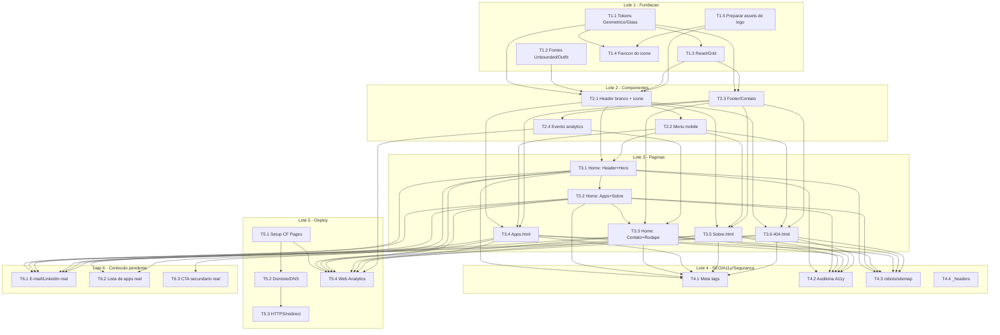

# TASK.md — Site institucional LJSSoftware

**Status:** Pronto para revisão do usuário (Loop C do `/definir_organizar`) —
**revisado** após reabertura pontual do `UX-SPEC.md` (identidade visual final
"Geométrico/Glass", `ADR-005`, supersede `ADR-004`)
**Base:** `PRD-TECNICO.md` + `SDD.md` + ADRs 001-003, 005 (004 Superseded) +
`UX-SPEC.md` (revisado)
**Data original:** 2026-09-07 · **Data desta revisão:** 2026-09-07
**Autor:** Coordenador (chapéu Tech Lead)

> **Nota de proveniência desta revisão:** o `UX-SPEC.md` passou por uma
> reabertura pontual, fora deste loop, na qual o usuário aprovou diretamente
> a direção visual "Geométrico/Glass" (a partir da logo real da marca) e
> ajustou o layout do cabeçalho — ver `ADR-005`. Este `TASK.md` ainda não
> havia sido aprovado, por isso foi reeditado diretamente nesta mesma
> instância, sem handoff formal. Toda mudança de escopo/critério de aceite
> está sinalizada nas tabelas abaixo; o autocheck de granularidade foi
> reexecutado em todas as tarefas tocadas.

---

## 1. Diretrizes de Implementação

Traduzidas das restrições/ADRs do `SDD.md` e dos padrões do `UX-SPEC.md`
(revisado, `ADR-005`) em regras práticas para o Executor.

### 1.1 Estrutura de arquivos

```
/
├── index.html
├── apps.html
├── sobre.html
├── 404.html
├── _headers                # headers de segurança (Cloudflare Pages)
├── robots.txt
├── sitemap.xml
├── assets/
│   ├── css/
│   │   ├── tokens.css      # custom properties (paleta Geométrico/Glass, glass, shapes)
│   │   ├── base.css        # reset + grid/layout responsivo
│   │   └── components.css  # header, footer, cards "glass", badges, botões, formas decorativas
│   ├── fonts/              # Unbounded e Outfit em .woff2, self-hosted
│   ├── img/
│   │   ├── favicon/        # favicon.ico, png 32/180/512, apple-touch-icon (derivados do ícone da logo)
│   │   └── logo/           # logo-ljssoftware.png, logo-ljssoftware-transparente.png,
│   │                       # logo-ljssoftware-icone.png (copiados/otimizados de .md/assets/)
│   └── js/
│       ├── nav.js          # toggle do menu mobile
│       └── analytics.js    # evento custom de clique em contato
```

> **Mudança nesta revisão:** pasta `assets/img/logo/` adicionada para os 3
> PNGs de logo já existentes em `.md/assets/` (ver `ADR-005`); `assets/img/
> favicon/` não deriva mais de um monograma tipográfico "LJ", e sim de
> `logo-ljssoftware-icone.png` (ver T1.4). `assets/fonts/` passa a conter
> Unbounded/Outfit no lugar de Sora/Inter.

### 1.2 Convenções obrigatórias

- **Sem build step, sem framework, sem gerador de site** (ADR-001) — proibido
  introduzir `package.json`/toolchain de build. HTML/CSS/JS puro.
- **Header/Nav e Footer/Contato byte-idênticos entre as 4 páginas** (SDD.md,
  RT-02) — copiar o bloco literal, nunca reescrever/parafrasear ao integrar
  em cada página. Qualquer ajuste no componente exige replicar nas 4 páginas
  na mesma tarefa/commit.
- **CSS custom properties** nomeadas exatamente como na Seção 3.1 (revisada)
  do `UX-SPEC.md` — tabela abaixo substitui integralmente a tabela de tokens
  da versão anterior deste documento (que citava `--color-primary`,
  `--color-surface`, `--color-border`, hoje inexistentes):

  | Token | Uso |
  |---|---|
  | `--color-bg` | Fundo principal das seções (exceto header) |
  | `--color-bg-gradient-1` / `--color-bg-gradient-2` | Gradientes radiais decorativos sobrepostos ao fundo |
  | `--color-text-inverse` / `--color-text-inverse-secondary` | Texto principal/secundário sobre fundo escuro |
  | `--color-accent` | Badges, links, detalhes, foco de teclado sobre fundo escuro |
  | `--color-header-bg` | Fundo branco sólido do header (exceção ao resto da página) |
  | `--color-header-text` / `--color-header-nav-text` | Texto/ícone e nav sobre o header branco |
  | `--glass-bg` / `--glass-border` / `--glass-blur` / `--glass-radius` | Cards "glass" |
  | `--shape-radius` | Formas geométricas decorativas de fundo |

- **Não existe mais a classe `.wordmark`** nem qualquer tratamento
  tipográfico do nome como substituto de logotipo — o header usa o arquivo
  `logo-ljssoftware-icone.png` (56px) + texto "LJS Software" em HTML/CSS
  (Unbounded 700), lado a lado (ADR-005).
- **Fallback obrigatório de `backdrop-filter`** para os cards "glass": via
  `@supports not (backdrop-filter: blur(1px))`, aplicar `--glass-bg` sem
  blur (fundo semi-opaco sólido), para não deixar o card ilegível em
  navegadores sem suporte (UX-SPEC.md Seção 7).
- **`font-display: swap`** obrigatório em todo `@font-face` (Unbounded/
  Outfit).
- **Nenhum `outline: none` sem substituto** — foco de teclado sempre visível
  (`outline` na cor `--color-accent` sobre fundo escuro; sobre o header
  branco, usar um tom com contraste equivalente, verificado em T4.2).
- **`lang="pt-BR"`** em todo `<html>`; `<title>` e `meta description` únicos
  por página (RF-07).
- **Sem cookies/tracking além do Cloudflare Web Analytics** (ADR-003) —
  proibido adicionar qualquer outra ferramenta de analytics sem novo ADR.
- **Todo asset de imagem exportado/otimizado** (WebP com fallback onde
  aplicável; os 3 PNGs de logo mantêm formato PNG por já terem fundo
  removido, mas devem ser comprimidos sem perda visível) antes de ser
  versionado (SDD.md, RT-04) — não há pipeline de build para compressão
  automática.
- **Ícones puramente decorativos** (incluindo as formas geométricas de
  fundo) usam `alt=""`/`aria-hidden="true"`; nenhum link de contato é só
  ícone sem texto (UX-SPEC.md, Seção 5).
- **`prefers-reduced-motion: reduce`** respeitado em qualquer
  transição/scroll suave.

## 2. Spikes Técnicos

Nenhum spike técnico identificado. A stack (HTML/CSS/JS vanilla, Cloudflare
Pages, Cloudflare Web Analytics) é madura, sem incerteza técnica alta. O
efeito `backdrop-filter` ("glass") tem suporte variável entre navegadores,
mas isso é tratado como diretriz de implementação com fallback via
`@supports` (Seção 1.2), não como incerteza que justifique um spike —
comportamento de fallback é conhecido e direto de implementar.

## 3. Lista de Tarefas

Estimativas conforme `effort-estimation`. Todas as tarefas foram checadas
(ou re-checadas, nesta revisão) contra o canário de ~300k tokens de contexto
de trabalho — nenhuma se aproxima desse volume.

### Lote 1 — Fundação de Design System

> **Mudança nesta revisão:** T1.1, T1.2 e T1.4 tiveram critério de aceite
> reescrito para a paleta/tipografia/favicon "Geométrico/Glass" (ADR-005).
> T1.5 é uma tarefa nova, necessária pela introdução dos ativos de logo
> reais. Isso leva o lote a 5 tarefas (acima do alvo de 4) — justificativa:
> a reabertura de identidade visual introduziu um ativo novo (arquivos de
> logo) que não existia na especificação anterior; T1.5 é pequena
> (preparação/otimização de asset, sem lógica), não overhead artificial.

| ID | Tarefa | Dono | Critério de aceite | Estimativa | Status |
|---|---|---|---|---|---|
| T1.1 | **[ALTERADA]** Tokens de design "Geométrico/Glass": paleta completa (`--color-bg`, `--color-bg-gradient-1/2`, `--color-text-inverse[-secondary]`, `--color-accent`, `--color-header-*`) + estilos base de card "glass" (`--glass-bg/-border/-blur/-radius`, incl. fallback `@supports`) + estilos base de forma geométrica decorativa (`--shape-radius`, rotação) em `assets/css/tokens.css`. **Não inclui mais `.wordmark`** (removido; substituído por ícone real, ver T1.5/T2.1) | Frontend | Todos os tokens da tabela da Seção 1.2 declarados; card "glass" de exemplo renderiza com blur e com fallback sólido testado (DevTools "disable feature"); combinações `--color-text-inverse[-secondary]`/`--color-accent` sobre `--color-bg`, e `--color-header-text`/`--color-header-nav-text` sobre `--color-header-bg`, testadas em ferramenta de contraste e atingem WCAG AA | 0,5 dia | **Concluída** — `assets/css/tokens.css` criado com todos os tokens da tabela da Seção 1.2, classe `.glass-card` (com fallback `@supports not (backdrop-filter: blur(1px))`) e `.decorative-shape`. Smoke-test visual em `assets/css/tokens.smoke.html` (blur + fallback inspecionáveis via DevTools) e validação automatizada de contraste em `assets/css/tokens.contrast-check.js` (Node, sem dependências): 5/5 combinações exigidas PASS WCAG AA — `--color-text-inverse` 13.91:1, `--color-text-inverse-secondary` 9.96:1, `--color-accent` 10.13:1 (todas sobre `--color-bg`), `--color-header-text` 15.39:1, `--color-header-nav-text` 9.18:1 (sobre `--color-header-bg`); razões documentadas em comentário no topo do CSS. Não inclui `.wordmark` (removida do design, ADR-005). |
| T1.2 | **[ALTERADA]** Self-hosting de fontes **Unbounded e Outfit** (`.woff2`), `@font-face` com `font-display: swap` (troca de Sora/Inter) | Frontend | Fontes carregam de `assets/fonts/`, sem requisição a CDN externo; texto visível imediatamente com fonte de sistema e troca suave ao carregar Unbounded/Outfit | 0,5 dia | **Concluída** — 4 arquivos `.woff2` (subset "latin", cobre acentuação do português) baixados uma única vez e versionados em `assets/fonts/`: `unbounded-v12-latin-500.woff2` (20.740 bytes), `unbounded-v12-latin-700.woff2` (21.092 bytes), `outfit-v15-latin-400.woff2` (14.032 bytes), `outfit-v15-latin-600.woff2` (14.140 bytes), conforme pesos do UX-SPEC.md Seção 3.1 (Unbounded 500/700 títulos, Outfit 400/600 corpo). `tokens.css` já existia (T1.1, paralela) — declarações `@font-face` (todas com `font-display: swap`) e tokens auxiliares `--font-heading`/`--font-body` acrescentados nele, sem tocar no conteúdo de T1.1. Smoke-test visual em `assets/fonts/fonts.smoke.html` (4 pesos renderizados + instruções de inspeção via DevTools Network/throttling) e verificação automatizada sem dependências em `assets/fonts/fonts.smoke.check.js` (Node): confirma ausência de qualquer referência a CDN externo de fontes em todo HTML/CSS do projeto, presença de `font-display: swap` em todos os `@font-face`, e integridade dos 4 arquivos — todas as checagens PASS (G-11 satisfeita). |
| T1.3 | CSS reset/base + grid de layout responsivo (breakpoints 360px/768px/1024px conforme UX-SPEC.md Seção 6) em `assets/css/base.css` | Frontend | Reset aplicado; classes de container/grid disponíveis e testadas nos 3 breakpoints com conteúdo de exemplo, sem rolagem horizontal — **impacto menor desta revisão**: nenhuma mudança de critério, só usa os novos tokens de cor de fundo (`--color-bg`) em vez dos antigos | 0,5 dia | **Concluída** — `assets/css/base.css` criado: reset básico (box-sizing, remoção de margin/padding padrão, `overflow-x: hidden` em `html`/`body`, normalização de `img`/lista/link/botão/heading), suporte a `prefers-reduced-motion: reduce`, foco de teclado visível (`:focus-visible` com `--color-accent`, nunca `outline: none` sem substituto) e classes utilitárias `.sr-only`/`.skip-link`. Classes de layout mobile-first reutilizando `--color-bg`/`--color-accent` já existentes em `tokens.css` (sem redefinir tokens): `.container` (max-width 1200px, padding lateral crescente), `.grid.grid--2col`/`.grid--3col` (1 coluna em 360px, 2 em 768px, 3 em 1024px só para `--3col`, conforme UX-SPEC.md Seção 6) e `.stack`/`.stack--row-tablet-up` (empilhamento vertical em mobile, linha a partir de 768px, para o padrão de rodapé). Smoke-test visual em `assets/css/base.smoke.html` (conteúdo de exemplo nos 3 grids/container/stack + rótulo de instrução de inspeção via DevTools) — inspecionado manualmente em 360px/768px/1024px: sem rolagem horizontal em nenhuma das 3 larguras, grid de 3 colunas mostra 1/2/3 colunas conforme esperado. |
| T1.4 | **[ALTERADA]** Favicon derivado de `logo-ljssoftware-icone.png` (`.md/assets/`, recorte quadrado do ícone geométrico "U/S") em múltiplos tamanhos (`favicon.ico`, PNG 32/180/512, apple-touch-icon) — **não é mais um monograma tipográfico "LJ"** | Frontend | Arquivos gerados em `assets/img/favicon/`, derivados do arquivo real de ícone (nenhuma arte nova criada); visualmente consistente com o ícone da logo | 0,5 dia | **Concluída** — gerados com Python 3.14 + Pillow (12.3.0; ImageMagick indisponível no ambiente) a partir de `assets/img/logo/logo-ljssoftware-icone.png` (T1.5, 94×114px, glifo "U/S" já ocupa o canvas de ponta a ponta, sem margem). **Desvio pequeno de detalhe resolvido em silêncio**: um recorte quadrado central literal cortaria as pontas do "U"/"S" (topo/base); em vez disso, o ícone foi "quadrado" por padding transparente nas laterais (canvas 114×114, letterbox), preservando 100% do glifo real sem distorção/corte (G-14) — depois redimensionado com reamostragem LANCZOS para cada tamanho. Arquivos gerados em `assets/img/favicon/`: `favicon.ico` (multi-tamanho 16/32/48px, 866 bytes), `favicon-32x32.png` (32×32, 2.223 bytes), `apple-touch-icon.png` (180×180, 22.759 bytes), `favicon-512x512.png` (512×512, 113.130 bytes). Inspeção visual confirma consistência com o ícone da logo em todos os tamanhos. |
| T1.5 | **[NOVA]** Preparar ativos de logo: copiar `logo-ljssoftware.png`, `logo-ljssoftware-transparente.png` e `logo-ljssoftware-icone.png` de `.md/assets/` para `assets/img/logo/`, comprimindo sem perda visível (RT-04) | Frontend | Os 3 arquivos presentes em `assets/img/logo/`, tamanho de arquivo otimizado, nenhuma arte nova criada (conforme ADR-005); arquivos prontos para uso em T1.4, T2.1 e T4.1 (og:image) | 0,25 dia | **Concluída** — 3 arquivos copiados de `.md/assets/` para `assets/img/logo/` e otimizados losslessly com Pillow (`optimize=True`, `compress_level=9`): `logo-ljssoftware.png` 23030→19036 bytes (-17,3%), `logo-ljssoftware-transparente.png` 21654→19575 bytes (-9,6%), `logo-ljssoftware-icone.png` 9142→8452 bytes (-7,5%). Verificado pixel-a-pixel idêntico ao original (nenhuma arte recriada, G-14). Ferramenta CLI de otimização (pngquant/optipng/cwebp) indisponível no ambiente; usado Pillow (já instalado) como alternativa lossless. |

**Dependências do Lote 1:** T1.1, T1.2 e T1.5 são independentes entre si
(paralelizáveis). T1.3 e T1.4 dependem de T1.1 (tokens) e, no caso de T1.4,
também de T1.5 (arquivo de ícone já preparado).

### Lote 2 — Componentes Compartilhados

> **Mudança nesta revisão:** T2.1 (Header/Nav) teve critério de aceite
> reescrito — fundo branco (exceção ao resto do site), ícone + texto lado a
> lado, botão "Contato". T2.2 e T2.3 têm impacto menor (mesma estrutura,
> ajuste de tokens/contraste sobre o novo header branco).

| ID | Tarefa | Dono | Critério de aceite | Estimativa |
|---|---|---|---|---|
| T2.1 | **[ALTERADA]** Header/Nav: fundo `--color-header-bg` (branco sólido, exceção ao restante da página, que é escura); ícone `logo-ljssoftware-icone.png` (56px) + texto "LJS Software" (Unbounded 700, 25px, `--color-header-text`) lado a lado à esquerda; nav (Apps, Sobre) em `--color-header-nav-text`; botão "Contato" com fundo `--color-bg` (navy) e texto branco; skip link "Pular para o conteúdo" antes do header; landmarks semânticos — sem JS de menu ainda | Frontend | Bloco de referência pronto para ser copiado nas 4 páginas; layout horizontal ícone+texto conforme UX-SPEC.md Seção 3.1/wireframes; skip link visível ao focar via Tab; nav com `aria-current` na página ativa; contraste do texto/nav sobre fundo branco e do botão "Contato" verificados (WCAG AA) | 1 dia |
| T2.2 | Menu mobile: toggle hamburguer + overlay, acessível via teclado (`Tab`/`Enter`/`Space`), `aria-expanded` correto, animação respeitando `prefers-reduced-motion` — **impacto menor**: hamburguer agora sobre fundo branco do header, overlay pode abrir sobre fundo escuro do resto da página | Frontend | Menu abre/fecha via clique e teclado; foco gerenciado corretamente; funciona nos 3 breakpoints; contraste do ícone hamburguer sobre o header branco verificado | 1 dia |
| T2.3 | Footer/Contato: estrutura HTML/CSS com ícone reduzido da logo (não mais wordmark reduzido) + link `mailto:` (placeholder — Lacuna L-01) e link de LinkedIn (placeholder — Lacuna L-01) com ícone "nova aba" + texto, estados hover/foco sobre fundo `--color-bg` (escuro) — **impacto menor**: só tokens de cor mudam | Frontend | Bloco de referência pronto para as 4 páginas; nenhum link é só ícone; `target="_blank" rel="noopener"` no link de LinkedIn; foco visível com `--color-accent` | 0,5 dia |
| T2.4 | Evento custom de analytics (Cloudflare Web Analytics) disparado no clique dos links de e-mail e LinkedIn (rodapé e, na Home, seção de contato), em `assets/js/analytics.js` | Frontend | Clique em cada link dispara evento nomeado e identificável no beacon, incluindo os 2 botões da seção de contato da Home (T3.3); não bloqueia a navegação nativa do link | 0,5 dia |

**Dependências do Lote 2:** T2.1 e T2.3 dependem de T1.1/T1.2/T1.3/T1.5
(Lote 1 completo). T2.2 depende de T2.1. T2.4 depende de T2.3.

### Lote 3 — Páginas

> **Mudança nesta revisão:** a Home ganhou 6 seções (header, hero com 2
> CTAs, 3 cards "glass" de apps, 1 card "glass" de Sobre, seção de contato
> com 2 botões, rodapé) — o volume estourava a calibração de ~1 dia-pessoa
> de uma única tarefa. **Dividida em 3 sub-tarefas por bloco de seções**
> (T3.1, T3.2, T3.3), mantendo o autocheck de granularidade: cada uma cobre
> 2 seções relacionadas, sem misturar tela com outra categoria (endpoint/
> regra de negócio/SQL — inexistentes neste projeto). As demais páginas
> (antes T3.2-T3.4) foram renumeradas para T3.4-T3.6, sem mudança de escopo
> relevante além dos tokens visuais.

| ID | Tarefa | Dono | Critério de aceite | Estimativa |
|---|---|---|---|---|
| T3.1 | **[NOVA — divisão de T3.1 original]** `index.html` — Header + Hero: integração do header (T2.1/T2.2) no topo de `index.html`; seção hero (fundo escuro com mesh gradient `--color-bg-gradient-1/2`, formas geométricas decorativas) com título, subtítulo e 2 CTAs ("Ver apps" → `apps.html`; segundo CTA — conteúdo a confirmar, ver Lacuna L-06) | Frontend | RF-01 satisfeito; hero renderiza com mesh gradient e ao menos 1 forma decorativa (`aria-hidden`); 2 CTAs visíveis e navegáveis por teclado; `<title>`/meta description próprios (placeholder, refinados em T4.1) | 1 dia |
| T3.2 | **[NOVA — divisão de T3.1 original]** `index.html` — Seção de apps em desenvolvimento (grid de 3 cards "glass", badge "Em breve", prévia da vitrine — RF-02) + Seção Sobre (1 card "glass" centralizado, texto institucional curto + link "Saiba mais" para `sobre.html` — RF-03) | Frontend | 2 seções adicionadas após o hero (T3.1); cards "glass" com fallback funcionando (`@supports`); grid responsivo (3/2/1 colunas); link "Saiba mais" navega para `sobre.html` | 1 dia |
| T3.3 | **[NOVA — divisão de T3.1 original]** `index.html` — Seção de contato (fundo escuro, 2 botões: e-mail e LinkedIn, mesmo conteúdo/placeholder do rodapé) + integração do rodapé (T2.3) | Frontend | Home completa (6 seções, RF-01/02/03/04 refletidos); 2 botões de contato acessíveis por teclado e disparando o evento de analytics (T2.4); rodapé idêntico ao das demais páginas (RT-02) | 0,5 dia |
| T3.4 | *(antes T3.2)* `apps.html` — Vitrine: grid de cards (nome, descrição curta, badge "Em breve"), markup preparado para trocar badge por link real sem redesenho (RF-02) | Frontend | Grid 3/2/1 colunas conforme breakpoint; cada card seguindo o modelo de conteúdo do SDD.md Seção 5; nenhum link quebrado; visual "glass" consistente com T3.2 | 1 dia |
| T3.5 | *(antes T3.3)* `sobre.html` — Sobre: texto institucional único (RF-03) | Frontend | Página renderiza com header/footer integrados; heading único `<h1>`; texto de piso mínimo aceito, sinalizado para revisão de copy final (Lacuna L-03) | 0,5 dia |
| T3.6 | *(antes T3.4)* `404.html` — página de erro: mensagem curta + link de volta à Home | Frontend | Acessível para qualquer rota inexistente na Cloudflare Pages; header/footer integrados; link de retorno funcional | 0,5 dia |

**Dependências do Lote 3:** T3.1, T3.4, T3.5 e T3.6 dependem do Lote 2
completo (T2.1-T2.4) e podem começar em paralelo entre si (arquivos
diferentes). T3.2 depende de T3.1 (mesmo arquivo `index.html`, seções
sequenciais). T3.3 depende de T3.2 (mesmo motivo). **Paralelizáveis entre
si**: T3.1, T3.4, T3.5, T3.6 (4 frentes simultâneas possíveis assim que o
Lote 2 fechar); T3.2 e T3.3 são sequenciais dentro da própria Home.

> Lote com 6 tarefas (acima do alvo de ~4-5) — justificativa: as 3
> sub-tarefas da Home (T3.1-T3.3) são fatias do mesmo arquivo/tela, não 3
> telas distintas; mantidas no mesmo lote "Páginas" por serem, em conjunto,
> a mesma unidade funcional coerente que já existia (Home), apenas
> recalibrada em tamanho.

### Lote 4 — SEO, Acessibilidade e Segurança Transversal

| ID | Tarefa | Dono | Critério de aceite | Estimativa |
|---|---|---|---|---|
| T4.1 | Meta tags SEO finais nas 4 páginas (`<title>`/`meta description` únicos e específicos, Open Graph básico usando `logo-ljssoftware-transparente.png` como `og:image` — T1.5) + `<link rel="icon">` do favicon do Lote 1 | Frontend | Cada página com title/description distintos e descritivos (RF-07); favicon carrega em todas; `og:image` aponta para o lockup transparente | 0,5 dia |
| T4.2 | **[Impacto menor — critério de contraste atualizado]** Auditoria e ajuste de acessibilidade WCAG AA nas 4 páginas: contraste (incl. header branco, cards "glass" sobre gradiente no pior caso de sobreposição — UX-SPEC.md Seção 3.1), landmarks, ordem de foco, `prefers-reduced-motion`, `alt`/`aria-hidden` das formas decorativas | Frontend | Nenhuma pendência crítica de `accessibility-review`; todas as combinações da tabela de tokens (Seção 1.2) verificadas com ferramenta de contraste, incluindo o pior caso dos cards "glass" | 1 dia |
| T4.3 | `robots.txt` + `sitemap.xml` na raiz, listando as 4 páginas públicas | DevOps/Frontend | Arquivos válidos e acessíveis em `/robots.txt` e `/sitemap.xml` | 0,25 dia |
| T4.4 | Arquivo `_headers` do Cloudflare Pages com CSP restritiva (self + beacon do Cloudflare Web Analytics), `X-Content-Type-Options`, `X-Frame-Options: DENY`, `Referrer-Policy`, `Permissions-Policy` | DevOps | Headers aplicados a todas as rotas em preview deploy; CSP não bloqueia fontes/analytics legítimos, verificado no console do navegador sem erro de bloqueio | 0,5 dia |

**Dependências do Lote 4:** T4.1, T4.2, T4.3 dependem do Lote 3 completo
(T3.1-T3.6). T4.4 não depende de nenhuma página. **Paralelizáveis entre
si**: T4.1, T4.2, T4.3, T4.4.

### Lote 5 — Deploy e Infraestrutura

| ID | Tarefa | Dono | Critério de aceite | Estimativa |
|---|---|---|---|---|
| T5.1 | Setup do repositório Git + conexão ao Cloudflare Pages (build settings "sem build" / diretório raiz, branch principal), primeiro deploy de preview | DevOps | Deploy de preview acessível via URL `*.pages.dev`, atualizando a cada push | 0,5 dia |
| T5.2 | Domínio customizado `ljssoftware.com.br` no Cloudflare Pages + documentação dos passos de migração de NS para o stakeholder executar no registro.br (RT-03) | DevOps | Domínio adicionado no painel; passo a passo de migração de NS documentado e comunicado como pré-requisito de publicação final | 0,5 dia |
| T5.3 | Habilitar "Always Use HTTPS" (RF-05) + redirect 301 de `www.ljssoftware.com.br` para o domínio apex | DevOps | `http://` redireciona para `https://`; `www` redireciona para apex; certificado TLS válido emitido | 0,25 dia |
| T5.4 | Habilitar Cloudflare Web Analytics no projeto + inserir beacon script nas 4 páginas | DevOps | Beacon ativo nas 4 páginas; evento custom do T2.4 aparece no dashboard de analytics, incluindo os cliques na seção de contato da Home | 0,5 dia |

**Dependências do Lote 5:** T5.2 depende de T5.1. T5.3 depende de T5.2. T5.4
depende de T5.1 e do Lote 3 completo (T3.1-T3.6) e de T2.4. **Paralelizáveis
entre si**: T5.2 e T5.4 podem rodar em paralelo uma vez que T5.1 esteja
concluída (T5.3 aguarda T5.2).

### Lote 6 — Confirmação de Conteúdo Pendente

| ID | Tarefa | Dono | Critério de aceite | Estimativa |
|---|---|---|---|---|
| T6.1 | Confirmar com o stakeholder o endereço de e-mail definitivo e a URL real do perfil de LinkedIn; substituir os placeholders no rodapé (4 páginas) e na seção de contato da Home (T3.3) | Frontend | Placeholders substituídos pelo dado real confirmado nos 2 pontos (rodapé + seção de contato); link testado manualmente | 0,25 dia (+ tempo de resposta externo do stakeholder) |
| T6.2 | Confirmar com o stakeholder a lista definitiva de apps (nome + descrição curta) da fase 1 e atualizar `apps.html` (T3.4) e a prévia de apps da Home (T3.2) com o conteúdo real | Frontend | Cards da vitrine e da prévia na Home refletem os apps reais informados pelo stakeholder, mantendo a estrutura/markup definidos em T3.4/T3.2 | 0,25 dia (+ tempo de resposta externo do stakeholder) |
| T6.3 | **[NOVA]** Confirmar com o stakeholder o texto do segundo CTA do hero da Home (T3.1), hoje sem conteúdo definido além do placeholder | Frontend | CTA secundário com destino/texto reais definidos e implementados em `index.html` | 0,25 dia (+ tempo de resposta externo do stakeholder) |

**Dependências do Lote 6:** T6.1 depende de T3.1-T3.6 (Lote 3 completo). T6.2
depende de T3.2 e T3.4. T6.3 depende de T3.1. **Paralelizáveis entre si**:
T6.1, T6.2 e T6.3 (conteúdos independentes).

**Nota sobre o autocheck de granularidade (canário de ~300k tokens),
reexecutado nesta revisão:** todas as 25 tarefas envolvem no máximo 1
página HTML (ou uma fatia de seções dela) + os componentes compartilhados
dos Lotes 1-2 já prontos como referência — volume de contexto estimado bem
abaixo do canário. A única divisão nova desta revisão é a fragmentação de
T3.1 (original) em T3.1/T3.2/T3.3, motivada pelo estouro de escopo/tempo
identificado no dispatch da reabertura (6 seções na Home) — não pelo
canário de tokens em si, mas pela mesma régua de calibração de ~1
dia-pessoa por tarefa. A decisão de manter T4.1/T4.2/T4.3 como tarefas
únicas cross-page (L-04, mantida desta revisão) continua válida.

## 4. Dependências e Ordem de Execução



### Tabela de paralelismo por lote

| Lote | Tarefas paralelizáveis entre si | Tarefas com dependência direta (ordem obrigatória) |
|---|---|---|
| 1 | T1.1, T1.2 e T1.5 (sem dependência entre si) | T1.3 depende de T1.1; T1.4 depende de T1.1 e T1.5 |
| 2 | T2.1 e T2.3 (após Lote 1) | T2.2 depende de T2.1; T2.4 depende de T2.3 |
| 3 | T3.1, T3.4, T3.5, T3.6 (após Lote 2 completo) | T3.2 depende de T3.1; T3.3 depende de T3.2 (fatias sequenciais do mesmo `index.html`) |
| 4 | T4.1, T4.2, T4.3, T4.4 (T4.4 sem dependência de página) | Nenhuma dependência interna ao lote |
| 5 | T5.2 e T5.4 (após T5.1) | T5.3 depende de T5.2 |
| 6 | T6.1, T6.2, T6.3 | Nenhuma dependência interna ao lote |

O ponto de maior paralelismo real passa a ser o início do Lote 3 (4
instâncias simultâneas: T3.1, T3.4, T3.5, T3.6), com a Home continuando de
forma sequencial (T3.2 → T3.3) enquanto as outras 3 páginas avançam em
paralelo.

## 5. Riscos de Prazo

| # | Risco | Impacto | Mitigação |
|---|---|---|---|
| RP-01 | T5.2 depende de ação manual do stakeholder no registro.br (migração de NS) — fora do controle do Executor (SDD.md, RT-03) | Pode atrasar a publicação final (T5.3) mesmo com todo o site pronto | Sinalizar a T5.2 como pré-requisito assim que o Lote 5 iniciar; desenvolvimento do site (Lotes 1-4) não é bloqueado por isso |
| RP-02 | T6.1/T6.2/T6.3 dependem de resposta do stakeholder (e-mail/LinkedIn reais, lista de apps, CTA secundário do hero) | Pode atrasar o fechamento do Lote 6 e o lançamento com conteúdo definitivo | Placeholders definidos no UX-SPEC.md permitem que Lotes 1-5 avancem sem bloqueio; lançamento com conteúdo real fica condicionado só ao Lote 6 |
| RP-03 | **[ATUALIZADO — risco já concretizado e resolvido]** Produção interna da identidade visual (`ADR-004`) sem designer trazia risco de retrabalho se o resultado não agradasse ao stakeholder — esse risco **se concretizou**: o usuário pediu 5 conceitos visuais alternativos e ajustou o cabeçalho numa segunda rodada, gerando o `ADR-005` (supersede `ADR-004`) e esta revisão do `TASK.md`. Risco residual: nova iteração de identidade visual ainda poderia ocorrer durante a implementação do Lote 1/2 | Retrabalho adicional em T1.1/T1.4/T2.1 se houver novo ajuste visual | Validar rapidamente o resultado do Lote 1 (tokens/favicon) e do header (T2.1) com o stakeholder antes de iniciar o restante do Lote 3, reduzindo retrabalho em cascata sobre páginas já construídas |

## 6. Lacunas Sinalizadas

| # | Lacuna | Tipo | Como foi tratada |
|---|---|---|---|
| L-01 | Endereço de e-mail definitivo e URL real do LinkedIn ainda não confirmados pelo stakeholder — hoje só placeholder no `UX-SPEC.md` (Fluxo 4), replicado agora também na seção de contato da Home | Lacuna de conteúdo, não estrutural | Tarefa dedicada T6.1 (ampliada nesta revisão para cobrir também a seção de contato da Home); não bloqueia o desenvolvimento das demais tarefas |
| L-02 | Lista definitiva de apps (nomes/descrições) da fase 1 depende do stakeholder (PRD-TECNICO.md, RF-02, nota) | Lacuna de conteúdo, não estrutural | Tarefa dedicada T6.2 (ampliada nesta revisão para cobrir também a prévia de apps da Home); T3.2/T3.4 constroem a estrutura com conteúdo de exemplo/placeholder |
| L-03 | Copy final da seção "Sobre" (texto institucional) não foi fornecido em detalhe pelo stakeholder, além do piso mínimo aceito em INT-02 do `PRD-TECNICO.md` | Lacuna de conteúdo, decisão de detalhe | Decidida em silêncio de detalhe (permitido pelos guardrails): Executor escreve um texto institucional de piso mínimo em T3.5, sinalizado como sujeito a revisão de copy |
| L-04 | Decisão de manter T4.1 (meta tags), T4.2 (auditoria A11y) e T4.3 (robots/sitemap) como tarefas únicas cobrindo as 4 páginas, em vez de dividir uma tarefa por página | Decisão de granularidade (detalhe de implementação) | Mantida nesta revisão: as 3 tarefas aplicam o mesmo padrão de forma idêntica nas páginas já prontas — tarefa única reduz overhead de coordenação sem violar não-mistura nem o canário de tokens |
| L-05 | **[ATUALIZADO]** PR-06 do `PRD-TECNICO.md` (viabilidade de produzir identidade visual sem designer externo) foi resolvida originalmente no `ADR-004` e **revisada no `ADR-005`** após o usuário pedir/comparar 5 conceitos visuais e ajustar o cabeçalho — a mudança de método (uso de logo real + skill de design, em vez de wordmark tipográfico puro) já foi decidida e aprovada diretamente pelo usuário, não é mais um risco em aberto, e sim uma decisão consolidada | Decisão de produto já tomada pelo usuário, formalizada em ADR | `ADR-005` registra a decisão; este `TASK.md` já reflete o impacto nas tarefas de Lote 1/2/3 afetadas |
| L-06 | **[NOVA]** Conteúdo do CTA secundário do hero da Home (`UX-SPEC.md`, Fluxo 1) ainda não definido — "detalhe de conteúdo a confirmar com o stakeholder" | Lacuna de conteúdo, não estrutural | Tarefa dedicada T6.3 criada; T3.1 constrói a estrutura do hero com 2 CTAs, um deles com destino/texto placeholder até confirmação |
| L-07 | **[NOVA]** Os 3 arquivos de logo (`ADR-005`) são PNG com fundo removido por decontaminação de alfa, não vetores (SVG) reais — limite técnico aceito para o escopo atual (ícone usado a 56px), mas registrado para eventual necessidade futura de escalar a marca em tamanhos grandes | Dívida técnica aceita conscientemente (já registrada no `ADR-005`) | Nenhuma tarefa de vetorização criada nesta fase — sinalizado aqui apenas para rastreabilidade; revisitar com novo ADR se a necessidade surgir |

Nenhuma lacuna estrutural nova do `SDD.md`/`UX-SPEC.md` foi encontrada
durante esta revisão — o próprio `ADR-005` já é o mecanismo formal que
tratou a mudança de decisão arquitetural/de UX que motivou esta reabertura;
o `TASK.md` só precisou refletir esse impacto já resolvido, não abrir uma
nova lacuna estrutural por conta própria.

---

## Checklist de Pronto — TASK.md

- [x] Toda tarefa tem critério de aceite testável, pertence a um lote nomeado,
      e é pequena o suficiente para caber num único ciclo de implementação
- [x] Toda tarefa tem explícito, na Seção 4, se é paralelizável com outras do
      mesmo lote ou se depende de alguma
- [x] Nenhum lote muito acima de ~5-6 tarefas sem justificativa — Lote 1 (5)
      e Lote 3 (6) justificados explicitamente nas notas de cada lote
- [x] Toda tarefa não-spike tem estimativa; nenhum spike foi identificado
      (Seção 2)
- [x] Toda tarefa calibrada a ~1 dia-pessoa ou menos — a divisão de T3.1
      original em T3.1/T3.2/T3.3 foi exatamente para preservar este critério
      após o aumento de escopo da Home (ADR-005)
- [x] Nenhuma tarefa mistura mais de uma tela/endpoint/regra de
      negócio/mudança de SQL — não há endpoints nem SQL neste projeto; a
      divisão da Home é por seções da mesma tela, não uma mistura de telas
      distintas
- [x] Nenhuma tarefa, pela estimativa do Coordenador, deve exigir do Executor
      mais de ~300 mil tokens de contexto de trabalho
- [x] Todo autocheck de granularidade que resultou em divisão está
      documentado — a divisão de T3.1 em T3.1/T3.2/T3.3 está registrada com
      antes/depois na nota da Seção 3 (Lote 3) e na Seção 6 (contexto)
- [x] Toda diretriz de implementação relevante está traduzida em regra
      prática (Seção 1, incluindo o fallback de `backdrop-filter`)
- [x] Toda lacuna estrutural encontrada está sinalizada na Seção 6 — nenhuma
      lacuna estrutural nova nesta revisão; lacunas de conteúdo/detalhe
      atualizadas (L-01, L-02, L-05) e novas (L-06, L-07) registradas
- [x] Rascunho do `GUARDRAILS.md` produzido/atualizado junto do TASK.md
