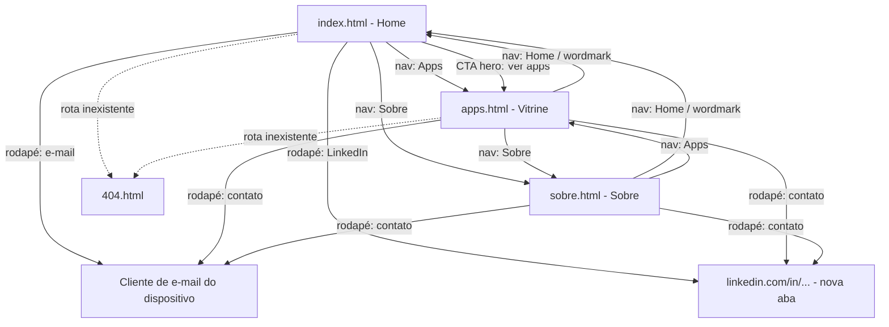

# UX-SPEC.md — Site institucional LJSSoftware

**Status:** Loop B já aprovado; **revisado em reabertura pontual** (fora do
fluxo formal do `/definir_organizar`) para consolidar a identidade visual
final ("Geométrico/Glass") decidida diretamente pelo usuário — ver `ADR-005`
**Base:** `PRD.md` + `PRD-TECNICO.md` (Rodada 2) + `SDD.md` (mesma sequência)
**Data original:** 2026-09-07 · **Data desta revisão:** 2026-09-07
**Autor:** Coordenador (chapéu UX/UI)

---

## 1. Fluxos de Tela

Arquitetura de informação definida pelo `SDD.md` (ADR-001): site multi-página
estático (`index.html`, `apps.html`, `sobre.html`, `404.html`), navegação por
header fixo com wordmark + nav, sem single-page/âncoras.

### Mapa de navegação



### Fluxo 1 — Home (RF-01)
Visitante chega em `index.html` (link direto, busca, redes sociais). Estrutura
de seções da página, na ordem confirmada com o usuário (direção visual
"Geométrico/Glass", ADR-005):

1. **Header** (fundo branco, ícone + "LJS Software" + nav — ver Seção 3.1).
2. **Hero** (fundo escuro/mesh gradient): título + subtítulo + 2 CTAs (ex.:
   "Ver apps" levando a `apps.html`, e um segundo CTA — detalhe de conteúdo a
   confirmar com o stakeholder, mesmo tratamento de placeholder de L-01/L-02
   no `TASK.md`).
3. **Seção de apps em desenvolvimento**: grid de 3 cards "glass", todos com
   badge "Em breve" (prévia da mesma vitrine de `apps.html` — RF-02).
4. **Seção Sobre**: 1 card "glass" centralizado com o texto institucional
   curto (RF-03) e link "Saiba mais" para `sobre.html`.
5. **Seção de contato**: fundo escuro, 2 botões (e-mail e LinkedIn) — mesmo
   conteúdo/placeholder do rodapé (ver Fluxo 4 e Lacuna L-01 do `TASK.md`);
   não é uma página própria nova, é uma seção mais visual do que o link
   simples de rodapé usado nas demais páginas, mantendo o trade-off já
   documentado na Seção 7 (sem `contato.html` dedicado).
6. **Rodapé**.

Nenhum estado de carregamento assíncrono — conteúdo já vem no HTML.

### Fluxo 2 — Vitrine de apps (RF-02, RN-01, RN-02)
Visitante acessa `apps.html` a partir da Home ou diretamente. Vê um grid de
cards, um por app, cada um com nome + descrição curta + badge "Em breve"
(fase 1: todos os apps nesse estado — ver Seção 4, Estados de Tela).
Estrutura do card já preparada (SDD.md, Seção 5) para, no futuro, trocar o
badge por um link de saída real sem redesenho.

### Fluxo 3 — Sobre (RF-03)
Visitante acessa `sobre.html`. Texto institucional único, sem interação além
da navegação padrão.

### Fluxo 4 — Contato (RF-04)
Não é uma página própria (decisão de UX documentada na Seção 7 — trade-off
com a arquitetura). O rodapé, presente em todas as páginas, expõe:
- Link `mailto:contato@ljssoftware.com.br` (endereço definitivo a confirmar
  com o stakeholder na execução — placeholder documentado no `TASK.md`).
- Link para o perfil de LinkedIn do stakeholder, abrindo em nova aba
  (`target="_blank" rel="noopener"`).

### Fluxo alternativo — Rota inexistente
Visitante acessa uma URL que não existe → `404.html`, com wordmark, mensagem
curta e link de volta para a Home.

## 2. Wireframes

Wireframes em ASCII, cobrindo desktop (≥1024px) e mobile (360-767px). Ver
Seção 6 para breakpoints intermediários.

> **Nota (revisão pós-ADR-005):** os wireframes abaixo refletem a estrutura
> de seções confirmada com o usuário (Fluxo 1, Seção 1) — header com fundo
> branco (exceção visual ao resto da página, que é escura), hero, seção de
> apps em desenvolvimento (3 cards "glass"), seção Sobre (1 card "glass"
> centralizado) e seção de contato (2 botões), antes do rodapé. Layout ASCII
> mantém a mesma lógica de blocos da versão anterior, com blocos novos
> adicionados.

### Home — Desktop
```
+--------------------------------------------------------------+
| [icone] LJS Software        Apps   Sobre   [ Contato ]        |  <- header BRANCO
+--------------------------------------------------------------+
|                                                                |
|              Título do hero                                   |
|        Subtítulo / tagline                                    |  <- hero (fundo escuro,
|         [ Ver apps ]   [ CTA secundário ]                     |     mesh gradient)
|                                                                |
+--------------------------------------------------------------+
|  Nossos apps                                                  |
|  +----------+   +----------+   +----------+                  |  <- seção apps (cards
|  | [glass]  |   | [glass]  |   | [glass]  |                  |     "glass", "Em breve")
|  |[Em breve]|   |[Em breve]|   |[Em breve]|                  |
|  +----------+   +----------+   +----------+                  |
+--------------------------------------------------------------+
|              +----------------------------+                   |
|              |  Sobre a LJSSoftware [glass]|                   |  <- seção Sobre (1 card
|              |  Texto curto...             |                   |     "glass" centralizado)
|              |  [ Saiba mais -> ]          |                   |
|              +----------------------------+                   |
+--------------------------------------------------------------+
|         [ E-mail ]          [ LinkedIn ]                       |  <- seção de contato
+--------------------------------------------------------------+
| rodapé                                                          |
+--------------------------------------------------------------+
```

### Home — Mobile
```
+---------------------------+
| [icone] LJS Soft.    [=]  |  <- header BRANCO + hamburguer
+---------------------------+
|                           |
|      Título do hero       |
|  Subtítulo / tagline      |
|      [ Ver apps ]         |
|      [ CTA secundário ]   |
|                           |
+---------------------------+
| Nossos apps                |
| +------------------------+ |
| | [glass] [Em breve]      | |
| +------------------------+ |
| +------------------------+ |
| | [glass] [Em breve]      | |
| +------------------------+ |
| +------------------------+ |
| | [glass] [Em breve]      | |
| +------------------------+ |
+---------------------------+
| +------------------------+ |
| | Sobre a LJSSoftware      | |
| | [glass] Texto curto...  | |
| | [ Saiba mais -> ]       | |
| +------------------------+ |
+---------------------------+
| [ E-mail ]                  |
| [ LinkedIn ]                |
+---------------------------+
| rodapé                     |
+---------------------------+
```

### Vitrine de apps — Desktop (grid 3 colunas)
```
+--------------------------------------------------------------+
| [LJSSoftware]           Home   Apps   Sobre                  |
+--------------------------------------------------------------+
|  Nossos apps                                                  |
|                                                                |
|  +------------+   +------------+   +------------+             |
|  | Nome do app|   | Nome do app|   | Nome do app|             |
|  | Descrição  |   | Descrição  |   | Descrição  |             |
|  | curta...   |   | curta...   |   | curta...   |             |
|  | [Em breve] |   | [Em breve] |   | [Em breve] |             |
|  +------------+   +------------+   +------------+             |
+--------------------------------------------------------------+
| rodapé (igual à Home)                                          |
+--------------------------------------------------------------+
```

### Vitrine de apps — Mobile (grid 1 coluna)
```
+---------------------------+
| [LJSSoftware]        [=]  |
+---------------------------+
| Nossos apps                |
|                            |
| +------------------------+ |
| | Nome do app             | |
| | Descrição curta...      | |
| | [Em breve]              | |
| +------------------------+ |
| +------------------------+ |
| | Nome do app              | |
| | Descrição curta...       | |
| | [Em breve]                | |
| +------------------------+ |
+---------------------------+
| rodapé (igual à Home)      |
+---------------------------+
```

### Sobre e 404
Seguem o mesmo header/rodapé; corpo é um bloco de texto único (Sobre) ou
mensagem curta + link de retorno (404) — sem wireframe adicional por não
terem componente novo além dos já especificados.

## 3. Design System

### 3.1 Identidade visual (RF-08 / ADR-004 superseded by ADR-005)

> **Nota de proveniência:** esta seção foi revisada em reabertura pontual do
> `UX-SPEC.md` (fora do fluxo formal do `/definir_organizar`, Loop B já
> fechado anteriormente). A especificação original abaixo era um wordmark
> tipográfico simples (Sora/Inter, paleta indigo/teal, sem símbolo), proposta
> pelo Coordenador conforme `ADR-004`. O usuário, diretamente, pediu e
> aprovou 5 conceitos visuais completos de home page (skill de design/
> Artifact) a partir da logo real da marca, escolheu a direção
> **"Geométrico/Glass"**, e depois ajustou especificamente o layout do
> cabeçalho. Essa decisão já foi tomada e aprovada — o texto abaixo a
> consolida, não a propõe. Ver `ADR-005` (supersede `ADR-004`) para o
> registro formal da mudança de decisão.

**Ativos de logo já produzidos (`.md/assets/`) — não recriar:**

| Arquivo | Conteúdo | Uso |
|---|---|---|
| `logo-ljssoftware.png` | Arte original enviada pelo usuário: ícone + texto, fundo cinza-claro sólido embutido | Referência/arquivo-fonte; não usar diretamente na UI (tem fundo sólido) |
| `logo-ljssoftware-transparente.png` | Lockup completo (ícone + texto), fundo removido (chroma-key/decontaminação de alfa) — **raster (PNG), não vetor/SVG** | Uso geral onde o lockup completo for necessário fora do header (ex.: og:image, redes sociais) |
| `logo-ljssoftware-icone.png` | Apenas o ícone geométrico "U/S", recortado, fundo transparente — também raster, não vetor | Vai no cabeçalho, ao lado do texto "LJS Software" (texto em HTML/CSS, não embutido na imagem) |

**Observação técnica registrada:** a remoção de fundo não é vetorização real
— os 3 arquivos permanecem raster. Se no futuro for necessário escalar a
logo para tamanhos muito grandes sem perda de qualidade, uma vetorização de
verdade (SVG) a partir da arte-fonte original, ou via serviço especializado,
ainda seria recomendável. Não é bloqueio para o escopo atual (ícone usado a
56px no cabeçalho).

**Cabeçalho (header) — layout específico, resultado de iteração adicional
com o usuário após os 5 conceitos:**
- Fundo do header: **branco sólido** (`#FFFFFF`), deliberadamente diferente
  do restante da página (fundo escuro `#0B2545`) — contraste para destacar o
  ícone, que é predominantemente azul/teal.
- Dentro do header: **ícone à esquerda + texto "LJS Software" ao lado**
  (lado a lado, horizontal) — substitui o lockup vertical original da
  arte-fonte (ícone em cima, texto embaixo).
- Ícone (`logo-ljssoftware-icone.png`): 56px de altura.
- Texto "LJS Software": fonte **Unbounded**, peso 700, 25px, cor `#0B2545`
  (navy escuro, legível sobre fundo branco).
- Nav (Apps, Sobre): texto navy `#264A6E`, peso 500.
- Botão "Contato" no header: fundo navy sólido `#0B2545`, texto branco.
- Justificativa registrada: no lockup vertical original da arte-fonte, ícone
  e nome ficavam pequenos/"esmagados"; o layout horizontal com fundo branco
  aumenta o destaque de ambos.

**Restante da página (hero, seções, rodapé): fundo escuro com mesh gradient**
— só o header foge a esse padrão, conforme decisão acima.

**Paleta de cores ("Geométrico/Glass") — substitui integralmente a paleta
indigo/teal anterior:**

| Token | Valor (hex/valor) | Uso |
|---|---|---|
| `--color-bg` | `#0B2545` (azul-marinho profundo) | Fundo principal das seções (hero, apps, sobre, contato, rodapé) — exceto o header |
| `--color-bg-gradient-1` | `#146B8C` | Gradiente radial decorativo sobreposto ao fundo (mesh gradient sutil, não sólido) |
| `--color-bg-gradient-2` | `#1FB6A6` | Segundo gradiente radial decorativo, sobreposto ao primeiro |
| `--color-text-inverse` | `#EAF6F4` (quase branco, tom frio) | Texto principal sobre fundo escuro |
| `--color-text-inverse-secondary` | `#B9D6D0` | Texto secundário sobre fundo escuro |
| `--color-accent` | `#7FE3D2` (teal claro) | Badges, links, detalhes, foco de teclado sobre fundo escuro |
| `--color-header-bg` | `#FFFFFF` | Fundo sólido do header (exceção ao fundo escuro do resto da página) |
| `--color-header-text` | `#0B2545` | Texto "LJS Software" e ícone sobre o header branco |
| `--color-header-nav-text` | `#264A6E` | Links de nav (Apps, Sobre) sobre o header branco |
| `--glass-bg` | `rgba(255,255,255,0.08)` | Fundo dos cards "glass" |
| `--glass-border` | `rgba(255,255,255,0.18)` | Borda dos cards "glass" (`1px solid`) |
| `--glass-blur` | `14px` | `backdrop-filter: blur(14px)` dos cards "glass" |
| `--glass-radius` | `20px` | `border-radius` dos cards "glass" |
| `--shape-radius` | `28px` | `border-radius` das formas geométricas decorativas de fundo |

Formas geométricas decorativas: blocos com `border-radius` ~28px, rotacionados
entre 10° e 35°, gradientes translúcidos azul/teal, posicionados atrás do
conteúdo (`z-index` baixo) — ecoam as peças entrelaçadas do ícone da logo.

Combinações a validar com ferramenta de contraste durante a execução (item de
`accessibility-review`, Seção 5): `--color-text-inverse`/
`--color-text-inverse-secondary` sobre `--color-bg`, `--color-accent` sobre
`--color-bg`, e `--color-header-text`/`--color-header-nav-text` sobre
`--color-header-bg` (branco) precisam atingir ≥4.5:1 (texto normal) ou ≥3:1
(texto grande/UI), conforme WCAG AA. Atenção especial ao texto sobre os cards
"glass" (fundo translúcido sobre o gradiente de fundo, contraste efetivo
varia conforme a área sobreposta) — verificar no pior caso de sobreposição.

**Tipografia (Google Fonts, self-hosted — mantém a política de hospedagem já
fixada no `SDD.md`, só os nomes das fontes mudam):**
- Títulos/display (`h1`-`h3`, texto "LJS Software" do header): **Unbounded**,
  peso 500-700 — geométrica, combina com o ícone da marca.
- Corpo de texto: **Outfit**, peso 400-600.
- `font-display: swap` obrigatório para não bloquear renderização de texto
  enquanto a fonte carrega (ver Seção 4, estado "Carregando").

**Favicon:** deriva do `logo-ljssoftware-icone.png` (recorte quadrado do
ícone geométrico "U/S"), não mais do monograma "LJ" tipográfico da
especificação anterior.

### 3.2 Componentes

| Componente | Novo/Existente | Descrição |
|---|---|---|
| Header/Nav | Novo | Fundo `--color-header-bg` (branco, exceção ao resto da página); ícone `logo-ljssoftware-icone.png` (56px) + texto "LJS Software" lado a lado à esquerda; nav à direita (desktop) / hamburguer (mobile); botão "Contato" com fundo `--color-bg` (navy) e texto branco |
| Card "glass" | Novo | `--glass-bg`/`--glass-border`/`--glass-blur`/`--glass-radius` — base visual de: App Card (Lote de apps), card da seção Sobre, e qualquer outro bloco de conteúdo sobre o fundo escuro |
| Forma geométrica decorativa | Novo | Bloco com `--shape-radius`, rotação 10-35°, gradiente translúcido azul/teal, `z-index` baixo, posicionado atrás do conteúdo (hero e outras seções) — puramente decorativo, `aria-hidden="true"` |
| Botão CTA primário | Novo | Usado em "Ver apps"/CTAs do hero — fundo `--color-accent`, texto `--color-bg` (navy, para contraste sobre o teal claro) |
| App Card | Novo | Variante do Card "glass" com nome, descrição, badge de status |
| Badge "Em breve" | Novo | Pílula com fundo `--glass-bg` e texto `--color-accent` ou `--color-text-inverse`, ícone de relógio opcional |
| Rodapé/Contato | Novo | Fundo escuro (`--color-bg`), 2 botões (e-mail e LinkedIn) com ícone + texto (nunca só ícone, ver Seção 5) |
| Link de nova aba (LinkedIn) | Novo | Ícone de "abre em nova aba" ao lado do texto, para deixar explícito que sai do site (RN-02) |

Não há design system prévio da marca além da logo em si (ícone + nome,
fornecidos pelo usuário) — todos os componentes de UI acima são novos,
desenhados na direção "Geométrico/Glass" (ADR-005) a partir dessa logo; não
há reaproveitamento de biblioteca visual existente.

## 4. Estados de Tela

Por ser um site 100% estático sem chamadas assíncronas de dados (SDD.md,
Seção 1-2), os 4 estados clássicos se aplicam de forma limitada — cada
fluxo abaixo justifica explicitamente o que se aplica ou não.

### Home / Sobre
- **Vazio:** não aplicável — conteúdo institucional é sempre fixo e presente
  no HTML, não existe cenário de "sem dado".
- **Carregando:** não aplicável a dados (não há requisição assíncrona de
  conteúdo); aplica-se apenas ao carregamento de fonte web — mitigado com
  `font-display: swap` (texto aparece imediatamente com fonte de sistema,
  troca suavemente quando Sora/Inter carregam).
- **Erro:** coberto pela página `404.html` para rota inexistente; não há
  outro erro possível (sem chamada de rede a dado dinâmico).
- **Sucesso:** estado padrão/único de renderização da página.

### Vitrine de apps
- **Vazio:** não aplicável na fase 1 — a lista de apps é hardcoded e sempre
  terá ao menos os apps informados pelo stakeholder como conteúdo (RF-02
  trata isso como decisão de conteúdo, não de comportamento). Caso um dia a
  lista fique vazia, o Executor deve tratar como lacuna a reportar via
  `BLOCKERS.md`, não decidir uma tela vazia nova sem alinhar antes.
- **Carregando:** não aplicável (mesmo motivo da Home).
- **Erro:** coberto por `404.html`.
- **Sucesso (padrão):** grid de cards, todos com badge "Em breve" na fase 1.
- **Estado futuro (documentado para não exigir redesenho — RF-02):** card
  com link de saída real substituindo o badge, incluindo indicador visual de
  saída do site (RN-02) — especificado aqui ainda que não implementado na
  fase 1, para orientar o Executor a já deixar o CSS/markup preparado.

### Rodapé/Contato
- **Padrão (default):** link com ícone + texto visível.
- **Hover/Foco:** sublinhado + cor `--color-accent`, contorno de foco visível
  (Seção 5).
- **Clicado:** abre cliente de e-mail padrão (`mailto:`) ou nova aba
  (LinkedIn) — sem estado de carregamento intermediário (comportamento
  nativo do navegador).

## 5. Acessibilidade (WCAG AA — critério não negociável)

- **Contraste:** todas as combinações de texto/fundo da paleta (Seção 3.1)
  devem atingir WCAG AA (≥4.5:1 texto normal, ≥3:1 texto grande/UI) —
  verificação obrigatória do Executor com ferramenta de contraste antes de
  finalizar qualquer tela; qualquer combinação que falhar deve ser ajustada
  (tom mais escuro/claro do mesmo token), não ignorada.
- **Estrutura semântica:** uso de landmarks HTML5 (`<header>`, `<nav>`,
  `<main>`, `<footer>`), heading hierárquico correto (um único `<h1>` por
  página).
- **Navegação por teclado:** toda ação (nav, CTA, links de contato, toggle
  do menu mobile) deve ser alcançável e operável via `Tab`/`Enter`/`Space`,
  com indicador de foco visível (`outline` na cor `--color-accent`, nunca
  `outline: none` sem substituto).
- **Skip link:** link "Pular para o conteúdo" no início do `<body>`,
  visível ao focar via teclado, antes do header.
- **Texto alternativo:** favicon e qualquer imagem informativa (ex.: ícone
  de app, se algum app tiver imagem própria) devem ter `alt` descritivo;
  ícones puramente decorativos (ex.: ícone de "nova aba" ao lado do texto de
  link) usam `alt=""`/`aria-hidden="true"` para não duplicar leitura em
  leitor de tela.
- **Links de ícone:** nenhum link de contato é só ícone sem texto — sempre
  ícone + texto (ex.: "[ícone] contato@ljssoftware.com.br"), evitando
  depender de `aria-label` como única fonte de contexto.
- **Movimento:** qualquer transição/scroll suave deve respeitar
  `prefers-reduced-motion: reduce`, desabilitando a animação para quem
  configurou essa preferência no sistema.
- **Idioma:** atributo `lang="pt-BR"` em todo `<html>` (RNF-03).

## 6. Comportamento Responsivo

| Breakpoint | Largura | Comportamento |
|---|---|---|
| Mobile (base) | 360px – 767px | Nav vira hamburguer (menu overlay ao abrir); hero em coluna única; grid de apps em 1 coluna; rodapé empilhado verticalmente |
| Tablet | 768px – 1023px | Nav horizontal completa reaparece; grid de apps em 2 colunas; hero mantém layout de coluna única centralizado |
| Desktop | ≥1024px | Layout completo conforme wireframes da Seção 2; grid de apps em 3 colunas (ou 2, se o número de apps do conteúdo real for menor — decisão de conteúdo, não de layout) |

Aplica-se a todos os fluxos (Home, Vitrine, Sobre, 404, rodapé/contato) —
nenhum marcado como "não aplicável", conforme RF-06/RNF do PRD-TECNICO.md
(mínimo 360px, sem rolagem horizontal, sem sobreposição de elementos).

## 7. Restrições Técnicas Aplicadas (autochecagem contra o SDD.md)

- **Identidade visual final revisada (ADR-005, supersede ADR-004):** a
  direção "Geométrico/Glass" com ícone de marca, paleta navy/glass/teal e
  tipografia Unbounded/Outfit foi decidida diretamente pelo usuário fora do
  fluxo formal, e permanece compatível com as demais restrições técnicas
  desta seção: continua site 100% estático, sem framework/build (ADR-001,
  abaixo), fontes seguem via Google Fonts self-hosted (SDD.md, Seção 3, só o
  nome das fontes muda), e efeitos visuais (`backdrop-filter: blur`,
  gradientes, rotação de formas) são CSS puro, sem dependência de JS/lib
  externa. O `backdrop-filter` (efeito "glass") tem suporte variável em
  navegadores mais antigos — diretriz de implementação no `TASK.md` deve
  prever um fallback de fundo sólido semi-opaco (`--glass-bg` sem blur) via
  `@supports not (backdrop-filter: blur(1px))`, para não deixar o card
  ilegível onde o efeito não é suportado.
- **Sem framework/build (ADR-001):** todo componente desta especificação
  (header, cards, badges) deve ser implementável em HTML/CSS/JS vanilla
  puro, sem depender de um sistema de templates. Onde isso gera duplicação
  (header/rodapé repetidos em 3-4 arquivos), a mitigação já está registrada
  no `SDD.md` (Riscos Técnicos, RT-02) e na diretriz de implementação a ser
  detalhada no `TASK.md`.
- **Trade-off documentado — contato sem página própria:** a experiência
  poderia sugerir uma página `contato.html` dedicada (mais "completa"
  visualmente), mas como o conteúdo do canal de contato é só 1-2 links sem
  texto adicional, criar uma página só para isso adicionaria manutenção
  (mais um arquivo para replicar header/rodapé, ADR-001) sem ganho real de
  experiência. **Decisão tomada:** manter contato só no rodapé, presente em
  todas as páginas — trade-off de detalhe, decidido diretamente pelo
  Coordenador (mesmo agente que definiu a restrição), sem impacto de
  custo/prazo que justificasse escalar ao Gestor.
- **Trade-off documentado — vitrine sem renderização dinâmica:** a
  experiência ideal para adicionar/editar apps seria um componente
  data-driven (ex.: JSON + JS renderizando os cards). Isso conflitaria com a
  decisão de manter todo conteúdo hardcoded em HTML estático para preservar
  SEO/RF-07 sem depender de JS para conteúdo indexável (ADR-001). **Decisão
  tomada:** cada app é um bloco HTML estático repetido (não gerado via
  JS/JSON), com uma diretriz de implementação clara no `TASK.md` sobre o
  padrão exato de marcação, para que adicionar um app novo seja uma edição
  mecânica e de baixo risco mesmo sem automação.
- **Fontes self-hosted:** decisão do `SDD.md` (Seção 3) de hospedar
  Sora/Inter como arquivos estáticos do próprio site, não via CDN do Google
  Fonts — aplicado nesta especificação sem exigir mudança de UX (mesmas
  fontes, só a origem do arquivo muda).
- **Analytics sem cookie (ADR-003):** nenhuma tela desta especificação
  inclui banner de consentimento de cookies — coerente com a escolha de
  Cloudflare Web Analytics no `SDD.md`, que não usa cookies.

---

## Checklist de Pronto — UX-SPEC.md

- [x] Todo fluxo do `PRD-TECNICO.md` tem tela(s) correspondente(s) mapeada(s)
      (RF-01 a RF-04 cobertos nas Seções 1-2)
- [x] Todo fluxo de tela tem os 4 estados especificados, ou justificativa de
      por que não se aplica (Seção 4 — "Vazio"/"Carregando" justificados
      como não aplicáveis onde cabível, "Erro" e "Sucesso" sempre cobertos)
- [x] Todo componente novo está sinalizado como tal (Seção 3.2 — todos
      marcados "Novo", já que não existe design system prévio)
- [x] Toda tela passou por `accessibility-review` sem pendência crítica
      (Seção 5 — contraste, semântica, teclado, skip link, alt text,
      movimento, idioma)
- [x] Comportamento responsivo definido para todo fluxo relevante, ou
      marcado "não aplicável" (Seção 6 — nenhum fluxo marcado como não
      aplicável, todos cobertos)
- [x] Todo trade-off entre experiência e restrição técnica do `SDD.md` está
      documentado, com a decisão tomada (Seção 7 — dois trade-offs
      documentados: página de contato e vitrine sem renderização dinâmica)
