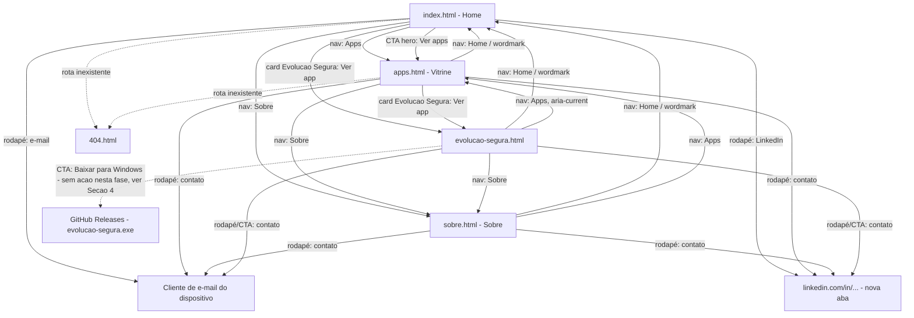

# UX-SPEC.md — Site institucional LJSSoftware

**Status:** Loop B já aprovado; revisado uma vez para consolidar a identidade
visual final "Geométrico/Glass" (`ADR-005`). **Reaberto pontualmente
novamente (Rodada 3, 2026-09-17)** para especificar a nova página de
divulgação de app desktop `evolucao-segura.html` (RF-09) — ver Fluxo 5
(Seção 1), wireframe (Seção 2), tokens/componentes novos (Seção 3),
estados (Seção 4) e restrições técnicas aplicadas (Seção 7). Baseado num
mockup de conceito de exploração visual já aprovado pelo stakeholder (não
formal), com ajustes de arquitetura/consistência feitos pelo Coordenador
nesta formalização. **Ajuste pontual adicional (mesma reabertura,
2026-09-17):** o usuário confirmou que os 2 CTAs de download ("Baixar para
Windows", hero e CTA final) não devem ter nenhuma ação nesta entrega —
adicionado o quinto estado "Indisponível para download nesta fase" à
Seção 4 e o respectivo trade-off à Seção 7.
**Reaberto pontualmente (Rodada 4, 2026-09-18)** para "Página de detalhe
padronizada por app" (RA-10): novo Fluxo 6 (template de página de app),
roteamento dos cards atualizado no Fluxo 2, componente `.changelog` (Seção
3.2), estados do template (Seção 4) e trade-offs (Seção 7). Fluxos 1, 3, 4, 5
e o design system anterior permanecem inalterados.
**Base:** `PRD.md` + `PRD-TECNICO.md` (Rodada 2 + adendo Rodada 3) +
`SDD.md` (mesma sequência, incl. `ADR-006`)
**Data original:** 2026-09-07 · **Revisão anterior:** 2026-09-07 (`ADR-005`)
· **Data desta revisão:** 2026-09-17
**Autor:** Coordenador (chapéu UX/UI)

---

## 1. Fluxos de Tela

Arquitetura de informação definida pelo `SDD.md` (ADR-001): site multi-página
estático (`index.html`, `apps.html`, `sobre.html`, `evolucao-segura.html`,
`404.html`), navegação por header fixo com wordmark + nav, sem
single-page/âncoras — `evolucao-segura.html` é uma página própria dentro do
mesmo site (não uma landing page isolada), primeiro caso concreto do padrão
"página de divulgação de app desktop" (RF-09).

### Mapa de navegação



### Fluxo 1 — Home (RF-01)
Visitante chega em `index.html` (link direto, busca, redes sociais). Estrutura
de seções da página, na ordem confirmada com o usuário (direção visual
"Geométrico/Glass", ADR-005):

1. **Header** (fundo branco, ícone + "LJS Software" + nav — ver Seção 3.1).
2. **Hero** (fundo escuro/mesh gradient): título + subtítulo + 2 CTAs (ex.:
   "Ver apps" levando a `apps.html`, e um segundo CTA — detalhe de conteúdo a
   confirmar com o stakeholder, mesmo tratamento de placeholder de L-01/L-02
   no `TASK.md`).
3. **Seção de apps em desenvolvimento**: grid de 3 cards "glass", todos com
   badge "Em breve" (prévia da mesma vitrine de `apps.html` — RF-02).
4. **Seção Sobre**: 1 card "glass" centralizado com o texto institucional
   curto (RF-03) e link "Saiba mais" para `sobre.html`.
5. **Seção de contato**: fundo escuro, 2 botões (e-mail e LinkedIn) — mesmo
   conteúdo/placeholder do rodapé (ver Fluxo 5 e Lacuna L-01 do `TASK.md`);
   não é uma página própria nova, é uma seção mais visual do que o link
   simples de rodapé usado nas demais páginas, mantendo o trade-off já
   documentado na Seção 7 (sem `contato.html` dedicado).
6. **Rodapé**.

Nenhum estado de carregamento assíncrono — conteúdo já vem no HTML.

### Fluxo 2 — Vitrine de apps (RF-02, RF-09, RN-01, RN-02, RN-03)
Visitante acessa `apps.html` a partir da Home ou diretamente. Vê um grid de
cards, um por app, cada um com nome + descrição curta + badge "Em breve" ou
link "Ver app" (conforme `status`/`tipo` do app — `SDD.md` Seção 5).
Estrutura do card já preparada (SDD.md, Seção 5) para trocar o badge por um
link sem redesenho, seguindo o critério de roteamento (Rodada 3,
`PRD-TECNICO.md` Seção 9.2):
- **[ATUALIZADO, Rodada 4, RN-05/RF-10.4] Todo app publicado — web ou
  desktop:** o "Ver app" do card aponta para a página interna do app
  (`destino-ideal.html`, `radar-esportivo.html`, `evolucao-segura.html`),
  markup igual ao caso desktop abaixo (sem `target`, sem `rel`, sem indicador
  de nova aba). O bloco "web = link externo direto" abaixo fica como
  histórico e **deixa de valer** para Destino Ideal e Radar Esportivo. A
  saída real para o produto web acontece só dentro da página (CTA "Abrir
  app", Fluxo 6). O botão "Saiba mais" (modal, Lote 7) permanece inalterado.
  Card "Em breve" segue com badge sem link (RF-10.11). **Minha Jornada**
  (card hoje com link externo direto) fica fora desta rodada — ver questão
  em aberto no `TASK.md` L-14.
- **(Histórico, superado) App web publicado** (`tipo: web`): badge vira `<a class="badge--link"
  href="URL_EXTERNA" target="_blank" rel="noopener">Ver app</a>` — padrão já
  em produção (Destino Ideal, Radar Esportivo).
- **App desktop/instalável publicado** (`tipo: desktop`): badge vira
  `<a class="badge--link" href="[nome-do-app].html">Ver app</a>` — **sem**
  `target="_blank"`/`rel="noopener"` (navegação interna, mesmo domínio) e
  **sem** indicador de "nova aba" (RN-02 só se aplica a saída real do site).
  Primeiro caso: Evolução Segura → `evolucao-segura.html` (Fluxo 5).

O card em si **nunca** aponta direto para um arquivo de download (RN-03) —
é sempre a página de divulgação própria que oferece o CTA de download.

### Fluxo 3 — Página de divulgação de app desktop: Evolução Segura (RF-09)

Visitante clica em "Ver app" no card do Evolução Segura (`apps.html` ou
prévia de `index.html`) e navega, dentro do mesmo site, para
`evolucao-segura.html`. Página de produto de rolagem única (não single-page
app — é uma página HTML própria, com âncoras internas para navegação rápida
entre seções), estruturada em 10 blocos de conteúdo + header/rodapé
(baseada no mockup de conceito já validado com o stakeholder,
`evolucao-segura-mockup.html`, adaptada aqui ao design system formal):

1. **Hero de produto** (`.hero--product`, variante de 2 colunas do `.hero`
   existente): título + subtítulo + eyebrow ("Prontuário eletrônico
   criptografado") + fatos rápidos (ex.: "100% local", "Windows 10/11") +
   2 CTAs ("Baixar para Windows" primário — **estado "indisponível para
   download nesta fase" nesta entrega, ver Seção 4**, "Ver por dentro"
   secundário → âncora `#por-dentro`, este funcional normalmente) + 1
   screenshot real (slot S1, já capturado) ao lado do texto.
2. **O problema** (3 `.problem-card`, variante do `.glass-card`): nomeia o
   "concorrente real" (arquivo de texto solto, nuvem não intencional, edição
   sem rastro) antes de apresentar a solução — copy já validada no mockup.
3. **Proposta de valor** (3 `.pillar`, variante do `.glass-card`): os 3
   pilares do produto (proteção verificável, registro auditável, busca).
4. **Como isso aparece na tela / "Por dentro"** (`id="por-dentro"`, âncora
   do CTA do hero): 4 blocos `.feature` (texto + screenshot alternados,
   slots S2-S5) + 2 screenshots de apoio (slots S6-S7, backup/senha
   mestra) — a seção com mais conteúdo de prova visual da página.
5. **Conformidade** (texto institucional curto: guarda de prontuário por 5
   anos é obrigação legal do psicólogo, formato também importa).
6. **Instalação** (`id="instalacao"`): lista numerada `.steps` (4 passos,
   do download à criação da senha mestra) + bloco `.notice` (aviso âmbar,
   honesto, sobre o alerta do SmartScreen do Windows ao rodar um instalador
   sem assinatura de código paga — explica o que o visitante vai ver e como
   prosseguir) + screenshot do próprio aviso do Windows (slot S8).
7. **Licença de uso** (`id="licenca"`, **[ATUALIZADO, ajuste pontual]**):
   1 `.pillar` explicando só o que é verificável hoje — 7 dias de teste;
   ao fim do período o app bloqueia apenas a escrita, leitura e exportação
   em PDF continuam disponíveis — fechando com a frase honesta "O passo a
   passo para continuar usando depois do teste ainda está sendo definido —
   quando estiver pronto, esta seção é atualizada com os detalhes."
   **Sem** o passo a passo de chave/contra-chave (removido: não é uma tela
   real do produto hoje, ver Seção 7) e **sem** screenshot desta seção (o
   slot S9 foi removido — não há tela de licenciamento para capturar).
8. **Requisitos de sistema** (`id="requisitos"`): tabela `.specs` (SO,
   conexão, onde ficam os dados, perfil de uso, espaço em disco).
9. **Dúvidas/FAQ** (`.faq`, `<details>`/`<summary>` nativos — recolhível
   sem JS): 5 perguntas frequentes.
10. **CTA final** (`id="baixar"`, mesmo `.glass-card`/`final-cta`): repete
    a promessa central + CTA de download (**mesmo estado "indisponível para
    download nesta fase" do CTA do hero, ver Seção 4 — os dois CTAs de
    download da página, hero e final, compartilham o mesmo estado sempre**)
    + metadados do arquivo (tamanho, versão — a confirmar) + link para reler
    a seção de instalação antes de baixar.

Todas as 10 seções seguem o mesmo header/rodapé das demais páginas (G-02) e
os mesmos tokens de design (Seção 3), com os componentes novos desta página
documentados na Seção 3.2.

### Fluxo 6 — Página de detalhe padronizada por app (RA-10, RF-10) [Novo, Rodada 4]

Template único, derivado de `evolucao-segura.html` (Fluxo 3), aplicado a cada
app **publicado**; mantido em `dev/templates/app-page.template.html` (fora de
`public/`), copiado manualmente por app, com checklist RNF-11 no cabeçalho do
arquivo. Visitante chega por busca orgânica ou pelo "Ver app" do card
(Fluxo 2), lê a página e, se web, sai pelo CTA "Abrir app".

Ordem fixa das seções (RF-10.2). Ordem e componentes reutilizam os do Lote 8
(`.hero--product`, `.pillar`, `.shot`, `.faq`, `.glass-card`):
1. **Hero** (`.hero--product`, obrigatória): `<h1>` único = nome + proposta em
   uma frase, eyebrow opcional, CTA principal, 1 `.shot` (o melhor print).
2. **Proposta de valor** (obrigatória): 3 `.pillar`.
3. **Prints/demo** (omitida do DOM se sem conteúdo; RN-04 exige >= 1 print
   para a página existir): `.feature`/`.shot`; demo = GIF/vídeo próprio
   estático (`` GIF ou `<video>` arquivo próprio, controles visíveis,
   sem autoplay com som, respeitando `prefers-reduced-motion`; nunca
   iframe/embed de terceiro, G-09).
4. **FAQ** (omitida se < 3 perguntas reais): `.faq` (`<details>`).
5. **Changelog** (omitido até haver a 1a entrada, PR-13): componente novo
   `.changelog` (Seção 3.2), lista `<ol reversed>` de `<li>` com `<time
   datetime="AAAA-MM-DD">`, versão opcional e descrição curta, mais recente
   primeiro.
6. **CTA final** (obrigatória): repete o CTA do hero.

Seções extras específicas do produto (ex.: "O problema", "Instalação",
"Requisitos" em Evolução Segura) são permitidas **entre** a proposta de valor
e o FAQ, reutilizando os componentes do Lote 8, sem alterar a ordem das seis
obrigatórias/omitíveis.

**Variantes do CTA principal (hero e final, sempre o mesmo estado):**
- **App web:** `<a class="hero__cta hero__cta--primary" href="URL_DO_PRODUTO"
  target="_blank" rel="noopener noreferrer" data-analytics-event="app-[slug]-abrir">Abrir
  app<span class="sr-only"> (abre em nova aba)</span></a>` + ícone visual
  de saída (mesmo padrão RN-02 do LinkedIn).
- **App desktop:** segue o Fluxo 3/Seção 4 (estado "Indisponível para
  download nesta fase", L-11), nunca link para binário (RN-03).
- Header idêntico às demais páginas com `aria-current="page"` no item
  "Apps" (RF-10.8, G-02).

### Fluxo 4 — Sobre (RF-03)
Visitante acessa `sobre.html`. Texto institucional único, sem interação além
da navegação padrão.

### Fluxo 5 — Contato (RF-04)
Não é uma página própria (decisão de UX documentada na Seção 7 — trade-off
com a arquitetura). O rodapé, presente em todas as páginas, expõe:
- Link `mailto:contato@ljssoftware.com.br` (endereço definitivo a confirmar
  com o stakeholder na execução — placeholder documentado no `TASK.md`).
- Link para o perfil de LinkedIn do stakeholder, abrindo em nova aba
  (`target="_blank" rel="noopener"`).

### Fluxo alternativo — Rota inexistente
Visitante acessa uma URL que não existe → `404.html`, com wordmark, mensagem
curta e link de volta para a Home.

## 2. Wireframes

Wireframes em ASCII, cobrindo desktop (≥1024px) e mobile (360-767px). Ver
Seção 6 para breakpoints intermediários.

> **Nota (revisão pós-ADR-005):** os wireframes abaixo refletem a estrutura
> de seções confirmada com o usuário (Fluxo 1, Seção 1) — header com fundo
> branco (exceção visual ao resto da página, que é escura), hero, seção de
> apps em desenvolvimento (3 cards "glass"), seção Sobre (1 card "glass"
> centralizado) e seção de contato (2 botões), antes do rodapé. Layout ASCII
> mantém a mesma lógica de blocos da versão anterior, com blocos novos
> adicionados.

### Home — Desktop
```
+--------------------------------------------------------------+
| [icone] LJS Software        Apps   Sobre   [ Contato ]        |  <- header BRANCO
+--------------------------------------------------------------+
|                                                                |
|              Título do hero                                   |
|        Subtítulo / tagline                                    |  <- hero (fundo escuro,
|         [ Ver apps ]   [ CTA secundário ]                     |     mesh gradient)
|                                                                |
+--------------------------------------------------------------+
|  Nossos apps                                                  |
|  +----------+   +----------+   +----------+                  |  <- seção apps (cards
|  | [glass]  |   | [glass]  |   | [glass]  |                  |     "glass", "Em breve")
|  |[Em breve]|   |[Em breve]|   |[Em breve]|                  |
|  +----------+   +----------+   +----------+                  |
+--------------------------------------------------------------+
|              +----------------------------+                   |
|              |  Sobre a LJSSoftware [glass]|                   |  <- seção Sobre (1 card
|              |  Texto curto...             |                   |     "glass" centralizado)
|              |  [ Saiba mais -> ]          |                   |
|              +----------------------------+                   |
+--------------------------------------------------------------+
|         [ E-mail ]          [ LinkedIn ]                       |  <- seção de contato
+--------------------------------------------------------------+
| rodapé                                                          |
+--------------------------------------------------------------+
```

### Home — Mobile
```
+---------------------------+
| [icone] LJS Soft.    [=]  |  <- header BRANCO + hamburguer
+---------------------------+
|                           |
|      Título do hero       |
|  Subtítulo / tagline      |
|      [ Ver apps ]         |
|      [ CTA secundário ]   |
|                           |
+---------------------------+
| Nossos apps                |
| +------------------------+ |
| | [glass] [Em breve]      | |
| +------------------------+ |
| +------------------------+ |
| | [glass] [Em breve]      | |
| +------------------------+ |
| +------------------------+ |
| | [glass] [Em breve]      | |
| +------------------------+ |
+---------------------------+
| +------------------------+ |
| | Sobre a LJSSoftware      | |
| | [glass] Texto curto...  | |
| | [ Saiba mais -> ]       | |
| +------------------------+ |
+---------------------------+
| [ E-mail ]                  |
| [ LinkedIn ]                |
+---------------------------+
| rodapé                     |
+---------------------------+
```

### Vitrine de apps — Desktop (grid 3 colunas)
```
+--------------------------------------------------------------+
| [LJSSoftware]           Home   Apps   Sobre                  |
+--------------------------------------------------------------+
|  Nossos apps                                                  |
|                                                                |
|  +------------+   +------------+   +------------+             |
|  | Nome do app|   | Nome do app|   | Nome do app|             |
|  | Descrição  |   | Descrição  |   | Descrição  |             |
|  | curta...   |   | curta...   |   | curta...   |             |
|  | [Em breve] |   | [Em breve] |   | [Em breve] |             |
|  +------------+   +------------+   +------------+             |
+--------------------------------------------------------------+
| rodapé (igual à Home)                                          |
+--------------------------------------------------------------+
```

### Vitrine de apps — Mobile (grid 1 coluna)
```
+---------------------------+
| [LJSSoftware]        [=]  |
+---------------------------+
| Nossos apps                |
|                            |
| +------------------------+ |
| | Nome do app             | |
| | Descrição curta...      | |
| | [Em breve]              | |
| +------------------------+ |
| +------------------------+ |
| | Nome do app              | |
| | Descrição curta...       | |
| | [Em breve]                | |
| +------------------------+ |
+---------------------------+
| rodapé (igual à Home)      |
+---------------------------+
```

### Sobre e 404
Seguem o mesmo header/rodapé; corpo é um bloco de texto único (Sobre) ou
mensagem curta + link de retorno (404) — sem wireframe adicional por não
terem componente novo além dos já especificados.

### Evolução Segura — Desktop (`evolucao-segura.html`)
```
+--------------------------------------------------------------+
| [icone] LJS Software    Home  Apps*  Sobre   [ Contato ]      |  <- header BRANCO
+--------------------------------------------------------------+  (* aria-current="page"
|  Prontuário criptografado        +------------------+         |     em "Apps", nao "Home")
|  no seu computador                | [screenshot S1]  |         |  <- hero--product
|  Subtitulo...                     | print real       |         |     (2 colunas)
|  [ Baixar p/ Windows (indisponivel) ] [Ver por dentro]         |
|  Download ainda nao disponivel nesta fase                     |  <- nota junto ao CTA
+--------------------------------------------------------------+
|  O concorrente nao e outro software...                        |
|  +----------+   +----------+   +----------+                  |  <- problem-card x3
|  | [glass]  |   | [glass]  |   | [glass]  |                  |
+--------------------------------------------------------------+
|  Tres coisas, bem feitas                                      |
|  +----------+   +----------+   +----------+                  |  <- pillar x3
+--------------------------------------------------------------+
|  Como isso aparece na tela            [id=por-dentro]         |
|  texto  | [screenshot S2] |   [screenshot S3] | texto          |  <- .feature x4
|  texto  | [screenshot S4] |   [screenshot S5] | texto          |     (alternado)
|         [screenshot S6]        [screenshot S7]                |
+--------------------------------------------------------------+
|  Guardar por 5 anos e obrigacao sua...  (texto, sem card)      |  <- conformidade
+--------------------------------------------------------------+
|  Como instalar          [id=instalacao]                       |
|  1. Baixe   2. Aviso Windows   3. Senha mestra   4. Use 7 dias |  <- .steps
|  +--------------------------------------------------------+   |
|  | [!] Sim, o Windows vai exibir um aviso.  (fundo ambar)  |   |  <- .notice
|  +--------------------------------------------------------+   |
|          [screenshot S8 - aviso SmartScreen]                   |
+--------------------------------------------------------------+
|  Licenca de uso          [id=licenca]     [ATUALIZADO, ajuste pontual]|
|  +----------------------------------------------------------+  |  <- pillar x1
|  | 7 dias de teste; depois so bloqueia escrita (leitura/PDF  |  |
|  | continuam). Passo a passo pos-teste ainda sendo definido. |  |
|  +----------------------------------------------------------+  |
+--------------------------------------------------------------+
|  Requisitos de sistema   [id=requisitos]                       |
|  +----------------------------------------------------------+ |  <- .specs (tabela)
+--------------------------------------------------------------+
|  Duvidas                                                        |
|  > E se eu esquecer a senha mestra?                             |  <- .faq (<details>)
|  > Meus dados vao para algum servidor?     (5 itens)            |
+--------------------------------------------------------------+
|     [ Baixar para Windows (indisponivel) ]  [id=baixar]        |  <- CTA final (glass)
|     Download ainda nao disponivel nesta fase                  |
+--------------------------------------------------------------+
| rodapé (igual às demais páginas)                                |
+--------------------------------------------------------------+
```
Mobile (360-767px): todas as seções empilham em 1 coluna; `.hero--product`
perde a grade de 2 colunas (texto acima, screenshot abaixo); `.feature`
sempre texto acima da imagem, nunca lado a lado (ver Seção 6).

## 3. Design System

### 3.1 Identidade visual (RF-08 / ADR-004 superseded by ADR-005)

> **Nota de proveniência:** esta seção foi revisada em reabertura pontual do
> `UX-SPEC.md` (fora do fluxo formal do `/definir_organizar`, Loop B já
> fechado anteriormente). A especificação original abaixo era um wordmark
> tipográfico simples (Sora/Inter, paleta indigo/teal, sem símbolo), proposta
> pelo Coordenador conforme `ADR-004`. O usuário, diretamente, pediu e
> aprovou 5 conceitos visuais completos de home page (skill de design/
> Artifact) a partir da logo real da marca, escolheu a direção
> **"Geométrico/Glass"**, e depois ajustou especificamente o layout do
> cabeçalho. Essa decisão já foi tomada e aprovada — o texto abaixo a
> consolida, não a propõe. Ver `ADR-005` (supersede `ADR-004`) para o
> registro formal da mudança de decisão.

**Ativos de logo já produzidos (`.md/assets/`) — não recriar:**

| Arquivo | Conteúdo | Uso |
|---|---|---|
| `logo-ljssoftware.png` | Arte original enviada pelo usuário: ícone + texto, fundo cinza-claro sólido embutido | Referência/arquivo-fonte; não usar diretamente na UI (tem fundo sólido) |
| `logo-ljssoftware-transparente.png` | Lockup completo (ícone + texto), fundo removido (chroma-key/decontaminação de alfa) — **raster (PNG), não vetor/SVG** | Uso geral onde o lockup completo for necessário fora do header (ex.: og:image, redes sociais) |
| `logo-ljssoftware-icone.png` | Apenas o ícone geométrico "U/S", recortado, fundo transparente — também raster, não vetor | Vai no cabeçalho, ao lado do texto "LJS Software" (texto em HTML/CSS, não embutido na imagem) |

**Observação técnica registrada:** a remoção de fundo não é vetorização real
— os 3 arquivos permanecem raster. Se no futuro for necessário escalar a
logo para tamanhos muito grandes sem perda de qualidade, uma vetorização de
verdade (SVG) a partir da arte-fonte original, ou via serviço especializado,
ainda seria recomendável. Não é bloqueio para o escopo atual (ícone usado a
56px no cabeçalho).

**Cabeçalho (header) — layout específico, resultado de iteração adicional
com o usuário após os 5 conceitos:**
- Fundo do header: **branco sólido** (`#FFFFFF`), deliberadamente diferente
  do restante da página (fundo escuro `#0B2545`) — contraste para destacar o
  ícone, que é predominantemente azul/teal.
- Dentro do header: **ícone à esquerda + texto "LJS Software" ao lado**
  (lado a lado, horizontal) — substitui o lockup vertical original da
  arte-fonte (ícone em cima, texto embaixo).
- Ícone (`logo-ljssoftware-icone.png`): 56px de altura.
- Texto "LJS Software": fonte **Unbounded**, peso 700, 25px, cor `#0B2545`
  (navy escuro, legível sobre fundo branco).
- Nav (Apps, Sobre): texto navy `#264A6E`, peso 500.
- Botão "Contato" no header: fundo navy sólido `#0B2545`, texto branco.
- Justificativa registrada: no lockup vertical original da arte-fonte, ícone
  e nome ficavam pequenos/"esmagados"; o layout horizontal com fundo branco
  aumenta o destaque de ambos.

**Restante da página (hero, seções, rodapé): fundo escuro com mesh gradient**
— só o header foge a esse padrão, conforme decisão acima.

**Paleta de cores ("Geométrico/Glass") — substitui integralmente a paleta
indigo/teal anterior:**

| Token | Valor (hex/valor) | Uso |
|---|---|---|
| `--color-bg` | `#0B2545` (azul-marinho profundo) | Fundo principal das seções (hero, apps, sobre, contato, rodapé) — exceto o header |
| `--color-bg-gradient-1` | `#146B8C` | Gradiente radial decorativo sobreposto ao fundo (mesh gradient sutil, não sólido) |
| `--color-bg-gradient-2` | `#1FB6A6` | Segundo gradiente radial decorativo, sobreposto ao primeiro |
| `--color-text-inverse` | `#EAF6F4` (quase branco, tom frio) | Texto principal sobre fundo escuro |
| `--color-text-inverse-secondary` | `#B9D6D0` | Texto secundário sobre fundo escuro |
| `--color-accent` | `#7FE3D2` (teal claro) | Badges, links, detalhes, foco de teclado sobre fundo escuro |
| `--color-header-bg` | `#FFFFFF` | Fundo sólido do header (exceção ao fundo escuro do resto da página) |
| `--color-header-text` | `#0B2545` | Texto "LJS Software" e ícone sobre o header branco |
| `--color-header-nav-text` | `#264A6E` | Links de nav (Apps, Sobre) sobre o header branco |
| `--glass-bg` | `rgba(255,255,255,0.08)` | Fundo dos cards "glass" |
| `--glass-border` | `rgba(255,255,255,0.18)` | Borda dos cards "glass" (`1px solid`) |
| `--glass-blur` | `14px` | `backdrop-filter: blur(14px)` dos cards "glass" |
| `--glass-radius` | `20px` | `border-radius` dos cards "glass" |
| `--shape-radius` | `28px` | `border-radius` das formas geométricas decorativas de fundo |
| `--color-notice-bg` | `rgba(255, 209, 102, 0.10)` **[Novo, Rodada 3]** | Fundo do bloco `.notice` (aviso honesto, ex.: alerta do SmartScreen na instalação) |
| `--color-notice-border` | `rgba(255, 209, 102, 0.35)` **[Novo, Rodada 3]** | Borda do bloco `.notice` |
| `--color-notice-icon` | `#FFD166` (âmbar) **[Novo, Rodada 3]** | Ícone e título do bloco `.notice` — única cor fora da paleta navy/glass/teal do site, introduzida deliberadamente para sinalizar "atenção" sem usar vermelho de erro (o conteúdo não é um erro, é uma explicação) |

**Decisão registrada (item novo desta reabertura):** o mockup de conceito
usava `#FFD166` (âmbar) só no bloco `.notice`. Avaliada a alternativa de
reaproveitar `--color-accent` (teal) para esse bloco — descartada porque
teal já significa "positivo/destaque" em todo o resto do site (CTAs,
badges, foco de teclado), e usá-lo também para "atenção" diluiria esse
significado. **Decisão:** 3 tokens novos dedicados (acima), família de cor
"aviso", usada exclusivamente no componente `.notice`. Contraste do texto
(`--color-text-inverse` sobre `--color-notice-bg`, que é quase transparente
sobre `--color-bg`) e do ícone/título (`--color-notice-icon` sobre
`--color-bg`, crítico de UI ≥3:1) devem ser verificados pelo Executor com
ferramenta de contraste antes de fechar a tarefa correspondente (mesmo
protocolo de `accessibility-review` já usado para os demais tokens).

Formas geométricas decorativas: blocos com `border-radius` ~28px, rotacionados
entre 10° e 35°, gradientes translúcidos azul/teal, posicionados atrás do
conteúdo (`z-index` baixo) — ecoam as peças entrelaçadas do ícone da logo.

Combinações a validar com ferramenta de contraste durante a execução (item de
`accessibility-review`, Seção 5): `--color-text-inverse`/
`--color-text-inverse-secondary` sobre `--color-bg`, `--color-accent` sobre
`--color-bg`, e `--color-header-text`/`--color-header-nav-text` sobre
`--color-header-bg` (branco) precisam atingir ≥4.5:1 (texto normal) ou ≥3:1
(texto grande/UI), conforme WCAG AA. Atenção especial ao texto sobre os cards
"glass" (fundo translúcido sobre o gradiente de fundo, contraste efetivo
varia conforme a área sobreposta) — verificar no pior caso de sobreposição.

**Tipografia (Google Fonts, self-hosted — mantém a política de hospedagem já
fixada no `SDD.md`, só os nomes das fontes mudam):**
- Títulos/display (`h1`-`h3`, texto "LJS Software" do header): **Unbounded**,
  peso 500-700 — geométrica, combina com o ícone da marca.
- Corpo de texto: **Outfit**, peso 400-600.
- `font-display: swap` obrigatório para não bloquear renderização de texto
  enquanto a fonte carrega (ver Seção 4, estado "Carregando").

**Favicon:** deriva do `logo-ljssoftware-icone.png` (recorte quadrado do
ícone geométrico "U/S"), não mais do monograma "LJ" tipográfico da
especificação anterior.

### 3.2 Componentes

| Componente | Novo/Existente | Descrição |
|---|---|---|
| Header/Nav | Novo | Fundo `--color-header-bg` (branco, exceção ao resto da página); ícone `logo-ljssoftware-icone.png` (56px) + texto "LJS Software" lado a lado à esquerda; nav à direita (desktop) / hamburguer (mobile); botão "Contato" com fundo `--color-bg` (navy) e texto branco |
| Card "glass" | Novo | `--glass-bg`/`--glass-border`/`--glass-blur`/`--glass-radius` — base visual de: App Card (Lote de apps), card da seção Sobre, e qualquer outro bloco de conteúdo sobre o fundo escuro |
| Forma geométrica decorativa | Novo | Bloco com `--shape-radius`, rotação 10-35°, gradiente translúcido azul/teal, `z-index` baixo, posicionado atrás do conteúdo (hero e outras seções) — puramente decorativo, `aria-hidden="true"` |
| Botão CTA primário | Novo | Usado em "Ver apps"/CTAs do hero — fundo `--color-accent`, texto `--color-bg` (navy, para contraste sobre o teal claro) |
| App Card | Novo | Variante do Card "glass" com nome, descrição, badge de status |
| Badge "Em breve" | Novo | Pílula com fundo `--glass-bg` e texto `--color-accent` ou `--color-text-inverse`, ícone de relógio opcional |
| Rodapé/Contato | Novo | Fundo escuro (`--color-bg`), 2 botões (e-mail e LinkedIn) com ícone + texto (nunca só ícone, ver Seção 5) |
| Link de nova aba (LinkedIn) | Novo | Ícone de "abre em nova aba" ao lado do texto, para deixar explícito que sai do site (RN-02) |
| `.hero--product` | **Novo [Rodada 3]** | Variante de 2 colunas do `.hero` existente (texto + CTAs à esquerda, 1 `.shot` à direita em desktop ≥900px; empilha em mobile); usada em `evolucao-segura.html` |
| `.shot` | **Novo [Rodada 3]** | Moldura de screenshot com legenda (`figure`/`figcaption`): estado "a capturar" (placeholder com tag + dica de enquadramento, usado até o Executor substituir pela imagem real) e estado "capturado" (imagem real, `alt` descritivo, legenda opcional) |
| `.problem-card` / `.pillar` | **Novo [Rodada 3]** | Variantes de conteúdo do `.glass-card` já existente (mesmo token base `--glass-*`) — `.problem-card` para a seção "O problema", `.pillar` para "Proposta de valor"/"Licença de uso"; sem novo token visual, só variação de conteúdo/ícone interno |
| `.feature` | **Novo [Rodada 3]** | Bloco de texto + `.shot` alternados (imagem à esquerda/direita, alternando a cada item), usado na seção "Como isso aparece na tela" |
| `.steps` | **Novo [Rodada 3]** | Lista numerada (`<ol>`), usada em "Como instalar" — numeração via `counter`/`aria-hidden`, texto do passo sempre legível por leitor de tela (não depende só do número visual). **[ATUALIZADO, ajuste pontual]** deixou de ser usada em "Licença de uso" (o passo a passo de chave/contra-chave foi removido dessa seção, ver Seção 7) |
| `.notice` | **Novo [Rodada 3]** | Bloco de aviso honesto (cor âmbar dedicada, `--color-notice-*` — Seção 3.1), usado para o alerta do SmartScreen do Windows na instalação; título + texto + (quando aplicável) trecho de código do caminho a seguir |
| `.specs` | **Novo [Rodada 3]** | Tabela de requisitos de sistema (`<table>` semântica com `<caption>`/`scope="row"`), usada na seção "Requisitos de sistema"; empilha em 1 coluna em mobile (Seção 6) |
| `.faq` | **Novo [Rodada 3]** | FAQ recolhível via `<details>`/`<summary>` nativos (sem JS necessário para abrir/fechar, acessível por teclado nativamente), usada na seção "Dúvidas" |

| `.changelog` | **Novo [Rodada 4]** | Histórico de versões da página de app: `<ol reversed>` dentro de `.glass-card`, cada `<li>` com `<time datetime="AAAA-MM-DD">`, versão opcional (`<strong>`) e descrição curta; sem token novo (reusa `--glass-*`, `--color-accent`); mobile empilha data acima do texto. Marcado novo por G-12 |

Não há design system prévio da marca além da logo em si (ícone + nome,
fornecidos pelo usuário) — todos os componentes de UI acima são novos,
desenhados na direção "Geométrico/Glass" (ADR-005) a partir dessa logo; não
há reaproveitamento de biblioteca visual existente.

## 4. Estados de Tela

Por ser um site 100% estático sem chamadas assíncronas de dados (SDD.md,
Seção 1-2), os 4 estados clássicos se aplicam de forma limitada — cada
fluxo abaixo justifica explicitamente o que se aplica ou não.

### Home / Sobre
- **Vazio:** não aplicável — conteúdo institucional é sempre fixo e presente
  no HTML, não existe cenário de "sem dado".
- **Carregando:** não aplicável a dados (não há requisição assíncrona de
  conteúdo); aplica-se apenas ao carregamento de fonte web — mitigado com
  `font-display: swap` (texto aparece imediatamente com fonte de sistema,
  troca suavemente quando Sora/Inter carregam).
- **Erro:** coberto pela página `404.html` para rota inexistente; não há
  outro erro possível (sem chamada de rede a dado dinâmico).
- **Sucesso:** estado padrão/único de renderização da página.

### Vitrine de apps
- **Vazio:** não aplicável na fase 1 — a lista de apps é hardcoded e sempre
  terá ao menos os apps informados pelo stakeholder como conteúdo (RF-02
  trata isso como decisão de conteúdo, não de comportamento). Caso um dia a
  lista fique vazia, o Executor deve tratar como lacuna a reportar via
  `BLOCKERS.md`, não decidir uma tela vazia nova sem alinhar antes.
- **Carregando:** não aplicável (mesmo motivo da Home).
- **Erro:** coberto por `404.html`.
- **Sucesso (padrão):** grid de cards, todos com badge "Em breve" na fase 1.
- **Estado futuro (documentado para não exigir redesenho — RF-02):** card
  com link de saída real substituindo o badge, incluindo indicador visual de
  saída do site (RN-02) — especificado aqui ainda que não implementado na
  fase 1, para orientar o Executor a já deixar o CSS/markup preparado.

### Evolução Segura — Desktop (`evolucao-segura.html`) — [Novo, Rodada 3]
- **Vazio:** aplica-se de forma pontual, não à página inteira — cada slot de
  screenshot (`.shot`) que ainda não tem a imagem real capturada usa o
  estado "vazio" explícito do componente: moldura com tag "SLOT Sx · a
  capturar" + dica textual de enquadramento para o Executor, nunca uma
  imagem quebrada ou um espaço em branco sem explicação. Nenhuma seção
  pode ser marcada `Concluída` no `TASK.md` com um slot ainda nesse estado
  (G-06 aplicado ao componente, não só à tela inteira) — S1 já foi
  capturado e serve de referência do estado "capturado"; S2-S9 nascem no
  estado "vazio" e são resolvidos pelas tarefas de captura de screenshot
  (`TASK.md`, Lote 11).
- **Carregando:** mesmo tratamento de fonte web (`font-display: swap`) das
  demais páginas; não há chamada assíncrona de dado.
- **Erro:** coberto por `404.html`, igual às demais páginas. O CTA de
  download em si não tem estado de erro nesta fase — antes de T10.2
  substituir o badge do card por link real, o pré-requisito de RT-08
  (`SDD.md`) já precisa estar resolvido (repositório/Release público),
  então não existe cenário publicado de link de download quebrado.
- **Indisponível para download nesta fase [Novo estado, quinto além dos 4
  clássicos — decisão explícita do usuário, mais forte que o "link
  pendente" de RT-08/T10.2]:** aplica-se aos **2 CTAs de download da
  página** — o primário do hero (Seção 1) e o do CTA final (Seção 10) — e
  é o estado em que **ambos nascem nesta entrega**, independente de
  RT-08/`ADR-006` já estar resolvido ou não. Diferente do que estava
  registrado antes (CTA aponta para a Release real assim que o
  pré-requisito externo for resolvido), o usuário confirmou que **ainda não
  quer distribuir o produto**: nenhum dos 2 botões pode ter `href`
  funcional para o `.exe`, para o GitHub Releases, nem um `href="#"`/JS
  disfarçando um destino que não existe. O botão continua **visualmente
  presente e proeminente** (a seção não é removida nem escondida) mas se
  comunica como indisponível de forma honesta, nunca como um link quebrado
  ou um botão comum sem reação: elemento não-`<a>` (ex.: `<button
  disabled>` ou `<span role="button" aria-disabled="true">`, nunca âncora
  com `href` vazio), cursor `not-allowed`, aparência visualmente distinta
  do CTA "Ver por dentro" (opacidade reduzida ou variante `--muted`/
  desabilitada do botão primário), e uma nota curta visível junto ao botão
  (ex.: "Download ainda não disponível nesta fase") — não basta o texto do
  próprio botão sozinho. Este estado é o que os 2 CTAs devem ter **ao
  publicar esta entrega**; a transição para o estado "Sucesso" abaixo (link
  real) é uma decisão de negócio futura e distinta, fora do escopo desta
  reabertura — quando ocorrer, T10.2/T9.1/T9.6 precisarão ser reabertas
  para trocar o estado, não é algo que o Executor antecipa sozinho.
- **Sucesso (estado futuro, não implementado nesta entrega):** página
  completa com os 10 blocos de conteúdo, todos os 9 slots de screenshot no
  estado "capturado", CTA de download apontando para a Release real do
  GitHub (`ADR-006`) — documentado aqui só para não exigir redesenho
  quando a distribuição for autorizada; nesta entrega, os 2 CTAs
  permanecem no estado "Indisponível para download nesta fase" acima,
  mesmo que todos os demais blocos/screenshots já estejam prontos.
- **Estado intermediário aceito para publicação parcial (documentado para
  não travar o lançamento):** se, no momento do deploy, algum slot S2-S9
  ainda não tiver captura real disponível (ex.: aguardando dado fictício
  populado no app), a página só pode ir ao ar com **todos** os slots
  resolvidos — RF-09 exige "ao menos 1 screenshot real", mas o critério de
  granularidade do `TASK.md` (Lote 11) trata a falta de qualquer imagem
  planejada como bloqueio da tarefa de página correspondente, não como
  lacuna a publicar com placeholder visível ao visitante final.

### Página de detalhe de app (template) — [Novo, Rodada 4]
- **Vazio:** por seção. Prints/FAQ/changelog sem conteúdo real são **omitidos
  do DOM** (nunca vazios nem com texto de preenchimento, RF-10.2); se faltar
  proposta de valor ou ao menos 1 print, a página **não é publicada** (RN-04).
  Slot `.shot` "a capturar" nunca vai ao ar (mesma regra da Seção 4/ES).
- **Carregando:** sem dado assíncrono; `font-display: swap`; imagens fora da
  dobra `loading="lazy"` com `width`/`height` (evita CLS, RNF-07); GIF/vídeo
  próprio com `preload="none"`/poster quando vídeo.
- **Erro:** `404.html`; CTA "Abrir app" é link externo — falha do produto de
  destino está fora do controle do site (aceito, mesmo tratamento do
  LinkedIn).
- **Sucesso:** página com seções aplicáveis e CTA funcional (web) ou estado
  "indisponível" (desktop, L-11).

### Rodapé/Contato
- **Padrão (default):** link com ícone + texto visível.
- **Hover/Foco:** sublinhado + cor `--color-accent`, contorno de foco visível
  (Seção 5).
- **Clicado:** abre cliente de e-mail padrão (`mailto:`) ou nova aba
  (LinkedIn) — sem estado de carregamento intermediário (comportamento
  nativo do navegador).

## 5. Acessibilidade (WCAG AA — critério não negociável)

- **Contraste:** todas as combinações de texto/fundo da paleta (Seção 3.1)
  devem atingir WCAG AA (≥4.5:1 texto normal, ≥3:1 texto grande/UI) —
  verificação obrigatória do Executor com ferramenta de contraste antes de
  finalizar qualquer tela; qualquer combinação que falhar deve ser ajustada
  (tom mais escuro/claro do mesmo token), não ignorada.
- **Estrutura semântica:** uso de landmarks HTML5 (`<header>`, `<nav>`,
  `<main>`, `<footer>`), heading hierárquico correto (um único `<h1>` por
  página).
- **Navegação por teclado:** toda ação (nav, CTA, links de contato, toggle
  do menu mobile) deve ser alcançável e operável via `Tab`/`Enter`/`Space`,
  com indicador de foco visível (`outline` na cor `--color-accent`, nunca
  `outline: none` sem substituto).
- **Skip link:** link "Pular para o conteúdo" no início do `<body>`,
  visível ao focar via teclado, antes do header.
- **Texto alternativo:** favicon e qualquer imagem informativa (ex.: ícone
  de app, se algum app tiver imagem própria) devem ter `alt` descritivo;
  ícones puramente decorativos (ex.: ícone de "nova aba" ao lado do texto de
  link) usam `alt=""`/`aria-hidden="true"` para não duplicar leitura em
  leitor de tela.
- **Links de ícone:** nenhum link de contato é só ícone sem texto — sempre
  ícone + texto (ex.: "[ícone] contato@ljssoftware.com.br"), evitando
  depender de `aria-label` como única fonte de contexto.
- **Movimento:** qualquer transição/scroll suave deve respeitar
  `prefers-reduced-motion: reduce`, desabilitando a animação para quem
  configurou essa preferência no sistema.
- **Idioma:** atributo `lang="pt-BR"` em todo `<html>` (RNF-03).
- **[Novo, Rodada 3] `evolucao-segura.html`:** `.faq` usa `<details>`/
  `<summary>` nativos (foco/expansão/leitura por teclado e leitor de tela
  sem JS adicional); `.specs` é uma `<table>` semântica com `<caption>` e
  `scope="row"` nos cabeçalhos de linha, nunca uma grade visual sem
  marcação de tabela; `.notice` não depende só da cor âmbar para transmitir
  "atenção" — título explícito ("Sim, o Windows vai exibir um aviso...") e
  ícone com `aria-hidden="true"` (redundante à cor, nunca a única pista);
  todo `.shot` no estado "a capturar" usa `role="img"` com `aria-label`
  descrevendo o que a imagem final vai mostrar (para que um leitor de tela
  não anuncie um espaço vazio sem contexto antes da captura real existir);
  no estado "capturado", o `alt` descreve o conteúdo real da tela (com
  dado fictício, nunca dado real de paciente).

## 6. Comportamento Responsivo

| Breakpoint | Largura | Comportamento |
|---|---|---|
| Mobile (base) | 360px – 767px | Nav vira hamburguer (menu overlay ao abrir); hero em coluna única; grid de apps em 1 coluna; rodapé empilhado verticalmente |
| Tablet | 768px – 1023px | Nav horizontal completa reaparece; grid de apps em 2 colunas; hero mantém layout de coluna única centralizado |
| Desktop | ≥1024px | Layout completo conforme wireframes da Seção 2; grid de apps em 3 colunas (ou 2, se o número de apps do conteúdo real for menor — decisão de conteúdo, não de layout) |

Aplica-se a todos os fluxos (Home, Vitrine, Sobre, 404,
`evolucao-segura.html`, rodapé/contato) — nenhum marcado como "não
aplicável", conforme RF-06/RNF do PRD-TECNICO.md (mínimo 360px, sem
rolagem horizontal, sem sobreposição de elementos).

**[Novo, Rodada 3] `evolucao-segura.html`:** `.hero--product` usa grid de 2
colunas só a partir de 900px (breakpoint próprio, entre Tablet e Desktop,
igual ao mockup de conceito — abaixo disso o texto vem antes da imagem,
nunca depois, para preservar a ordem de leitura); `.feature` sempre
empilha texto acima da imagem abaixo de 768px, alternando lado (esquerda/
direita) só a partir de Tablet; `.specs` vira lista de pares
rótulo/valor empilhados abaixo de 768px (sem `<table>` com rolagem
horizontal); `.faq` e `.steps` não têm comportamento responsivo especial
(já são de coluna única em qualquer largura).

## 7. Restrições Técnicas Aplicadas (autochecagem contra o SDD.md)

- **Identidade visual final revisada (ADR-005, supersede ADR-004):** a
  direção "Geométrico/Glass" com ícone de marca, paleta navy/glass/teal e
  tipografia Unbounded/Outfit foi decidida diretamente pelo usuário fora do
  fluxo formal, e permanece compatível com as demais restrições técnicas
  desta seção: continua site 100% estático, sem framework/build (ADR-001,
  abaixo), fontes seguem via Google Fonts self-hosted (SDD.md, Seção 3, só o
  nome das fontes muda), e efeitos visuais (`backdrop-filter: blur`,
  gradientes, rotação de formas) são CSS puro, sem dependência de JS/lib
  externa. O `backdrop-filter` (efeito "glass") tem suporte variável em
  navegadores mais antigos — diretriz de implementação no `TASK.md` deve
  prever um fallback de fundo sólido semi-opaco (`--glass-bg` sem blur) via
  `@supports not (backdrop-filter: blur(1px))`, para não deixar o card
  ilegível onde o efeito não é suportado.
- **Sem framework/build (ADR-001):** todo componente desta especificação
  (header, cards, badges) deve ser implementável em HTML/CSS/JS vanilla
  puro, sem depender de um sistema de templates. Onde isso gera duplicação
  (header/rodapé repetidos em 3-4 arquivos), a mitigação já está registrada
  no `SDD.md` (Riscos Técnicos, RT-02) e na diretriz de implementação a ser
  detalhada no `TASK.md`.
- **Trade-off documentado — contato sem página própria:** a experiência
  poderia sugerir uma página `contato.html` dedicada (mais "completa"
  visualmente), mas como o conteúdo do canal de contato é só 1-2 links sem
  texto adicional, criar uma página só para isso adicionaria manutenção
  (mais um arquivo para replicar header/rodapé, ADR-001) sem ganho real de
  experiência. **Decisão tomada:** manter contato só no rodapé, presente em
  todas as páginas — trade-off de detalhe, decidido diretamente pelo
  Coordenador (mesmo agente que definiu a restrição), sem impacto de
  custo/prazo que justificasse escalar ao Gestor.
- **Trade-off documentado — vitrine sem renderização dinâmica:** a
  experiência ideal para adicionar/editar apps seria um componente
  data-driven (ex.: JSON + JS renderizando os cards). Isso conflitaria com a
  decisão de manter todo conteúdo hardcoded em HTML estático para preservar
  SEO/RF-07 sem depender de JS para conteúdo indexável (ADR-001). **Decisão
  tomada:** cada app é um bloco HTML estático repetido (não gerado via
  JS/JSON), com uma diretriz de implementação clara no `TASK.md` sobre o
  padrão exato de marcação, para que adicionar um app novo seja uma edição
  mecânica e de baixo risco mesmo sem automação.
- **Fontes self-hosted:** decisão do `SDD.md` (Seção 3) de hospedar
  Sora/Inter como arquivos estáticos do próprio site, não via CDN do Google
  Fonts — aplicado nesta especificação sem exigir mudança de UX (mesmas
  fontes, só a origem do arquivo muda).
- **Analytics sem cookie (ADR-003):** nenhuma tela desta especificação
  inclui banner de consentimento de cookies — coerente com a escolha de
  Cloudflare Web Analytics no `SDD.md`, que não usa cookies.

**[Novos, Rodada 3] Trade-offs/decisões da página `evolucao-segura.html`:**

- **CTA "Baixar para Windows" sem nenhuma ação nesta entrega (decisão
  explícita do usuário, ajuste pontual sobre a mesma reabertura, mais forte
  que a premissa anterior de RT-08/T10.2):** o registro anterior desta
  seção e do `TASK.md` (T9.1/T9.6) previa o CTA de download apontando para
  a Release do GitHub assim que RT-08 fosse resolvido (repositório
  público). O usuário confirmou que essa premissa não vale mais para esta
  entrega: **por enquanto não há distribuição do produto**, e os 2 CTAs de
  download (hero e CTA final) não podem ter nenhum destino — nem o `.exe`,
  nem o GitHub Releases, nem um `href="#"`/JS simulando um link
  funcional. **Decisão tomada:** os 2 CTAs nascem no estado "Indisponível
  para download nesta fase" (Seção 4, novo quinto estado), continuam
  visíveis e proeminentes (a seção não é removida), mas usam um elemento
  não clicável (`<button disabled>`/`aria-disabled="true"`, nunca `<a
  href>`) com indicação visual e textual explícita de que o download ainda
  não está disponível. Isso não invalida RT-08 nem `ADR-006` — a
  necessidade de o repositório estar público continua registrada como
  pré-requisito para o dia em que a distribuição for autorizada — apenas
  desacopla essa autorização de RT-08: mesmo com RT-08 resolvido, o CTA
  continua indisponível até uma nova decisão de negócio liberar a
  distribuição.

- **Fluxo de ativação/licenciamento sem funcionalidade real nesta
  reabertura (decisão de arquitetura, com impacto de escopo — sinalizado):**
  o conteúdo da seção "Licença de uso" **não** tem campo/formulário
  funcional na página para o visitante inserir a chave e receber a
  contra-chave — isso exigiria processamento server-side que o site
  estático não tem (ADR-001/G-01/G-04), e está fora do critério de aceite
  de RF-09 (que cobre só a página de divulgação). **Decisão tomada:**
  publicar a página com o conteúdo explicativo apenas, sem simular um
  formulário que não funciona; se/quando a ativação via site for
  priorizada como funcionalidade real, será uma decisão de arquitetura
  nova (novo ADR), sinalizada ao Gestor por poder alterar a garantia
  "zero backend" do site institucional — registrado como risco RT-07
  (`SDD.md`) e lacuna L-08 (`TASK.md`).
  **[ATUALIZADO, ajuste pontual — mais forte que a decisão acima]:** ao
  investigar o Guia do Usuário (12 capítulos) e o Catálogo de Telas reais
  do produto (fontes fornecidas pelo stakeholder), o usuário não encontrou
  nenhuma tela de licenciamento (chave/contra-chave) implementada em
  nenhum dos dois documentos, e nenhuma menção a trial/licença/chave em
  todo o Guia do Usuário — confirmação de que o fluxo chave→contra-chave
  descrito em RT-07/L-08 é só uma intenção do PRD do app, não uma tela
  real na v0.1.0. **Decisão tomada:** a seção "Licença de uso" não
  descreve mais o passo a passo de chave/contra-chave (nem como copy
  informativa) — descrever, por texto, um mecanismo que não existe
  implementado seria induzir o visitante a esperar algo que o produto não
  entrega hoje. A seção passa a afirmar só o que é verificável: 7 dias de
  teste; ao fim, o app bloqueia apenas a escrita (leitura e exportação em
  PDF continuam disponíveis); e fecha com a frase honesta "O passo a passo
  para continuar usando depois do teste ainda está sendo definido — quando
  estiver pronto, esta seção é atualizada com os detalhes." O slot de
  screenshot S9 (telas de licenciamento) também foi removido — não existem
  telas reais para capturar. Isso é mais forte que a decisão anterior
  (que só desacoplava o CTA de download da liberação real): agora nem o
  texto explicativo do mecanismo entra nesta versão da página. **Não
  invalida** RT-07/L-08 nem exige reabrir o `SDD.md`/ADR-006 — a lacuna de
  arquitetura sobre ativação/licenciamento futura continua registrada
  como está; o que muda aqui é só o conteúdo desta página, não a decisão
  de arquitetura sobre o mecanismo em si.
- **`aria-current="page"` no item "Apps" do nav, não em nenhum item novo
  (regra nova, não uma exceção pontual):** como `evolucao-segura.html` não
  é um destino de navegação de primeiro nível (não há item "Evolução
  Segura" no header), mas é semanticamente uma "sub-página" da vitrine, o
  item de nav "Apps" recebe `aria-current="page"` quando o visitante está
  em `evolucao-segura.html` — mesmo padrão já usado no mockup de conceito.
  **Decisão tomada:** esta é a regra permanente para qualquer futura
  página de divulgação de app desktop (RF-09) que não tenha item de nav
  próprio: marcar `aria-current="page"` no item de nav da seção-mãe (Apps),
  não deixar todos os itens sem indicação.
- **Voz da página — 1ª pessoa em parte do conteúdo, plural institucional no
  resto (decisão sinalizada para confirmação do usuário, não fechada em
  silêncio):** o mockup usa 1ª pessoa do singular ("Fale comigo", "nem eu")
  em trechos específicos de reforço de confiança sobre segurança/privacidade
  do produto (ex.: dentro do bloco `.notice` de instalação), enquanto o
  resto do site (header, rodapé, demais páginas) usa a voz institucional
  plural ("Fale conosco", "LJS Software"). **Decisão adotada nesta
  formalização:** manter a 1ª pessoa **restrita** aos 1-2 trechos de copy
  persuasiva específicos do produto (não no header/rodapé/CTA principal,
  que seguem "Fale conosco" e o restante do padrão institucional já em
  produção), preservando a consistência estrutural exigida por G-02 (que
  cobre header/footer, não corpo de texto). Esta é uma decisão de
  detalhe de copy, mas registrada aqui explicitamente para o usuário
  confirmar ou reverter na revisão deste pacote — o relatório de UX que
  originou o mockup marcou este ponto como potencialmente grande o
  suficiente para preferir confirmação explícita em vez de silêncio.

- **[Rodada 4] Um clique a mais até o app web (trade-off aceito pelo
  usuário, PR-12):** o card deixa de abrir o produto direto; a página
  interna ganha SEO/contexto ao custo de um clique extra. Decisão: manter,
  medir cliques do CTA "Abrir app" por 30 dias (RF-10.10) antes de reavaliar.
- **[Rodada 4] CTA desktop desabilitado x RF-10.10 (mensurável):** o CTA de
  download do Evolução Segura está no estado "indisponível" (L-11), logo não
  gera clique mensurável; a métrica RF-10.10 se aplica aos CTAs ativos (apps
  web). Sinalizado ao usuário como questão em aberto (`TASK.md` L-15), sem
  decidir instrumentar botão desabilitado.
- **[Rodada 4] Template fora de `public/`:** o esqueleto fica em
  `dev/templates/` para nunca ser publicado nem indexado (RN-04); custo:
  precisa ser copiado à mão (aceito, G-01/PR-11).
- **[Rodada 4] Seções extras do produto:** ordem das seis seções-base é fixa;
  seções específicas (ES) entram entre valor e FAQ — evita reescrever
  `evolucao-segura.html` e cumpre "sem perda de conteúdo" (PRD 9.3).

---

## Checklist de Pronto — UX-SPEC.md

- [x] Todo fluxo do `PRD-TECNICO.md` tem tela(s) correspondente(s) mapeada(s)
      (RF-01 a RF-04 cobertos nas Seções 1-2)
- [x] Todo fluxo de tela tem os 4 estados especificados, ou justificativa de
      por que não se aplica (Seção 4 — "Vazio"/"Carregando" justificados
      como não aplicáveis onde cabível, "Erro" e "Sucesso" sempre cobertos)
- [x] Todo componente novo está sinalizado como tal (Seção 3.2 — todos
      marcados "Novo", já que não existe design system prévio)
- [x] Toda tela passou por `accessibility-review` sem pendência crítica
      (Seção 5 — contraste, semântica, teclado, skip link, alt text,
      movimento, idioma)
- [x] Comportamento responsivo definido para todo fluxo relevante, ou
      marcado "não aplicável" (Seção 6 — nenhum fluxo marcado como não
      aplicável, todos cobertos)
- [x] Todo trade-off entre experiência e restrição técnica do `SDD.md` está
      documentado, com a decisão tomada (Seção 7 — dois trade-offs
      originais + três novos da Rodada 3 (ativação/licenciamento fora de
      escopo, `aria-current` no item-mãe do nav, voz da página) + um ajuste
      pontual que reforça o primeiro (não descrever, nem por texto, o
      mecanismo de chave/contra-chave que não existe implementado)
- [x] **[Rodada 3]** Nova página `evolucao-segura.html` (RF-09) mapeada:
      fluxo (Fluxo 5), wireframe (Seção 2), tokens/componentes novos
      (Seção 3.1/3.2, com G-12 aplicado), 4 estados de tela incl. o estado
      "vazio" por slot de screenshot (Seção 4), acessibilidade (Seção 5) e
      responsivo (Seção 6) cobertos
